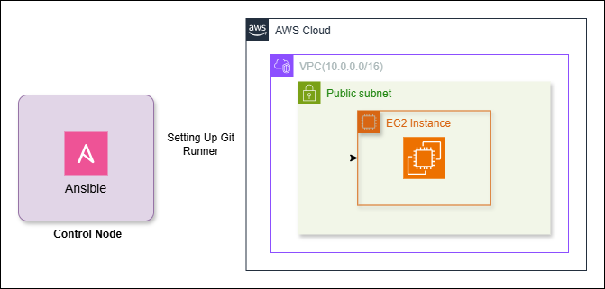

# Automate Git-runner setup on a Public EC2 instance using Ansible

Automating the setup of GitHub runners on a public EC2 instance using Ansible allows for streamlined deployment and management of continuous integration (CI) and continuous deployment (CD) processes. 
This documentation provides a step-by-step guide on how to set-up the process of automating the setup of a GitHub runner on a public EC2 instance using `Ansible`.



## Steps

### Step 1: Configure and setup AWS(vpc, subnet, route-table, Internet gateway)

1. Create a vpc named `my-vpc` with IPv4 CIDR block `10.0.0.0/16`
2. Create a public subnet named `public-subnet` with IPv4 CIDR block `10.0.1.0/24`
3. Create a route table named `rt-public` and associate it with the `public-subnet`.
4. Create an internet gateway named `igw` and attach it to the vpc.
5. Edit routes of the router:
    - Public Route Table(rt-public):
        - Add a route with destination `0.0.0.0/0` and target `igw`

Here, is the resource map:


### Step 2: Launce a public EC2 instance

**Git-runner instance**

1. Launch an EC2 instance named `git-runner` in the `public-subnet`.
2. Select `Ubuntu Server 24.04 LTS (HVM), SSD Volume Type` as the AMI.
3. Create a key pair named `git-runner.pem`.
4. Add a security group named `git-runner` with inbound rules:
    - SSH from anywhere or from your IP.


### Step 3: Create a github repository and connect it with VS-Code(Optional if you want to use your local machine. Make sure your machine runs on ubuntu)

1. First create an empty Github repository.
2. Clone the repository to `PORIDHI VS-Code` using SSH command.
    - Open the vs-code terminal.
    - Run the command 
    ```sh
    ssh-keygen -t ed25519 -C "your_email@example"
    ```
    
    - Create a new SSH key in the your github and fill it with the newly created public key.
    
    - Run the command `ssh -T git@github.com` to test the connection.
    - Clone the repository using SSH command.
3. Change directory to your Git-repository directory.


### Step 4: Install Ansible

- Open the termanal and run these commands to install Ansible.
    ```sh
    sudo apt-get update -y
    sudo apt install software-properties-common -y
    sudo apt-add-repository --yes --update ppa:ansible/ansible
    sudo apt-get install -y ansible
    ```
- Check installation
    ```sh
    ansible --version
    ```
    

### Step 5: Create or use the previously generated key pair for remote ssh into the Git-runner Public instance
- Copy the public key
- Open the git-runner instance terminal as it is a public instance. Otherwise use the pem file for remote ssh from your local machine. 
- Paste the public key to the `known_hosts`
- Now you can ssh it from your local machine or vs-code terminal.


### Step 6: Configure Ansible Playbooks for Git-runner setup

1. Create a directory named `ansible`
2. Create a file named `hosts.ini` inside the ansible directory and add the following content:
```sh
[git-runner]
git-runner ansible_host=<git-runner-ec2-public-ip> ansible_user=ubuntu ansible_ssh_private_key_file=~/.ssh/id_rsa
```
3. Create a file named `setup-git-runner.yml` inside the `ansible` directory. Add the following content to the file.
```yml
---
- name: Setup GitHub Runner
  hosts: git-runner
  become: yes
  tasks:
    - name: Create actions-runner directory
      file:
        path: /home/ubuntu/actions-runner
        state: directory
        owner: ubuntu
        group: ubuntu

    - name: Download GitHub Actions runner using curl
      command: curl -o actions-runner-linux-x64-2.317.0.tar.gz -L https://github.com/actions/runner/releases/download/v2.317.0/actions-runner-linux-x64-2.317.0.tar.gz
      args:
        chdir: /home/ubuntu/actions-runner/

    - name: Extract GitHub Runner
      become_user: ubuntu
      unarchive:
        src: /home/ubuntu/actions-runner/actions-runner-linux-x64-2.317.0.tar.gz
        dest: /home/ubuntu/actions-runner
        remote_src: yes
    
    - name: Check if GitHub Runner is already configured
      stat:
        path: /home/ubuntu/actions-runner/.runner
      register: runner_config

    - name: Configure GitHub Runner
      become_user: ubuntu
      shell: ./config.sh --url <YOUR_GITHUB_REPOSITORY_LINK> --token <YOUR_GITHUB_RUNNER_TOKEN> --name "Git-runner" --unattended
      args:
        chdir: /home/ubuntu/actions-runner
      when: not runner_config.stat.exists

    - name: Check if GitHub Runner service is already installed
      stat:
        path: /etc/systemd/system/<NAME_OF_YOUR_RUNNER_SERVICE>
      register: runner_service_installed

    - name: Install GitHub Runner service
      shell: sudo ./svc.sh install
      args:
        chdir: /home/ubuntu/actions-runner  
      when: not runner_service_installed.stat.exists

    - name: Check if GitHub Runner service is running
      systemd:
        name: <NAME_OF_YOUR_RUNNER_SERVICE>
        state: started
      register: runner_service

    - name: Start GitHub Runner service if not running
      shell: |
        sudo ./svc.sh start
      args:
        chdir: /home/ubuntu/actions-runner
      when: runner_service is failed
```
**NOTE: MAKE SURE TO CHANGE THE <> VALUES WITH YOUR VALUES**

### Step 7: Run the ansbile Playbook

1. First Change your directory to the `ansible` directory
2. Run this command:
```sh
ansible-playbook -i hosts.ini setup-git-runner.yml
```
3. Check the logs of the terminal and check if any error occured.
```sh
root@4cb447b2e0d6e332:~/code/Git-runner-using-ansible/ansible# ansible-playbook -i hosts.ini setup-git-runner.yml
[WARNING]: Invalid characters were found in group names but not replaced, use -vvvv to see details
[WARNING]: Found both group and host with same name: git-runner

PLAY [Setup GitHub Runner] *******************************************************************************************************

TASK [Gathering Facts] *******************************************************************************************************
ok: [git-runner]

TASK [Create actions-runner directory] *******************************************************************************************************
changed: [git-runner]

TASK [Download GitHub Actions runner using curl] *******************************************************************************************************
changed: [git-runner]

TASK [Verify download checksum] *******************************************************************************************************
changed: [git-runner]

TASK [Extract GitHub Runner] *******************************************************************************************************
changed: [git-runner]

TASK [Configure GitHub Runner] *******************************************************************************************************
changed: [git-runner]

TASK [Install GitHub Runner service] *******************************************************************************************************
changed: [git-runner]

TASK [Start GitHub Runner service] *******************************************************************************************************
changed: [git-runner]

PLAY RECAP *******************************************************************************************************
git-runner                 : ok=8    changed=7    unreachable=0    failed=0    skipped=0    rescued=0    ignored=0   
```

4. If no error occured, then you have successfully installed the GitHub Runner on your server.

5. You can check it by ssh into the public instance and run these commands:
    ```sh
    cd actions-runner
    sudo ./svc.sh status
    ```
    If the output is like this, then you have successfully installed the GitHub Runner on your server.
    

6. You can also check the runner from your github repostory.
    

---

#### So, we have successfully automated the git-runner setup in a public instance using Ansible. 