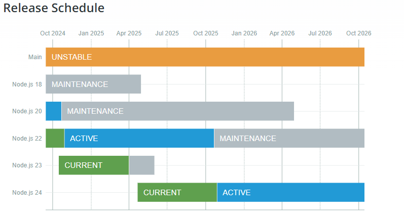

# A Deeper Look into Node.js Docker Images

Node.js Docker images come in various flavours, each tailored for specific use cases. Picking the right image for your application can be challenging, as it involves balancing factors such as size, security vulnerabilities, and functionality. This document explores the differences among popular Node.js Docker images, highlighting their pros and cons to help developers make informed choices.


## Objective

This documentation aims to:

- Compare various Node.js Docker image variants.
- Analyse their composition and intended use cases.
- Provide recommendations for choosing the right image based on development and production needs.


## Table of Contents

- [Node.js Releases and Selection Criteria](#nodejs-releases-and-selection-criteria)
- [Basic Comparison of Available Images](#basic-comparison-of-available-images)
- [Overview of Each Image](#overview-of-each-image)
  - [Official Docker Images](#official-docker-images)
  - [Bitnami Images](#bitnami-images)
  - [GoogleContainerTools Distroless](#googlecontainertools-distroless)
  - [Chainguard’s Distroless](#chainguards-distroless)
- [Conclusion and Recommendations](#conclusion-and-recommendations)


## Node.js Releases and Selection Criteria

Node.js recommends using Active LTS or Maintenance LTS releases for production applications. Active LTS versions are considered stable and ready for general use, while Maintenance LTS ensures critical bug fixes for an extended period.



###  Release Lifecycle

- **Current Release:** Supported for six months after release, intended for library authors and early adopters.

- **Active LTS:** Stable and reliable, with extended support for 30 months. Suitable for production.

- **Maintenance LTS:** Focused on critical fixes, suitable for older but still functional production environments.


## Basic Comparison of Available Images

### Official Docker Images

In the official Node.js Docker images, the `node` tag is used to specify the version of Node.js. The `node` tag is followed by the version number, which corresponds to the Node.js release. Here are some examples:

```bash
docker pull node:22
docker pull node:22-slim
docker pull node:22-alpine
```

### Bitnami Images

Bitnami repacks the Node.js binary with additional dependencies and tools. 

```bash
docker pull bitnami/node:22
```

### GoogleContainerTools Distroless

GoogleContainerTools Distroless images are minimalistic images that only contain the Node.js binary and its dependencies. They are designed to be used in production environments where security and size are critical.

```bash
docker pull gcr.io/distroless/nodejs22-debian12
```

### Chainguard’s Distroless

Chainguard’s Distroless images are similar to GoogleContainerTools Distroless images, but they are built on top of the Chainguard base image.

```bash
docker pull cgr.dev/chainguard/node:latest
```

Simply listing the pulled images can already give us some initial food for thought:

```bash
docker images
```

To begin with, the disparity in scale between these pictures is breathtaking. The size of the Node.js installation itself can also likely be estimated; considering the low overhead of the distroless and alpine-based images, it should be about 140MB. What constitutes the remaining bulky node:22 and bitnami/node:22 images, though, given that Node.js is only 140MB?

We will begin by examining the largest of these Node.js pictures, node:22, before moving on to more detailed ones.


