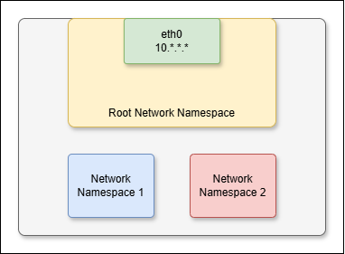

# Kubernetes Network Traffic Path

Kubernetes networking is a foundational aspect of cluster functionality. It ensures seamless communication between components (pods, services, nodes) within the cluster. Let’s break this topic into its core principles, requirements, and mechanisms.


### **1. Key Principles of Kubernetes Networking**
Kubernetes enforces specific rules to maintain network connectivity. These principles are:

1. **Pod-to-Pod Communication Without NAT:**
   - Every pod should be able to communicate directly with any other pod in the cluster using their IP addresses.
   - No Network Address Translation (NAT) is required, simplifying communication.

2. **Flat Network Structure:**
   - Pods operate in a flat network space where all pod IPs are unique.
   - This flat structure means each pod has a routable IP across the cluster.

3. **Service Abstraction:**
   - Services act as a stable endpoint for accessing pods, even if pod IPs change.
   - Kubernetes uses kube-proxy to ensure services route traffic to the correct pods.

4. **Node-to-Pod Communication:**
   - Nodes must be able to communicate with any pod within the cluster.
   - Pods running on a node should be able to communicate with the node itself.

5. **External Access to Pods and Services:**
   - Mechanisms like NodePort, LoadBalancer, and Ingress expose services or pods to the outside world.



### **2. Networking Models**
Kubernetes relies on certain assumptions about the underlying network infrastructure:

#### **Model 1: Pod-to-Pod Networking**
- Pods are assigned unique IP addresses.
- Communication between pods is direct, without needing proxies or NAT.
- Example: Pod A (10.0.0.1) can directly communicate with Pod B (10.0.0.2).

#### **Model 2: Pod-to-Service Networking**
- Pods communicate with a service (via ClusterIP) instead of directly accessing other pods.
- The service abstracts the pods and performs load balancing.

---

### **3. Requirements for a Kubernetes Network**
For networking to work seamlessly, Kubernetes enforces these requirements:

#### **1. Unique Pod IPs**
- Each pod must have a unique IP within the cluster to prevent conflicts.
- The Container Network Interface (CNI) is responsible for assigning these IPs.

#### **2. Consistent Connectivity**
- Pods should remain reachable regardless of where they are scheduled in the cluster.

#### **3. DNS Resolution**
- Pods and services rely on CoreDNS for name resolution.
- DNS translates service names into ClusterIP addresses.

#### **4. Network Policies**
- Network policies control communication between pods or from external sources.
- They act as a firewall for Kubernetes, ensuring secure traffic flow.


## How Linux network namespaces work in a pod

```yaml
apiVersion: v1
kind: Pod
metadata:
  name: multi-container-pod
spec:
  containers:
    - name: container-1
      image: busybox
      command: ['/bin/sh', '-c', 'sleep 1d']
    - name: container-2
      image: nginx
```

