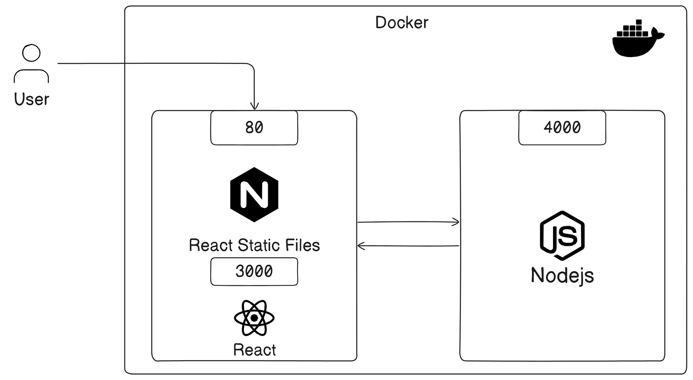
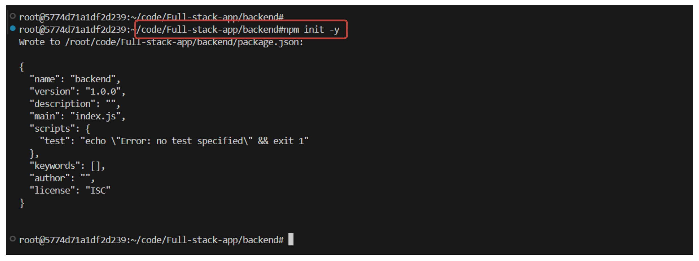
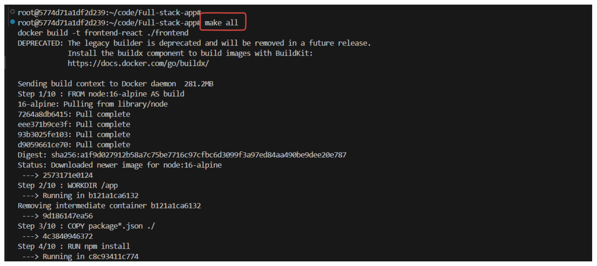

# Dockerize a Basic Full Stack Application with React and Node.js using Makefile. 

In this lab, we will guide you through the creation of a basic full-stack application where,

- The **frontend** is built using React.
- The **backend** is built using Node.js with Express.
- Both the frontend and backend are `dockerized` using Docker.
- The `Images` are built and pushed to DockerHub using a `Makefile`.



Overall Project directory:

```sh
Full-stack-app
|- backend
|   |- index.js
|   |- package.json
|   |- Dockerfile
|   .
|
|- frontend
|   |- public
|   |- src
|   |- package.json
|   |- Dockerfile
|      
|- Makefile
```

Let's break it down step by step.


## Step 1: Setting Up the Backend (Node.js with Express)

### 1.1. Create a Directory for the Backend

```bash
mkdir Full-stack-app
cd Full-stack-app
mkdir backend
cd backend
```

### 1.2. Initialize the Node.js Project
```bash
npm init -y
```



This will create a `package.json` file.

### 1.3. Install Dependencies
Install `express` to handle server routing.

```bash
npm install express cors
```


### 1.4. Create `index.js` for the Backend

In the `backend` directory, create a file called `index.js`:

```bash
touch index.js
```

Edit `index.js` with the following content:

```javascript
const express = require('express');
const os = require('os');
const cors = require('cors');

const app = express();
const PORT = 4000;

app.use(cors()); // Enable CORS for all routes

app.get("/", (req, res) => {
    const message = "Hello world from the backend! 🚀";
    console.log(message);
    res.json({ message });
});

app.listen(PORT, () => {
    console.log(`Server Running at port ${PORT}`);
});
```

### 1.5. Create a Dockerfile for the Backend
In the `backend` directory, create a `Dockerfile`:

```bash
touch Dockerfile
```

Add the following content to the `Dockerfile`:

```Dockerfile
# Use the official Node.js image from the Docker Hub
FROM node:14

# Create and set the working directory inside the container
WORKDIR /app

# Copy package.json and install dependencies
COPY package*.json ./
RUN npm install

# Copy the rest of the app files
COPY . .

# Expose the port that your app will run on
EXPOSE 4000

# Start the server
CMD ["node", "index.js"]
```


## Step 2: Setting Up the Frontend (React)

### 2.1. Create a Directory for the Frontend

```bash
cd ..
npx create-react-app frontend
```

### 2.2. Modify the React App

Navigate to `frontend/src/App.js` and replace the content with the following code:

```javascript
import React, { useState, useEffect } from 'react';

function App() {
  const [data, setData] = useState('Loading...');

  const callAPI = async () => {
    try {
      const res = await fetch("http://localhost:4000/");
      const data = await res.json();
      setData(data.message);
    } catch (error) {
      console.log('Error:', error);
    }
  };

  useEffect(() => {
    callAPI();
  }, []);

  return (
    <div className="App">
      <h1>Backend Response:</h1>
      <p>{data}</p>
    </div>
  );
}

export default App;
```

This fetches the message from the backend and displays it on the frontend.

### 2.3. Create a Dockerfile for the Frontend
In the `frontend` directory, create a `Dockerfile`:

```bash
touch Dockerfile
```

Add the following content:

```Dockerfile
# Stage 1: Build the React app
FROM node:16-alpine AS build

WORKDIR /app

# Copy package.json and package-lock.json
COPY package*.json ./

# Install dependencies
RUN npm install

# Copy the rest of the code
COPY . .

# Build the React app for production
RUN npm run build

# Stage 2: Serve the React app
FROM nginx:alpine

# Copy the built app to the NGINX container
COPY --from=build /app/build /usr/share/nginx/html

# Expose port 80 to access the React app
EXPOSE 80

# Start NGINX
CMD ["nginx", "-g", "daemon off;"]
```

This Dockerfile uses a multi-stage build. The first stage builds the React app, and the second stage uses Nginx to serve the static files.


## Step 3: Writing the `Makefile`

Let's create a `Makefile` to build and push the Docker images.

### Create the `Makefile`

In the `my-fullstack-app` directory, create a `Makefile`:

```bash
touch Makefile
```

### Writing rite the Makefile step by step:

A `Makefile` is a simple text file that contains a set of rules used to automate the build and deployment process. It is often used with `make`, a build automation tool, to execute tasks like compiling programs, running tests, or building Docker images.

Here's a breakdown of how the `Makefile` works in our case:

### Basic Structure of a Makefile:

A `Makefile` typically has the following components:
1. **Variables**: Used to store values like filenames, Docker image names, or versions to be reused.
2. **Targets**: These define tasks or commands that you want to run.
3. **Recipes**: The actual shell commands to be executed for a given target.
4. **Phony Targets**: Targets that aren't files, but commands that you want to run (e.g., `build`, `clean`).

### Makefile:

```makefile
# Variables
DOCKER_USERNAME = your-dockerhub-username
```
- **Variables**: These are placeholders that store common values to avoid repetition. In this case, `DOCKER_USERNAME` holds the username for Docker Hub.
  
  You can later replace `your-dockerhub-username` with your actual Docker Hub username.

#### Frontend Section

```makefile
# Frontend Variables
FRONTEND_IMAGE_NAME = your-frontend-image-name
FRONTEND_TAG = latest
```
- **Frontend Variables**: These store information specific to the frontend application, such as the Docker image name and tag.

```makefile
# Build the Docker image for the frontend
build-frontend:
	docker build -t $(FRONTEND_IMAGE_NAME) ./frontend
```
- **`build-frontend` Target**: This target runs the `docker build` command to build the Docker image for the frontend. The image name is set to `$(FRONTEND_IMAGE_NAME)` (i.e., `react-frontend`).
  
  `./frontend` is the directory containing the frontend source code and `Dockerfile`.

```makefile
# Tag the Docker image for the frontend
tag-frontend:
	docker tag $(FRONTEND_IMAGE_NAME):$(FRONTEND_TAG) $(DOCKER_USERNAME)/$(FRONTEND_IMAGE_NAME):$(FRONTEND_TAG)
```
- **`tag-frontend` Target**: This tags the newly built image using the `docker tag` command. The tag is composed of the DockerHub username (`$(DOCKER_USERNAME)`) and the image name and tag.
  
  For example, it will tag the image as `your-dockerhub-username/react-frontend:latest`.

```makefile
# Push the Docker image for the frontend
push-frontend:
	docker push $(DOCKER_USERNAME)/$(FRONTEND_IMAGE_NAME):$(FRONTEND_TAG)
```
- **`push-frontend` Target**: This command pushes the tagged image to DockerHub using the `docker push` command.

```makefile
# Combined command to build, tag, and push the frontend Docker image
all-frontend: build-frontend tag-frontend push-frontend
```
- **`all-frontend` Target**: This is a combined target that calls the `build-frontend`, `tag-frontend`, and `push-frontend` targets sequentially, effectively building, tagging, and pushing the Docker image in one command.


#### Backend Section

The backend section is nearly identical to the frontend section, but it operates on the backend Docker image. Here's a quick summary:

```makefile
# Backend Variables
BACKEND_IMAGE_NAME = your-backend-image-name
BACKEND_TAG = latest
```
- Backend-specific variables: Here, `nodejs-app-aws-eks` is used as the backend image name.

```makefile
# Build, tag, and push backend image
build-backend:
    docker build -t $(BACKEND_IMAGE_NAME) ./backend

tag-backend:
    docker tag $(BACKEND_IMAGE_NAME):$(BACKEND_TAG) $(DOCKER_USERNAME)/$(BACKEND_IMAGE_NAME):$(BACKEND_TAG)

push-backend:
    docker push $(DOCKER_USERNAME)/$(BACKEND_IMAGE_NAME):$(BACKEND_TAG)

all-backend: build-backend tag-backend push-backend
```
- Backend build, tag, push, and clean targets work the same way as the frontend targets but for the backend image.


```makefile
# Run all for both frontend and backend in parallel
all: all-frontend all-backend
```
- **`all` Target**: This target runs `all-frontend` and `all-backend` in parallel. It builds, tags, and pushes both frontend and backend images together when executed.

#### `.PHONY` Declaration

```makefile
.PHONY: build-frontend tag-frontend push-frontend all-frontend clean-frontend \
        build-backend tag-backend push-backend all-backend clean-backend clean all
```
- **`.PHONY`**: Declares that these targets are not files but commands. This ensures that `make` doesn't get confused by files with the same name as targets.

### Why Use a Makefile?
- **Automation**: You can define a sequence of steps and easily run them with simple commands like `make all`.
- **Consistency**: Running the same commands in a structured way ensures that the same steps are followed every time, minimizing human error.
- **Parallelization**: You can combine tasks and run them concurrently, like building both frontend and backend in parallel with `make all`.

## Here is the Complete Makefile:

```Makefile
# Variables
DOCKER_USERNAME = your-dockerhub-username
FRONTEND_IMAGE_NAME = React-frontend
FRONTEND_TAG = latest
BACKEND_IMAGE_NAME = Nodejs-backend
BACKEND_TAG = latest

build-frontend:
	docker build -t $(FRONTEND_IMAGE_NAME) ./frontend

tag-frontend:
	docker tag $(FRONTEND_IMAGE_NAME):$(FRONTEND_TAG) $(DOCKER_USERNAME)/$(FRONTEND_IMAGE_NAME):$(FRONTEND_TAG)

push-frontend:
	docker push $(DOCKER_USERNAME)/$(FRONTEND_IMAGE_NAME):$(FRONTEND_TAG)

all-frontend: build-frontend tag-frontend push-frontend

build-backend:
	docker build -t $(BACKEND_IMAGE_NAME) ./backend

tag-backend:
	docker tag $(BACKEND_IMAGE_NAME):$(BACKEND_TAG) $(DOCKER_USERNAME)/$(BACKEND_IMAGE_NAME):$(BACKEND_TAG)

push-backend:
	docker push $(DOCKER_USERNAME)/$(BACKEND_IMAGE_NAME):$(BACKEND_TAG)

all-backend: build-backend tag-backend push-backend

clean: clean-frontend clean-backend

all: frontend backend

.PHONY: build-frontend tag-frontend push-frontend all-frontend clean-frontend \
        build-backend tag-backend push-backend all-backend clean-backend clean all
```
Modify the `DOCKER_USERNAME`, `Image_Name` variable with your DockerHub username and image name for actual deployment.


### How to Use:
- First Login into Docker hub
  ```sh
  docker login
  ```
  Provide the credentials as needed.

  

- To build, tag, and push the **frontend** image:
  ```bash
  make all-frontend
  ```

- To build, tag, and push the **backend** image:
  ```bash
  make all-backend
  ```

- To build, tag, and push **both** images in parallel:

  ```bash
  make all
  ```

  

### Check the created images

After completion of the make command, you can check if docker images:

```sh
docker images
```


## Step 4: Running the Application

Now that we have Docker images for both the frontend and backend, let's run the entire application using Docker.

### 4.1. Run the Backend
Run the backend image:

```bash
docker run -p 4000:4000 your-dockerhub-username/<backend-image-name>
```


This will run the backend server on port 4000.

### 4.2. Run the Frontend
Run the frontend image:

```bash
docker run -p 80:80 your-dockerhub-username/<frontend-image-name>
```

This will run the frontend on port 80.


---

## Conclusion

You've successfully created a full-stack application using React for the frontend and Node.js with Express for the backend. Both applications were dockerized, and the images were built and pushed to DockerHub using a Makefile.

### Summary of Concepts:
- **Docker**: Used to containerize the application.
- **Makefile**: Automates the build and push processes.
- **React**: Frontend library.
- **Node.js/Express**: Backend server for handling API requests.

Now you can further develop your app, enhance the features, and scale it using these building blocks!