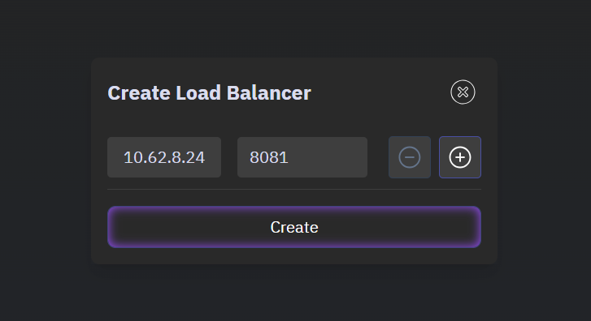
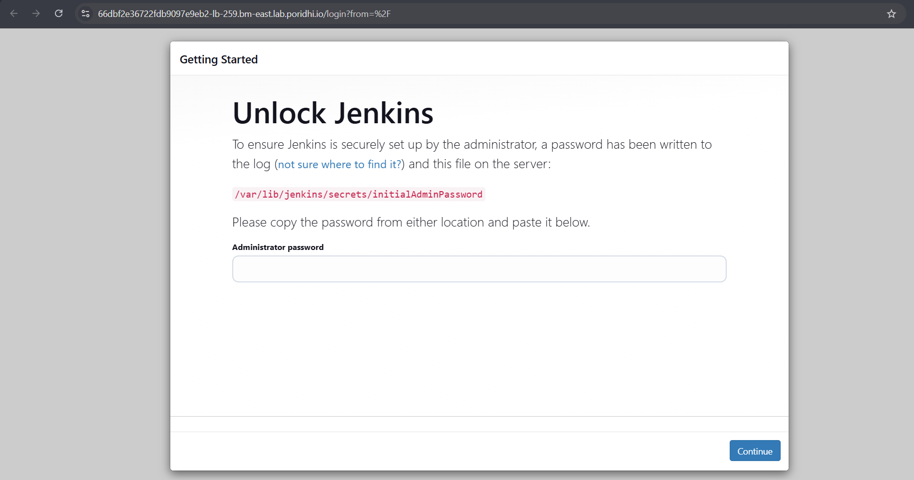
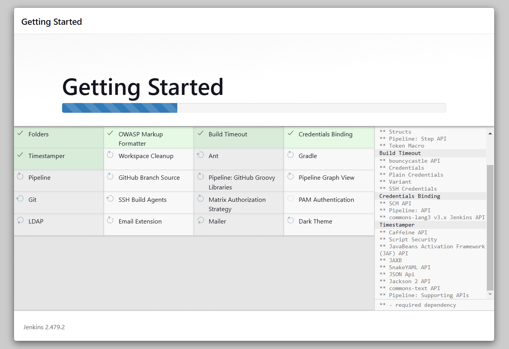
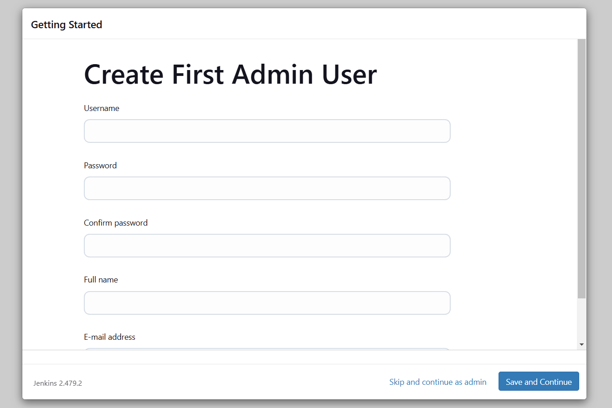
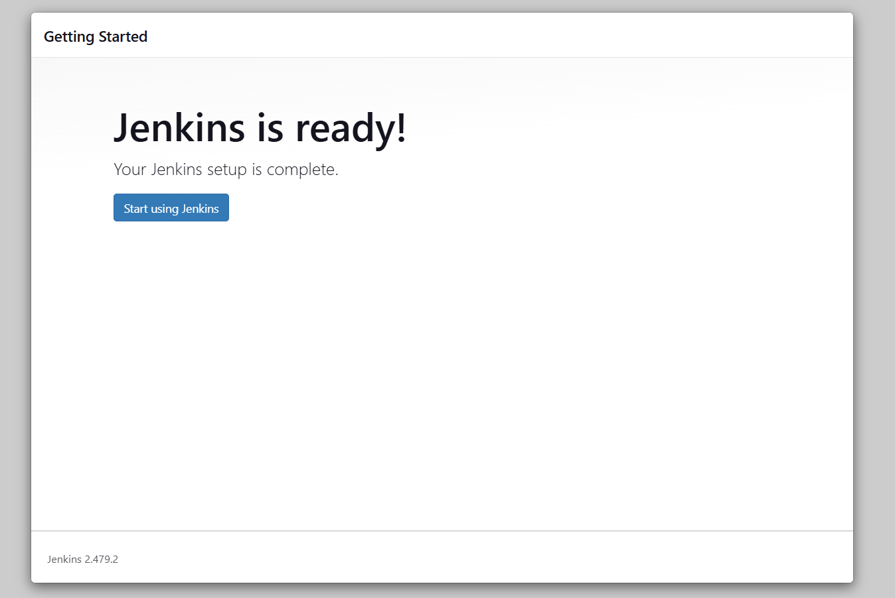

# Getting Started with Jenkins

This guide will walk you through the process of installing Jenkins on an Ubuntu server using recommended configurations. Jenkins is an open-source automation server that is widely used for Continuous Integration (CI) and Continuous Delivery (CD) in software development. It allows developers to automate various stages of their development processes, such as building, testing, and deploying applications.

## Prerequisites

- A server running Ubuntu with sudo access.
- Basic understanding of Linux command line operations.

## What is Jenkins?

Jenkins is an **open-source automation server** used for **Continuous Integration (CI)** and **Continuous Delivery/Deployment (CD)**. It helps automate software development processes like building, testing, and deploying code. 


Jenkins is highly flexible and extensible through a wide range of plugins, making it suitable for various DevOps workflows.

### Key Features of Jenkins:
1. **Automation**: Automates repetitive tasks like builds, tests, and deployments.
2. **Extensibility**: Supports over 1,800 plugins for integration with tools like Git, Maven, Docker, Kubernetes, and more.
3. **Pipeline Support**: Enables users to define complex CI/CD pipelines using the **Jenkins Pipeline** feature.
4. **Distributed Builds**: Supports distributed builds across multiple nodes for better performance.
5. **Cross-Platform**: Runs on various operating systems, including Windows, macOS, and Linux.


## Install Jenkins on Ubuntu With Recommended Configurations

### Step 1: Update Package List

Before installing Jenkins, update your server's package list:

```bash
sudo apt -y update
sudo apt upgrade -y
```

### Step 2: Install Java Runtime

Jenkins requires Java to run. Install OpenJDK 17:

```bash
sudo apt install openjdk-17-jre-headless -y
```

Make sure java is installed successfully using:

```bash
java --version
```


### Step 3: Add Jenkins Debian Repository

Import Jenkins GPG key using the following command:

```bash
curl -fsSL https://pkg.jenkins.io/debian-stable/jenkins.io-2023.key | sudo tee \
  /usr/share/keyrings/jenkins-keyring.asc > /dev/null
```

Add Jenkins repository to the sources list:

```bash
echo deb [signed-by=/usr/share/keyrings/jenkins-keyring.asc] \
  https://pkg.jenkins.io/debian-stable binary/ | sudo tee \
  /etc/apt/sources.list.d/jenkins.list > /dev/null
```

### Step 4: Install Jenkins

Install Jenkins using the following command:

```bash
sudo apt update
sudo apt install jenkins -y
```

### Step 5: Start Jenkins Service

Start Jenkins service using the following command:

```bash
sudo systemctl start jenkins
```


Oops! Looks like jenkins is having some issues to start the service. Let's check the status of the service using the following command:

```bash
sudo systemctl status jenkins
```


Now, Let's try to find out the reason for the issue and fix it.

### Step 6: Port Configuration

Jenkins generally runs on port 8080. But, it might be already in use by another application. Let's check if port 8080 is already in use by another application using the following command:

```bash
sudo netstat -tuln | grep 8080
```


We can see that port 8080 is already in use. 

So, let's change the port of jenkins to 8081. For that, we need to edit the jenkins configuration and service file.

```bash
sudo vi /etc/default/jenkins
```   

Find the line that says `HTTP_PORT=8080` and change it to the following:

```bash
HTTP_PORT=8081
JENKINS_ARGS="--httpPort=8081"
```

Now, Let's update the systemd service file to use the new port.

```bash
sudo vi /lib/systemd/system/jenkins.service
```

Find the line that says `ExecStart=/usr/bin/jenkins` and change it to the following:

```bash
ExecStart=/usr/bin/jenkins --httpPort=8081
```

Finally, Let's reload the systemd service and restart jenkins:

```bash
sudo systemctl daemon-reload
sudo systemctl restart jenkins
```

Now, Let's check the status of the jenkins service again:

```bash
sudo systemctl status jenkins
```


There you go! Jenkins is running successfully on port 8081.

### Step 7: Access Jenkins

We will access jenkins by using `Poridhi's LoadBalancer` on port 8081. At first, we need to get the public IP address of the LoadBalancer.
 
```bash 
ifconfig
```

Here copy the `IP` from `eth0` interface:


Now, create a load balancer from `Poridhi Lab` by providing the `IP` and `port: 8081`.



Access jenkins by opening the load balancer URL in your web browser.



### Step 8: Unlock Jenkins

To unlock Jenkins, retrieve the initial administrative password:

```bash
sudo cat /var/lib/jenkins/secrets/initialAdminPassword
```

Enter the password on the Jenkins setup page to proceed.

### Step 9: Install Suggested Plugins

During the initial setup, choose "Install Suggested Plugins." This will install all the required plugins for building and managing Jenkins projects. The installation might take a few minutes.




### Step 10: Create Admin User

After the plugins are installed, you will be prompted to create an admin user. Enter the desired username and password, then click "Save and Finish."



Congratulations! You are ready to use jenkins now.



## Conclusion

This guide has provided step-by-step instructions to install Jenkins on an Ubuntu server. With Jenkins installed on your Ubuntu server, you are now equipped to automate your development processes, reducing manual effort, minimizing errors, and accelerating your software delivery pipeline.