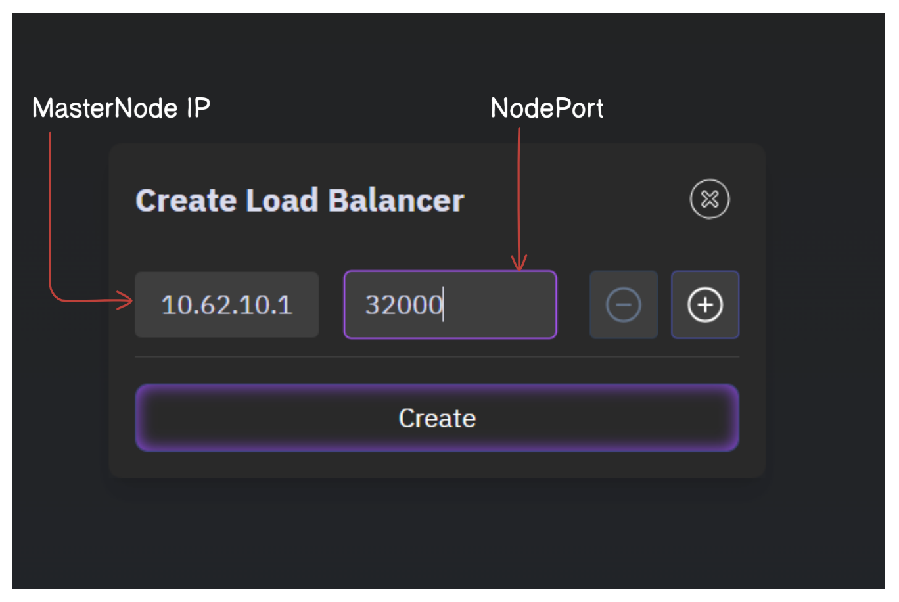
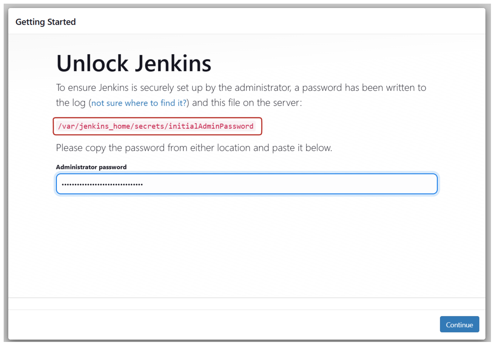

### Hosting Jenkins on Kubernetes: A Comprehensive Guide

Hosting Jenkins on a Kubernetes cluster provides an efficient way to manage deployments and leverage the dynamic scalability of Kubernetes. By running Jenkins in such an environment, you can easily integrate with Kubernetes-based workloads and dynamically scale Jenkins agents based on demand.


This guide provides a step-by-step walkthrough to set up Jenkins on a Kubernetes cluster. 

---

### Overview of Jenkins Setup on Kubernetes

To deploy Jenkins on Kubernetes, we will cover the following steps:

1. **Create a Namespace**: Isolate Jenkins and related resources in a specific namespace for better organization.
2. **Set Up a Service Account**: Assign administrative permissions to Jenkins within the cluster.
3. **Configure Persistent Storage**: Use Persistent Volumes (PV) to ensure Jenkins data persists across Pod restarts.
4. **Deploy Jenkins**: Use a Deployment manifest to create the Jenkins application.
5. **Expose Jenkins**: Configure a Service to allow external access via a NodePort.

>NOTE: This guide demonstrates local persistent storage for simplicity. In production, use cloud-specific storage solutions to ensure data durability and high availability.

## Steps to Set Up Jenkins on Kubernetes

### **Step 1: Create a Namespace**

Namespaces help segregate resources. Create a namespace dedicated to DevOps tools:

```bash
kubectl create namespace devops-tools
```

### **Step 2: Configure a Service Account**

Create a file named `serviceAccount.yaml` with the following content:

```yaml
---
apiVersion: rbac.authorization.k8s.io/v1
kind: ClusterRole
metadata:
  name: jenkins-admin
rules:
  - apiGroups: [""]
    resources: ["*"]
    verbs: ["*"]

---
apiVersion: v1
kind: ServiceAccount
metadata:
  name: jenkins-admin
  namespace: devops-tools

---
apiVersion: rbac.authorization.k8s.io/v1
kind: ClusterRoleBinding
metadata:
  name: jenkins-admin
roleRef:
  apiGroup: rbac.authorization.k8s.io
  kind: ClusterRole
  name: jenkins-admin
subjects:
- kind: ServiceAccount
  name: jenkins-admin
  namespace: devops-tools
```

This manifest defines:

- A `ClusterRole` named `jenkins-admin` with full permissions.
- A `ServiceAccount` named `jenkins-admin`.
- A `ClusterRoleBinding` linking the role to the service account.

Apply the configuration:

```bash
kubectl apply -f serviceAccount.yaml
```

### **Step 3: Configure Persistent Storage**

Create a `volume.yaml` file with the following content:

```yaml
kind: StorageClass
apiVersion: storage.k8s.io/v1
metadata:
  name: local-storage
provisioner: kubernetes.io/no-provisioner
volumeBindingMode: WaitForFirstConsumer

---
apiVersion: v1
kind: PersistentVolume
metadata:
  name: jenkins-pv-volume
  labels:
    type: local
spec:
  storageClassName: local-storage
  claimRef:
    name: jenkins-pv-claim
    namespace: devops-tools
  capacity:
    storage: 10Gi
  accessModes:
    - ReadWriteOnce
  local:
    path: /mnt
  nodeAffinity:
    required:
      nodeSelectorTerms:
      - matchExpressions:
        - key: kubernetes.io/hostname
          operator: In
          values:
          - worker-node01

---
apiVersion: v1
kind: PersistentVolumeClaim
metadata:
  name: jenkins-pv-claim
  namespace: devops-tools
spec:
  storageClassName: local-storage
  accessModes:
    - ReadWriteOnce
  resources:
    requests:
      storage: 3Gi
```

> Replace `worker-node01` with your worker node's hostname. Retrieve it using:

```bash
kubectl get nodes
```


Apply the volume configuration:

```bash
kubectl create -f volume.yaml
```

### **Step 4: Create Jenkins Deployment**

Define a deployment in `deployment.yaml`:

```yaml
apiVersion: apps/v1
kind: Deployment
metadata:
  name: jenkins
  namespace: devops-tools
spec:
  replicas: 1
  selector:
    matchLabels:
      app: jenkins-server
  template:
    metadata:
      labels:
        app: jenkins-server
    spec:
      securityContext:
            fsGroup: 1000 
            runAsUser: 1000
      serviceAccountName: jenkins-admin
      containers:
        - name: jenkins
          image: jenkins/jenkins:lts
          resources:
            limits:
              memory: "2Gi"
              cpu: "1000m"
            requests:
              memory: "500Mi"
              cpu: "500m"
          ports:
            - name: httpport
              containerPort: 8080
            - name: jnlpport
              containerPort: 50000
          livenessProbe:
            httpGet:
              path: "/login"
              port: 8080
            initialDelaySeconds: 90
            periodSeconds: 10
            timeoutSeconds: 5
            failureThreshold: 5
          readinessProbe:
            httpGet:
              path: "/login"
              port: 8080
            initialDelaySeconds: 60
            periodSeconds: 10
            timeoutSeconds: 5
            failureThreshold: 3
          volumeMounts:
            - name: jenkins-data
              mountPath: /var/jenkins_home         
      volumes:
        - name: jenkins-data
          persistentVolumeClaim:
              claimName: jenkins-pv-claim
```

Apply the deployment:

```bash
kubectl apply -f deployment.yaml
```

Verify the deployment status:

```bash
kubectl get deployments -n devops-tools
kubectl describe deployments -n devops-tools
```


#### **Step 5: Expose Jenkins**

Create a file named `service.yaml`:

```yaml
apiVersion: v1
kind: Service
metadata:
  name: jenkins-service
  namespace: devops-tools
  annotations:
      prometheus.io/scrape: 'true'
      prometheus.io/path:   /
      prometheus.io/port:   '8080'
spec:
  selector: 
    app: jenkins-server
  type: NodePort  
  ports:
    - port: 8080
      targetPort: 8080
      nodePort: 32000
```

Apply the service configuration:

```bash
kubectl apply -f service.yaml
```


### Access Jenkins

To access the Jenkins UI, we have to create a Load-Balancer.

First Get the MasterNode IP.


Create a LoadBalancer Using the MasterNode IP and NodePort(32000)




Access Jenkins using the load-balancer's UI.


---

### Retrieving Initial Admin Password

Jenkins will ask for the initial Admin password when you access the dashboard for the first time.



To retrieve the admin password:

**1. List Jenkins pods:**

```bash
kubectl get pods -n devops-tools
```

**2. View logs of the Jenkins pod:**

```bash
kubectl logs <jenkins-pod-name> -n devops-tools
```


**3. Or, directly extract the password:**

```bash
kubectl exec -it <jenkins-pod-name> -n devops-tools -- cat /var/jenkins_home/secrets/initialAdminPassword
```

---

### Conclusion

Deploying Jenkins on Kubernetes is a robust approach for scalable CI/CD pipelines. For production use:

- Employ cloud-native storage solutions for persistent volumes.
- Configure high availability for Jenkins.

This guide provides the foundation for hosting Jenkins on Kubernetes. Customize the setup to suit your specific requirements!