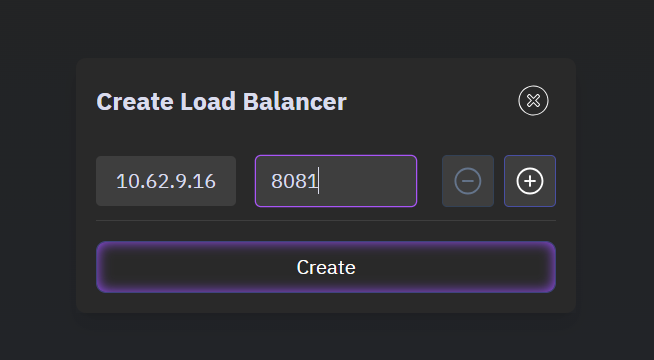

# CI CD Pipeline using Jenkins

In this lab, we will be setting up a CI/CD pipeline using Jenkins for a containerized application. We will be using DockerHub as our container registry and Kubernetes as our container orchestration tool. This lab is intended to be done on Poridhi's Virtual Machine.

## Install and Configure Jenkins

**1. Install Jenkins**

Create an installation script for Jenkins named `jenkins-install.sh` and fill it with the following code:

```sh
#!/bin/bash

# Function to print colored
print_message() {
    GREEN='\033[0;32m'
    NC='\033[0m'
    echo -e "${GREEN}$1${NC}"
}

# Function to check if command was successful
check_status() {
    if [ $? -eq 0 ]; then
        print_message "✓ Success: $1"
    else
        echo "✗ Error: $1"
        exit 1
    fi
}

# Check if script is run as root
if [ "$EUID" -ne 0 ]; then 
    echo "Please run as root (use sudo)"
    exit 1
fi

# Set Jenkins port (default 8081 or use command line argument)
JENKINS_PORT=${1:-8081}

print_message "Starting Jenkins installation..."
print_message "Jenkins will be configured to run on port: $JENKINS_PORT"

# Update system packages
print_message "Updating system packages..."
apt update
apt upgrade -y
check_status "System update completed"

# Install Java
print_message "Installing Java..."
apt install -y openjdk-17-jre-headless
check_status "Java installation completed"

# Verify Java installation
java -version
check_status "Java verification"

# Add Jenkins repository
print_message "Adding Jenkins repository..."
curl -fsSL https://pkg.jenkins.io/debian-stable/jenkins.io-2023.key | tee \
    /usr/share/keyrings/jenkins-keyring.asc > /dev/null

echo deb [signed-by=/usr/share/keyrings/jenkins-keyring.asc] \
    https://pkg.jenkins.io/debian-stable binary/ | tee \
    /etc/apt/sources.list.d/jenkins.list > /dev/null
check_status "Jenkins repository added"

# Install Jenkins
print_message "Installing Jenkins..."
apt update
apt install -y jenkins
check_status "Jenkins installation completed"

# Configure Jenkins port
print_message "Configuring Jenkins port..."
sed -i "s/HTTP_PORT=.*/HTTP_PORT=$JENKINS_PORT/" /etc/default/jenkins
sed -i "s/--httpPort=[0-9]*/--httpPort=$JENKINS_PORT/" /etc/default/jenkins
check_status "Port configuration completed"

# Update systemd service file
print_message "Updating systemd service..."
sed -i "s|^ExecStart=.*|ExecStart=/usr/bin/jenkins --httpPort=$JENKINS_PORT|" /lib/systemd/system/jenkins.service
check_status "Systemd service updated"

# Reload systemd and restart Jenkins
print_message "Restarting Jenkins..."
systemctl daemon-reload
systemctl restart jenkins
check_status "Jenkins restart completed"

# Wait for Jenkins to start
print_message "Waiting for Jenkins to start..."
sleep 30

# Get initial admin password
if [ -f /var/lib/jenkins/secrets/initialAdminPassword ]; then
    ADMIN_PASSWORD=$(cat /var/lib/jenkins/secrets/initialAdminPassword)
    print_message "Jenkins initial admin password: $ADMIN_PASSWORD"
else
    echo "Warning: Could not find initial admin password"
fi

print_message "\nInstallation completed!"
print_message "Please allow a few minutes for Jenkins to fully start"
print_message "Access Jenkins at: http://your-server-ip:$JENKINS_PORT"
```

Run the script by executing the following command:

```sh
sudo chmod +x jenkins-install.sh
./jenkins-install.sh
```

After running the script, you will see output like this:


**2. Access the Jenkins UI**

To access the Jenkins UI, we have to create a Load Balancer with the following configuration:

- eth0 IP of the Poridhi's VM
- PORT (8081)

To get the `eth0` IP, run this command:

```sh
ifconfig
```


Using these, create a loadbalancer.



Now follow the URL provided by the LoadBalancer, and access Jenkins UI.


To get the password, run the following command:

```sh
sudo cat /var/lib/jenkins/secrets/initialAdminPassword
```
This will output the initial admin password. Use this password to log in to the Jenkins UI.

**2. Install Required Plugins**

To complete our CI/CD pipeline, we need to install some Plugins and tools. Navigate to **Manage Jenkins** > **Manage Plugins** > **Available Plugins** and install the following plugings.

- **NodeJS**:
    - Name: `Node 16`
    - Enable automatic installation.
    - Version: `16.x`.

- **JDK**:
    - Name: `JDK 17`
    - Enable automatic installation.
    - Version: `17.0.8+1`.

- **Docker**:
    - Name: `Docker`.
    - Enable automatic installation.
    - Installer: Download from the official site.

**3. Integrate DockerHub**

1. Create a DockerHub Personal Access Token:
   - Go to DockerHub > **Account Settings** > **Security** > **Access Tokens**.
   - Generate a new token and copy it.

2. Add DockerHub credentials to Jenkins:
   - Navigate to **Manage Jenkins** > **Credentials** > **System** > **Global Credentials**.
   - Add a new credential:
     - Type: `Username with password`.
     - Username: Your DockerHub username.
     - Password: The generated token.
     - ID: `dockerhub`.
     - Description: `DockerHub Credentials`.

### 5. **Create a Jenkins Pipeline to Build and Push Docker Image**
1. In the Jenkins dashboard, create a new pipeline job:
   - Name: `Build and Push Docker Image`.
   - Type: `Pipeline`.

2. Configure the pipeline script:

```groovy
pipeline {
    agent any
    tools {
        jdk 'jdk17'
        nodejs 'node16'
    }
    stages {
        stage('clean workspace') {
            steps {
                cleanWs()
            }
        }
        stage('Checkout from Git') {
            steps {
                git branch: 'main', url: 'https://github.com/Ashfaque-9x/a-youtube-clone-app.git'
            }
        }
        stage("Sonarqube Analysis") {
            steps {
                withSonarQubeEnv('SonarQube-Server') {
                    sh '''$SCANNER_HOME/bin/sonar-scanner -Dsonar.projectName=Youtube-CICD \
                    -Dsonar.projectKey=Youtube-CICD'''
                }
            }
        }
        stage('Install Dependencies') {
            steps {
                sh "npm install"
            }
        }
         stage("Docker Build & Push"){
             steps{
                 script{
                   withDockerRegistry(credentialsId: 'dockerhub', toolName: 'docker'){   
                      sh "docker build -t <dockerhub-username>/<image-name> ."
                      sh "docker push <dockerhub-username>/<image-name>"
                    }
                }
            }
        }
}
```

3. Save and build the job.


