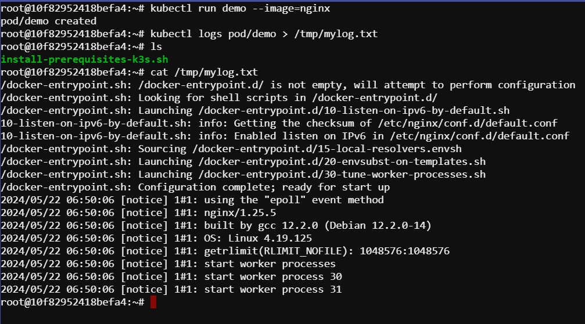

# Troubleshooting: Logs

## Task
Case 1 - Find the logs of the pod named `demo` and save that to `/tmp/mylog.txt` file.

Case 2 - Create a `multiple container pod` with multiple containers names `c1`,`c2` using `nginx` and `redis` image respectively and save the logs of container c2 to `/tmp/c2.txt` file.

## Common logs command

In Kubernetes, we can view logs from the containers by using the `logs` command.

- `kubectl logs demo`: to get the logs of the pod name demo.
- `kubectl logs -f demo`: to follow the logs for the pod name demo.
- `kubectl logs demo --all-containers=true`: to get logs from all containers.
- `kubectl logs demo -c <containername>`: to get logs from a specific container in case of multi-container pod.

- `kubectl logs -l app=nginx --all-containers=true`: logs form all containers in a pod with a specified label which in this case is app:nginx

- `kubectl logs -c c1 -p demo`: This will give logs from previously terminated container c1 from the demo pod. Useful when you are troubleshooting the crassloopbackoff error.

- `kubectl logs --tail=10 demo`: get most recent 10 line log output from the demo pod.

- `kubectl logs demo --all-containers=true --prefix=true`: to get logs with the log source.

## Solution

### Case 1: Find the logs of the pod named `demo` and save them to `/tmp/mylog.txt` file.

To find the logs of the pod named `demo` and save them to `/tmp/mylog.txt`, we can use the following commands:

First of all we have to create a pod  names `demo` with any image, let’s say nginx for this case.

```sh
kubectl run demo --image=nginx
```

```sh
kubectl logs pod/demo > /tmp/mylog.txt
```

This command retrieves the logs of the `demo` pod and redirects them to a file named `mylog.txt` located in the `/tmp` directory.

We can view the file content of `mylog.txt` by:




```sh
cat /tmp/mylog.txt
```

### Case 2: Create a multiple container pod with containers named `c1` and `c2` using nginx and redis images respectively, and save the logs of container `c2` to `/tmp/c2.txt` file.

To create a pod with multiple containers and save the logs of container `c2` to `/tmp/c2.txt`, we can use the following bare minimum YAML configuration:

```yaml
apiVersion: v1
kind: Pod
metadata:
  name: multi-container-pod
spec:
  containers:
    - name: c1
      image: nginx
    - name: c2
      image: redis
  restartPolicy: Never
```

Save this configuration to a file named for example `pod.yaml` and apply it using the `kubectl apply` command:

```sh
kubectl apply -f pod.yaml
```

Now, to save the logs of container `c2` to `/tmp/c2.txt`, we can use the following command:

```sh
kubectl logs multi-container-pod -c c2 > /tmp/c2.txt
```


This command retrieves the logs of container `c2` from the pod named `multi-container-pod` and saves them to a file named `c2.txt` located in the `/tmp` directory.