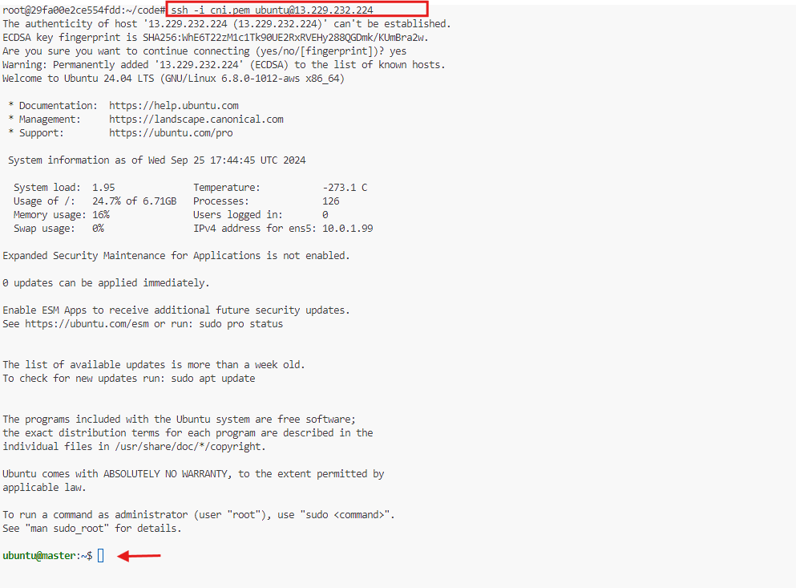
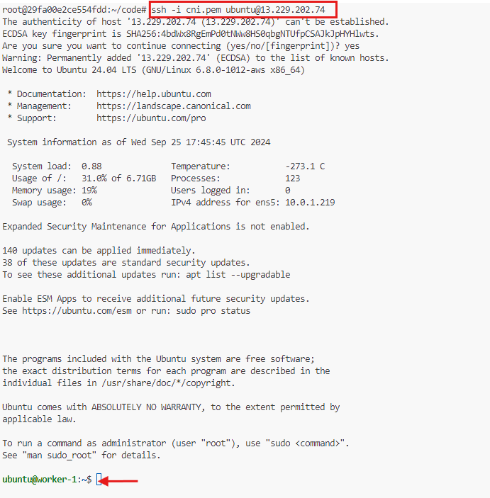
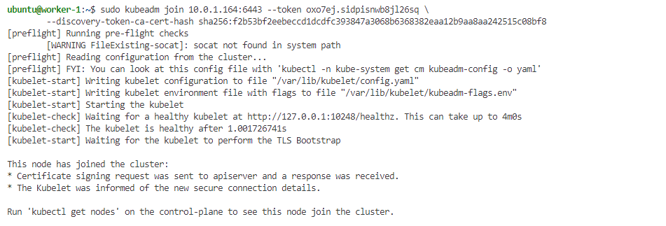
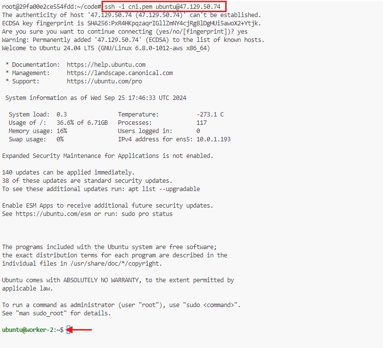
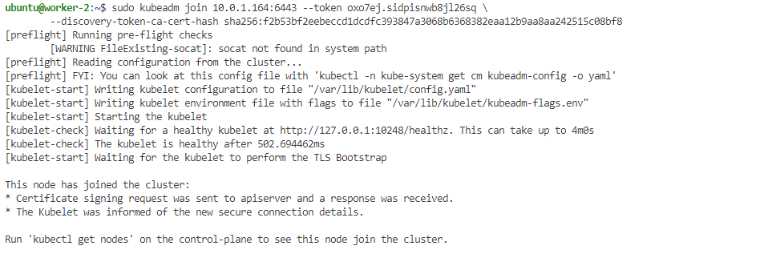
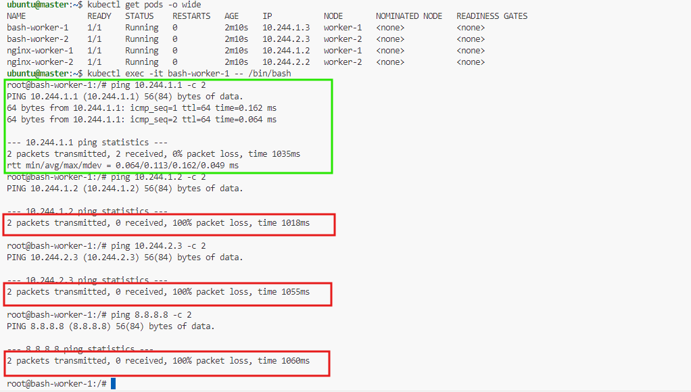

# **Dynamic IP Assignment for Kubernetes Pods with Bash CNI**

In Kubernetes, each pod must be assigned a unique IP address to communicate with other pods, the host system, and external networks. In this lab, we will implement dynamic IP assignment for Kubernetes pods using a custom **Bash CNI** plugin. By assigning IP addresses dynamically, we ensure efficient pod-to-pod and pod-to-host communication within the Kubernetes cluster.


### **What is CNI?**
CNI is a project under the **Cloud Native Computing Foundation (CNCF)** and consists of a specification and libraries used to configure networking for containers. It helps allocate and deallocate networking resources when containers are created or removed. CNI provides a standardized interface to ensure Kubernetes clusters can communicate consistently.

### **How CNI Works**
CNI works by integrating with container runtimes such as Docker. The runtime invokes the CNI when it creates or deletes containers. Here's a simplified process:
- **Container Creation**: The runtime calls the CNI, which configures networking for the container by setting up routes, namespaces, and interfaces. Once the network is configured, the runtime launches the container.
- **Container Deletion**: When a container is terminated, the runtime invokes the CNI again to clean up the networking resources.


### **CNI Plugins**
Kubernetes allows the use of various **CNI plugins**, which are responsible for networking tasks like IP address assignment, network configuration, and routing.

Popular plugins include:
- **Flannel**: Provides basic networking by creating an overlay network.
- **Calico**: Offers more advanced features such as network security policies and encryption.
- **Weave**: Facilitates networking across Kubernetes clusters, making it possible to connect pods across different nodes.
- **Cilium**: Provides enhanced security and network visibility by integrating with layers of the Linux kernel.

But we will use our own Custom CNI plugins.Which will gives us more clear idea about how CNI works in kubernetes

## **Objectives**

By the end of this lab, you will:

- Provision the necessary infrastructure for a Kubernetes cluster on AWS using Terraform.
- Modify the custom Bash CNI plugin to dynamically assign IP addresses to Kubernetes pods.
- Verify that pods are assigned unique IPs and can communicate with the host.
- Understand the Bash CNI plugin code that facilitates IP assignment.

## **Prerequisites**

Before starting this lab, ensure you have:

- An AWS account with programmatic access enabled.
- AWS CLI installed and configured.
- Terraform installed on your local machine.

## **Provision Infrastructure for Kubernetes Cluster**

We will use **Terraform** to automate the creation of AWS resources for our Kubernetes cluster. This includes setting up EC2 instances for the master and worker nodes, with the necessary tools for Kubernetes installed via user data scripts.


### **AWS CLI Configuration**

To configure AWS CLI, use the following command:

```bash
aws configure
```

This will prompt you to enter:

- **AWS Access Key ID**
- **AWS Secret Access Key**
- **Default region** (e.g., `ap-southeast-1`)
- **Output format** (e.g., `json`)

  

### **Terraform Configuration (`main.tf`)**

Create a `main.tf` file with the following configuration to set up your Kubernetes cluster infrastructure.

```hcl
# Provider configuration
provider "aws" {
  region = "ap-southeast-1" # Replace with your desired region
}

# Create a key pair and store it locally
resource "tls_private_key" "example" {
  algorithm = "RSA"
  rsa_bits  = 4096
}

resource "aws_key_pair" "my_key_pair" {
  key_name   = "cni"
  public_key = tls_private_key.example.public_key_openssh
}

resource "local_file" "private_key" {
  filename        = "${path.module}/cni.pem"
  content         = tls_private_key.example.private_key_pem
  file_permission = "0400"
}

# Create a VPC
resource "aws_vpc" "my_vpc" {
  cidr_block           = "10.0.0.0/16"
  enable_dns_support   = true
  enable_dns_hostnames = true
  tags = {
    Name = "my-vpc"
  }
}

# Create an Internet Gateway
resource "aws_internet_gateway" "my_igw" {
  vpc_id = aws_vpc.my_vpc.id
  tags = {
    Name = "my-igw"
  }
}

# Create a public subnet
resource "aws_subnet" "public_subnet" {
  vpc_id                  = aws_vpc.my_vpc.id
  cidr_block              = "10.0.1.0/24"
  map_public_ip_on_launch = true
  availability_zone       = "ap-southeast-1a"
  tags = {
    Name = "public-subnet"
  }
}

# Create a route table
resource "aws_route_table" "my_rt" {
  vpc_id = aws_vpc.my_vpc.id
  route {
    cidr_block = "0.0.0.0/0"
    gateway_id = aws_internet_gateway.my_igw.id
  }
  tags = {
    Name = "my-rt"
  }
}

# Associate the route table with the public subnet
resource "aws_route_table_association" "my_rt_association" {
  subnet_id      = aws_subnet.public_subnet.id
  route_table_id = aws_route_table.my_rt.id
}

# Create a security group allowing all traffic
resource "aws_security_group" "allow_all_traffic" {
  vpc_id = aws_vpc.my_vpc.id
  ingress {
    from_port   = 0
    to_port     = 0
    protocol    = "-1"
    cidr_blocks = ["0.0.0.0/0"]
  }
  egress {
    from_port   = 0
    to_port     = 0
    protocol    = "-1"
    cidr_blocks = ["0.0.0.0/0"]
  }
  tags = {
    Name = "allow-all-traffic"
  }
}

# Hostname and Kubernetes setup for each node
variable "user_data_master" {
  default = <<EOF
#!/bin/bash
sudo hostnamectl set-hostname master

# Install Docker
sudo apt-get update
sudo apt-get install -y apt-transport-https ca-certificates curl
sudo apt-get install -y docker.io

# Install Kubernetes components
curl -fsSL https://pkgs.k8s.io/core:/stable:/v1.31/deb/Release.key | sudo gpg --dearmor -o /etc/apt/keyrings/kubernetes-apt-keyring.gpg
echo 'deb [signed-by=/etc/apt/keyrings/kubernetes-apt-keyring.gpg] https://pkgs.k8s.io/core:/stable:/v1.31/deb/ /' | sudo tee /etc/apt/sources.list.d/kubernetes.list
sudo apt-get update
sudo apt-get install -y kubelet kubeadm kubectl

# Enable IP forwarding
sudo sysctl net.ipv4.ip_forward=1
EOF
}

variable "user_data_worker_1" {
  default = <<EOF
#!/bin/bash
sudo hostnamectl set-hostname worker-1

# Install Docker
sudo apt-get update
sudo apt-get install -y apt-transport-https ca-certificates curl
sudo apt-get install -y docker.io

# Install Kubernetes components
curl -fsSL https://pkgs.k8s.io/core:/stable:/v1.31/deb/Release.key | sudo gpg --dearmor -o /etc/apt/keyrings/kubernetes-apt-keyring.gpg
echo 'deb [signed-by=/etc/apt/keyrings/kubernetes-apt-keyring.gpg] https://pkgs.k8s.io/core:/stable:/v1.31/deb/ /' | sudo tee /etc/apt/sources.list.d/kubernetes.list
sudo apt-get update
sudo apt-get install -y kubelet kubeadm kubectl

# Enable IP forwarding
sudo sysctl net.ipv4.ip_forward=1
EOF
}

variable "user_data_worker_2" {
  default = <<EOF
#!/bin/bash
sudo hostnamectl set-hostname worker-2

# Install Docker
sudo apt-get update
sudo apt-get install -y apt-transport-https ca-certificates curl
sudo apt-get install -y docker.io

# Install Kubernetes components
curl -fsSL https://pkgs.k8s.io/core:/stable:/v1.31/deb/Release.key | sudo gpg --dearmor -o /etc/apt/keyrings/kubernetes-apt-keyring.gpg
echo 'deb [signed-by=/etc/apt/keyrings/kubernetes-apt-keyring.gpg] https://pkgs.k8s.io/core:/stable:/v1.31/deb/ /' | sudo tee /etc/apt/sources.list.d/kubernetes.list
sudo apt-get update
sudo apt-get install -y kubelet kubeadm kubectl

# Enable IP forwarding
sudo sysctl net.ipv4.ip_forward=1
EOF
}

# Create EC2 instances for master and workers
resource "aws_instance" "ec2_instances" {
  count                       = 3
  ami                         = var.ami_id
  instance_type               = var.instance_type
  subnet_id                   = aws_subnet.public_subnet.id
  vpc_security_group_ids      = [aws_security_group.allow_all_traffic.id]
  associate_public_ip_address = true
  key_name                    = aws_key_pair.my_key_pair.key_name
  
  # Assign different user_data to set the hostname for each instance
  user_data = lookup({
    0 = var.user_data_master
    1 = var.user_data_worker_1
    2 = var.user_data_worker_2
  }, count.index)

  tags = {
    Name = "ec2-instance-${count.index + 1}"
    Role = lookup({
      0 = "master"
      1 = "worker-1"
      2 = "worker-2"
    }, count.index)
  }
}
 # Output for private key and public IPs of instances
 output "private_key_path" {
   value = local_file.private_key.filename
 }
 
 output "ec2_public_ips_with_roles" {
  value = {
    "master"   = aws_instance.ec2_instances[0].public_ip
    "worker-1" = aws_instance.ec2_instances[1].public_ip
    "worker-2" = aws_instance.ec2_instances[2].public_ip
  }
}

# Variables for AMI and instance type
variable "ami_id" {
  default = "ami-01811d4912b4ccb26"  # Replace with your desired AMI
}

variable "instance_type" {
  default = "t3.small"
}
```

### **Applying the Terraform Configuration**

Once the `main.tf` file is created, follow these steps to apply the configuration and create the infrastructure:

1. **Initialize Terraform**:

   ```bash
   terraform init
   ```

2. **Apply the Terraform configuration**:

   ```bash
   terraform apply
   ```

   

Terraform will create the necessary infrastructure and output the public IPs of the EC2 instances and the path to the private key (`cni.pem`). You can use this information to SSH into the instances.

## **SSH into EC2 Instances and Set Up the Cluster**

Once the instances are provisioned, SSH into the **master** and **worker** nodes to complete the Kubernetes setup:

1. **SSH into the Master Node**:

   ```bash
   ssh -i cni.pem ubuntu@<master-public-ip>
   ```

   

2. **Initialize the Kubernetes Cluster on the Master Node**:

   ```bash
   sudo kubeadm init --pod-network-cidr=10.244.0.0/16
   ```

   

   *After running this command, Kubernetes will provide a `join command` needed to connect the worker nodes to the cluster. **Note down this join command** as you will use it later to join the worker nodes.*

3. **Set Up `kubectl` for the Master Node**:

   ```bash
   mkdir -p $HOME/.kube
   sudo cp -i /etc/kubernetes/admin.conf $HOME/.kube/config
   sudo chown $(id -u):$(id -g) $HOME/.kube/config
   ```

4. **SSH into Each Worker Node and Join the Cluster**:

   For **worker-1**:

   ```bash
   ssh -i cni.pem ubuntu@<worker-1-public-ip>
   ```
   

   ```bash
   sudo kubeadm join <master-ip>:6443 --token <token> --discovery-token-ca-cert-hash sha256:<hash>
   ```

   

   For **worker-2**:

   ```bash
   ssh -i cni.pem ubuntu@<worker-2-public-ip>
   ```

   

   ```bash
   sudo kubeadm join <master-ip>:6443 --token <token> --discovery-token-ca-cert-hash sha256:<hash>
   ```

   

### **Verify the Cluster Setup**

1. **Check the Status of the Nodes**:

   On the master node, run:

   ```bash
   kubectl get nodes
   ```

   

   Both master and worker nodes will show as **NotReady** until the CNI plugin is configured.

## **Setting Up Network Interfaces**

### **Create the Custom CNI Plug-in Configuration**

To implement networking for Kubernetes pods, we will create a custom CNI configuration.

1. **Create the CNI Configuration on Each Node (master, worker-1, worker-2)**:

   ```bash
   sudo nano /etc/cni/net.d/10-bash-cni-plugin.conf
   ```

2. **Add the Following Content**:

   ```json
   {
       "cniVersion": "0.3.1",
       "name": "mynet",
       "type": "bash-cni",
       "network": "10.244.0.0/16",
       "subnet": "<node-cidr-range>"
   }
   ```

   Replace `<node-cidr-range>` with:

   - `10.244.0.0/24` for the **master** node.
   - `10.244.1.0/24` for **worker-1**.
   - `10.244.2.0/24` for **worker-2**.

### **Create the `cni0` Bridge and Assign IP Addresses**

1. **Create the Network Bridge (`cni0`) on Each Node**:

   ```bash
   sudo brctl addbr cni0
   sudo ip link set cni0 up
   sudo ip addr add <bridge-ip>/24 dev cni0
   ```

   Replace `<bridge-ip>` with:
   - `10.244.0.1` for **master**.
   - `10.244.1.1` for **worker-1**.
   - `10.244.2.1` for **worker-2**.

   This prepares the network bridge on each node to facilitate pod-to-pod communication.

### **Verify the Network Configuration**

After setting up the `cni0` bridge and CIDR blocks, verify the successful creation of these interfaces:

1. **Check the Status of the `Network Bridge` on Each nodes**:

   ```bash
   sudo brctl show cni0
   ```
   For `master` node
 
   
 
   For `worker-1` node
 
   
 
   For `worker-2` node
   
   

2. **Verify IP Assignments for Each Bridge Interface**:

   ```bash
   ip addr show cni0
   ```

   For `master` node
   
   
 
   For `worker-1` node
 
   
 
   For `worker-2` node
 
   
   
   
   The output should show the respective IP addresses (`10.244.0.1`, `10.244.1.1`, `10.244.2.1`) assigned to the `cni0` bridge on each node
 
### **Check Node Status Again**

Now the nodes should be in a **Ready** state:

```bash
kubectl get nodes
```


## **Implementing the Bash CNI Plugin for IP Assignment**

Now we will create the Bash CNI plugin script to dynamically assign IP addresses to Kubernetes pods.

### **Create the Bash CNI Plugin Script**

1. **Create the CNI Plugin Directory and Script on Each Node**:

   ```bash
   sudo nano /opt/cni/bin/bash-cni
   ```

2. **Insert the Following Script**:

   ```bash
   #!/bin/bash -e

   # Redirect output to a log file
   exec 3>&1
   exec &>> /var/log/bash-cni-plugin.log

   # Define the location to store reserved IPs
   IP_STORE=/tmp/reserved_ips

   # Log the CNI command and input
   echo "CNI command: $CNI_COMMAND"
   stdin=$(cat /dev/stdin)
   echo "stdin: $stdin"

   # Function to allocate an available IP address
   allocate_ip(){
       for ip in "${all_ips[@]}"
       do
           reserved=false
           for reserved_ip in "${reserved_ips[@]}"
           do
               if [ "$ip" = "$reserved_ip" ]; then
                   reserved=true
                   break
               fi
           done
           if [ "$reserved" = false ] ; then
               echo "$ip" >> $IP_STORE
               echo "$ip"
               return
           fi
       done
   }

   case $CNI_COMMAND in
   ADD)
       mkdir -p /var/run/netns/
       ln -sfT $CNI_NETNS /var/run/netns/$CNI_CONTAINERID

       rand=$(tr -dc 'A-F0-9' < /dev/urandom | head -c4)
       host_if_name="veth$rand"
       ip link add $CNI_IFNAME type veth peer name $host_if_name

       ip link set $host_if_name up
       ip link set $host_if_name master cni0

       ip link set $CNI_IFNAME netns $CNI_CONTAINERID
       ip netns exec $CNI_CONTAINERID ip link set $CNI_IFNAME up

       # IP Assignment Logic
       subnet=$(echo "$stdin" | jq -r ".subnet")
       subnet_mask_size=$(echo $subnet | awk -F  "/" '{print $2}')
       base_ip=$(echo "$subnet" | awk -F '/' '{print $1}' | awk -F '.' '{print $1"."$2"."$3}')
       all_ips=($(seq -f "$base_ip.%g" 2 254))

       gw_ip="$base_ip.1"
       reserved_ips=$(cat $IP_STORE 2> /dev/null || printf "$base_ip.0\n$gw_ip\n")
       reserved_ips=(${reserved_ips[@]})
       printf '%s\n' "${reserved_ips[@]}" > $IP_STORE
       container_ip=$(allocate_ip)

       ip netns exec $CNI_CONTAINERID ip addr add $container_ip/$subnet_mask_size dev $CNI_IFNAME
       ip netns exec $CNI_CONTAINERID ip route add default via $gw_ip dev $CNI_IFNAME

       # Output JSON response
       mac=$(ip netns exec $CNI_CONTAINERID ip link show $CNI_IFNAME | awk '/ether/ {print $2}')
       echo "{
         \"cniVersion\": \"0.3.1\",
         \"interfaces\": [
             {
                 \"name\": \"$CNI_IFNAME\",
                 \"mac\": \"$mac\",
                 \"sandbox\": \"$CNI_NETNS\"
             }
         ],
         \"ips\": [
             {
                 \"version\": \"4\",
                 \"address\": \"$container_ip/$subnet_mask_size\",
                 \"gateway\": \"$gw_ip\",
                 \"interface\": 0
             }
         ]
       }" >&3

   ;;
   DEL)
       ip=$(ip netns exec $CNI_CONTAINERID ip addr show $CNI_IFNAME | awk '/inet / {print $2}' | sed s%/.*%% || echo "")
       if [ ! -z "$ip" ]
       then
           sed -i "/$ip/d" $IP_STORE
       fi
   ;;
   VERSION)
       echo '{
         "cniVersion": "0.3.1",
         "supportedVersions": [ "0.3.0", "0.3.1", "0.4.0" ]
       }' >&3
   ;;
   *)
     echo "Unknown CNI command: $CNI_COMMAND"
     exit 1
   ;;
   esac
   ```

3. **Make the Script Executable**:

   ```bash
   sudo chmod +x /opt/cni/bin/bash-cni
   ```

### Key Points of the Bash CNI Plugin Script:

1. **Logging Setup:**
   - The script logs all output to `/var/log/bash-cni-plugin.log` for debugging purposes. The command `exec &>> /var/log/bash-cni-plugin.log` ensures that all logs are directed to this file.

2. **IP Reservation:**
   - The `IP_STORE=/tmp/reserved_ips` variable defines where reserved IPs are stored. The file ensures that the same IP is not assigned to multiple containers by keeping a record of allocated IP addresses.

3. **CNI Command Handling:**
   - The script handles different CNI commands (`ADD`, `DEL`, `VERSION`) using a `case` statement:
     - **ADD**: Assigns an IP address to a container.
     - **DEL**: Removes the IP reservation when a container is deleted.
     - **VERSION**: Outputs the supported CNI versions.

4. **IP Allocation Logic:**
   - The `allocate_ip` function loops through available IPs and checks against reserved IPs. It assigns the first unreserved IP to the container.
   
5. **Creating the Veth Pair:**
   - The script creates a **veth pair** (virtual Ethernet interfaces) using `ip link add`, with one end attached to the container and the other to the host. The container-side interface is placed inside the container's network namespace using `ip netns exec $CNI_CONTAINERID`.

6. **IP and Route Configuration:**
   - After assigning the IP, the script sets up the IP address and default gateway for the container using:
     - `ip addr add $container_ip` for the IP assignment.
     - `ip route add default via $gw_ip` for the default route setup.

7. **JSON Response:**
   - After the network setup, the script outputs a JSON object that provides details of the interface, IP address, and gateway, which is required by the CNI specification.

8. **Deleting a Container's IP:**
   - On `DEL`, the script removes the container’s assigned IP from the reserved IPs list, allowing it to be reused later.

9. **Version Handling:**
   - The `VERSION` command outputs the CNI plugin's supported versions (CNI v0.3.1). This is a standard requirement for CNI plugins to advertise compatibility. 

This script dynamically manages IP address allocation and network setup for Kubernetes pods using the CNI (Container Network Interface) specification.

## **Testing IP Assignment and Pod Communication**

Now that we have implemented dynamic IP assignment, we will verify that pods are assigned IPs and can communicate with the host.

### **Deploy Pods for Testing**

1. **Create the YAML Configuration File (`deploy.yaml`)**:

   ```yaml
   apiVersion: v1
   kind: Pod
   metadata:
     name: nginx-worker-1
   spec:
     containers:
     - name: nginx
       image: nginx
       ports:
       - containerPort: 80
     nodeSelector:
       kubernetes.io/hostname: worker-1
   ---
   apiVersion: v1
   kind: Pod
   metadata:
     name: bash-worker-1
   spec:
     containers:
     - name: ubuntu
       image: smatyukevich/ubuntu-net-utils
       command:
         - "/bin/bash"
         - "-c"
         - "sleep 10000"
     nodeSelector:
       kubernetes.io/hostname: worker-1
   ---
   apiVersion: v1
   kind: Pod
   metadata:
     name: nginx-worker-2
   spec:
     containers:
     - name: nginx
       image: nginx
       ports:
       - containerPort: 80
     nodeSelector:
       kubernetes.io/hostname: worker-2
   ---
   apiVersion: v1
   kind: Pod
   metadata:
     name: bash-worker-2
   spec:
     containers:
     - name: ubuntu
       image: smatyukevich/ubuntu-net-utils
       command:
         - "/bin/bash"
         - "-c"
         - "sleep 10000"
     nodeSelector:
       kubernetes.io/hostname: worker-2
   ```

2. **Deploy the Pods**:

   ```bash
   kubectl apply -f deploy.yaml
   ```

   Here, we are deploying four simple pods.`bash-worker-1` & `nginx-worker-1` goes on the worker-1 and `bash-worker-2` & `nginx-worker-2` goes on the worker-2.Here explicitly tell the pods to scheduled on worker nodes ,but we can also scheduled pods on master node as we setup bash cni script and network infrasture for `master` node too.


3. **Verify IP Assignment for Each Pod**:

   ```bash
   kubectl get pods -o wide
   ```

   

   The pods should now have **dynamically assigned IP addresses** from the `10.244.x.x` subnet, confirming that IP assignment has been successfully implemented.

### **Test Pod Communication**

1. **Exec into `bash-worker-1` Pod**:

   ```bash
   kubectl exec -it bash-worker-1 -- /bin/bash
   ```

2. **Ping the Host from Within the Pod**:

   ```bash
   ping  10.244.1.1 -c 2
   ```

   This confirms that the pod can communicate with the host.

3. **Ping Another Pod on the Same Node**:

   ```bash
   ping  10.244.1.2 -c 2
   ```

   You might notice that the ping is unsuccessful. This is because inter-pod communication is not fully configured yet.

4. **Ping a Pod on a Different Node**:

   ```bash
   ping  10.244.2.3 -c 2
   ```

   This ping will also fail for the same reason.

5. **Ping an External Resource (Google DNS)**:

   ```bash
   ping  8.8.8.8 -c 2
   ```

   The ping will likely fail because we haven't set up NAT or proper routing to external networks.

   

**Note**: At this stage, the pods can only communicate with the host (the `cni0` bridge) because the necessary routing and forwarding rules are not in place. We will address these issues in the next labs.

### **Exit the Pod Shell**:

```bash
exit
```

## **Conclusion**

In this lab, we successfully implemented **dynamic IP assignment** for Kubernetes pods using a custom **Bash CNI** plugin. We created the `cni0` bridge, configured the CNI plugin script to assign IPs dynamically, and verified that pods receive unique IP addresses. While pods can communicate with the host, inter-pod communication and external network access require additional configuration, which we will address in subsequent labs.

In the upcoming labs, we will:

- Configure IP forwarding and routing to enable pod-to-pod communication across nodes.
- Set up NAT to allow pods to access external networks.
- Implement network policies for enhanced security.

Stay tuned to further enhance the networking capabilities of your Kubernetes cluster!