# Loki and Promtail Installation and Configuration Guide

This guide provides detailed instructions on how to install and configure **Loki** and **Promtail** for collecting, processing, and querying logs from different servers. We will set up Loki for storing logs and Promtail agents on two nodes **(Node1 and Node2)** to collect logs and forward them to the Loki server. Additionally, we will demonstrate how to query the logs using **Grafana**.


---

## Environment Overview

We will need three servers:
- **Loki Server:** This server runs Loki and stores logs,  which can be queried using Grafana.

- **Node1 & Node2:** These servers generate logs, which will be collected and sent to the Loki server via Promtail.


## Create AWS Infrastructure

**1. Configure AWS CLI**

```sh
aws configure
```


**2. Create a Directory for Your Infrastructure**

```sh
mkdir loki-infra
cd loki-infra
```

**3. Install Python venv**

```sh
sudo apt update
sudo apt install python3.8-venv -y
```

**4. Create a New Pulumi Project**

```sh
pulumi new aws-python
```


**5. Update the __main.py__ file:**

```python
import pulumi
import pulumi_aws as aws
import os

# Create a VPC
vpc = aws.ec2.Vpc(
    'kubernetes-vpc',
    cidr_block='10.0.0.0/16',
    enable_dns_support=True,
    enable_dns_hostnames=True,
    tags={'Name': 'kubernetes-the-hard-way'}
)

# Create a subnet
subnet = aws.ec2.Subnet(
    'kubernetes-subnet',
    vpc_id=vpc.id,
    cidr_block='10.0.1.0/24',
    map_public_ip_on_launch=True,
    tags={'Name': 'kubernetes'}
)

# Create an Internet Gateway
internet_gateway = aws.ec2.InternetGateway(
    'kubernetes-internet-gateway',
    vpc_id=vpc.id,
    tags={'Name': 'kubernetes'}
)

# Create a Route Table
route_table = aws.ec2.RouteTable(
    'kubernetes-route-table',
    vpc_id=vpc.id,
    routes=[
        aws.ec2.RouteTableRouteArgs(
            cidr_block='0.0.0.0/0',
            gateway_id=internet_gateway.id,
        )
    ],
    tags={'Name': 'kubernetes'}
)

# Associate the route table with the subnet
route_table_association = aws.ec2.RouteTableAssociation(
    'kubernetes-route-table-association',
    subnet_id=subnet.id,
    route_table_id=route_table.id
)

# Create a security group with egress and ingress rules
security_group = aws.ec2.SecurityGroup(
    'kubernetes-security-group',
    vpc_id=vpc.id,
    description="Kubernetes security group",
    ingress=[
        aws.ec2.SecurityGroupIngressArgs(
            protocol='-1',
            from_port=0,
            to_port=0,
            cidr_blocks=['0.0.0.0/0'],
        ),
        aws.ec2.SecurityGroupIngressArgs(
            protocol='tcp',
            from_port=22,
            to_port=22,
            cidr_blocks=['0.0.0.0/0'],
        ),
        aws.ec2.SecurityGroupIngressArgs(
            protocol='tcp',
            from_port=6443,
            to_port=6443,
            cidr_blocks=['0.0.0.0/0'],
        ),
        aws.ec2.SecurityGroupIngressArgs(
            protocol='tcp',
            from_port=443,
            to_port=443,
            cidr_blocks=['0.0.0.0/0'],
        ),
        aws.ec2.SecurityGroupIngressArgs(
            protocol='icmp',
            from_port=-1,
            to_port=-1,
            cidr_blocks=['0.0.0.0/0'],
        ),
    ],
    egress=[
        aws.ec2.SecurityGroupEgressArgs(
            protocol='-1',  # -1 allows all protocols
            from_port=0,
            to_port=0,
            cidr_blocks=['0.0.0.0/0'],  # Allow all outbound traffic
        )
    ],
    tags={'Name': 'kubernetes'}
)

# Create EC2 Instances for Controllers
controller_instances = []
for i in range(1):
    controller = aws.ec2.Instance(
        f'controller-{i}',
        instance_type='t2.small',
        ami='ami-01811d4912b4ccb26',  # Update with correct Ubuntu AMI ID
        subnet_id=subnet.id,
        key_name="loki",
        vpc_security_group_ids=[security_group.id],
        associate_public_ip_address=True,
        private_ip=f'10.0.1.1{i}',
        tags={
            'Name': f'controller-{i}'
        }
    )
    controller_instances.append(controller)

# Create EC2 Instances for Workers
worker_instances = []
for i in range(2):
    worker = aws.ec2.Instance(
        f'worker-{i}',
        instance_type='t2.small',
        ami='ami-01811d4912b4ccb26',  # Update with correct Ubuntu AMI ID
        subnet_id=subnet.id,
        key_name="loki",
        vpc_security_group_ids=[security_group.id],
        associate_public_ip_address=True,
        private_ip=f'10.0.1.2{i}',
        tags={'Name': f'worker-{i}'}
    )
    worker_instances.append(worker)

# Export Public and Private IPs of Controller and Worker Instances
controller_public_ips = [controller.public_ip for controller in controller_instances]
controller_private_ips = [controller.private_ip for controller in controller_instances]
worker_public_ips = [worker.public_ip for worker in worker_instances]
worker_private_ips = [worker.private_ip for worker in worker_instances]

pulumi.export('controller_public_ips', controller_public_ips)
pulumi.export('controller_private_ips', controller_private_ips)
pulumi.export('worker_public_ips', worker_public_ips)
pulumi.export('worker_private_ips', worker_private_ips)

# Export the VPC ID and Subnet ID for reference
pulumi.export('vpc_id', vpc.id)
pulumi.export('subnet_id', subnet.id)

# create config file
def create_config_file(ip_list):
    # Define the hostnames for each IP address
    hostnames = ['controller-0', 'worker-0', 'worker-1']
    
    config_content = ""
    
    # Iterate over IP addresses and corresponding hostnames
    for hostname, ip in zip(hostnames, ip_list):
        config_content += f"Host {hostname}\n"
        config_content += f"    HostName {ip}\n"
        config_content += f"    User ubuntu\n"
        config_content += f"    IdentityFile ~/.ssh/loki.id_rsa\n\n"
    
    # Write the content to the SSH config file
    config_path = os.path.expanduser("~/.ssh/config")
    with open(config_path, "w") as config_file:
        config_file.write(config_content)

# Collect the IPs for all nodes
all_ips = [controller.public_ip for controller in controller_instances] + [worker.public_ip for worker in worker_instances]

# Create the config file with the IPs once the instances are ready
pulumi.Output.all(*all_ips).apply(create_config_file)
```

**6. Generate the key Pair**

```sh
cd ~/.ssh/
aws ec2 create-key-pair --key-name loki --output text --query 'KeyMaterial' > loki.id_rsa
chmod 400 loki.id_rsa
```

**7. Create Infra**

```sh
pulumi up --yes
```

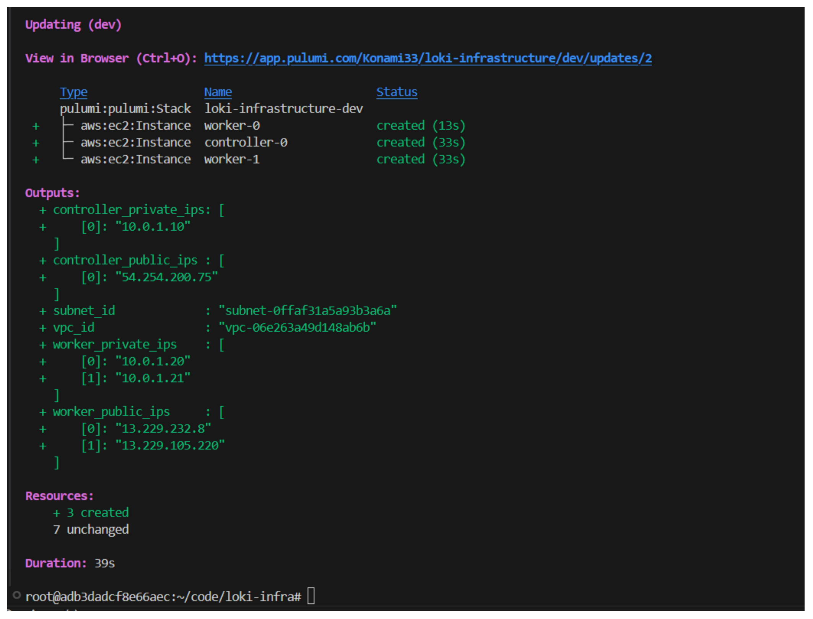


## Install Loki

**1. Navigate to the Loki Installation Page:**

- Visit the Loki documentation page, then go to the *Installation* section.
- Choose a method suitable for your environment. For local installation, select the "local" option.
  
**2. Download Loki:** From the **release** page, download the appropriate version for your system. For example, use the following command to download the binary:

```bash
wget https://github.com/grafana/loki/releases/download/v3.2.0/loki-linux-amd64.zip
```


   
**3. Unzip the Loki binary:**

```bash
unzip loki-linux-amd64.zip
```

**4. Get the Configuration File:** Download the sample configuration file:

```bash
wget https://raw.githubusercontent.com/grafana/loki/main/cmd/loki/loki-local-config.yaml
```


**5. Configure Loki:**

- Edit the configuration file if needed, for example, to change ports or storage options:
- Default ports:
    - HTTP: `3100`
    - gRPC: `9096`
- Default storage: Local filesystem.
- If you want to use cloud storage (e.g., S3), refer to the Loki documentation for additional configuration options.

**6. Start Loki:** Run Loki with the following command:

```bash
./loki-linux-amd64 -config.file=loki-local-config.yaml
```


### Verify Loki Installation

**Open a browser and navigate to Loki’s metrics endpoint:**
```bash
http://<LOKI_SERVER_PUBLIC_IP>:3100/metrics
```

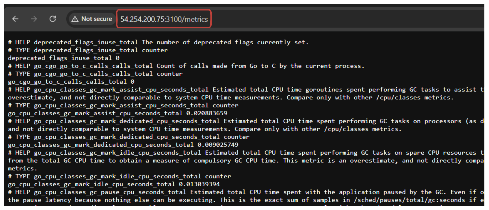

If you see the metrics output, the Loki server is running properly.**

---

## Installing Promtail on Nodes

**1. Download Promtail:** 

Navigate to the Loki release page and find the Promtail binary. For example:

```bash
wget https://github.com/grafana/loki/releases/download/v3.2.0/promtail-linux-amd64.zip
```

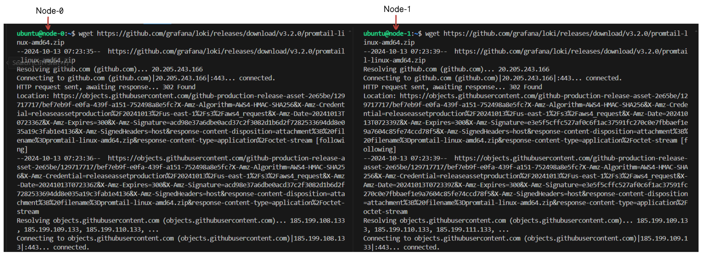

**2. Unzip Promtail:**

```bash
unzip promtail-linux-amd64.zip
```

### 3.2 Configure Promtail
**1. Get Promtail Configuration File:**

Download a basic Promtail configuration file:

```bash
wget https://raw.githubusercontent.com/grafana/loki/main/clients/cmd/promtail/promtail-local-config.yaml
```


**2. Edit Promtail Config:**

Update the Loki server URL under the `client` section:

```yaml
url: http://<LOKI_SERVER_PUBLIC_IP>:3100/loki/api/v1/push
```
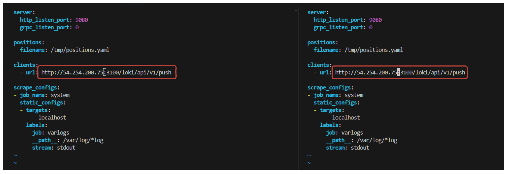

Define the log file paths to be collected under the `scrape_configs` section.

**3. Start Promtail:**

Run Promtail with the configuration file:

```bash
./promtail-linux-amd64 -config.file=promtail-local-config.yaml
```


> NOTE: Start on both nodes.

---

## Install Grafana Server

Install Grafana Server in the `Controller-0 instance`. Complete the following steps to install Grafana from the APT repository:

**1. Install the prerequisite packages:**

```sh
sudo apt-get install -y apt-transport-https software-properties-common wget
```

**2. Import the GPG key:**

```sh
sudo mkdir -p /etc/apt/keyrings/
wget -q -O - https://apt.grafana.com/gpg.key | gpg --dearmor | sudo tee /etc/apt/keyrings/grafana.gpg > /dev/null
```

**3. To add a repository for stable releases, run the following command:**

```sh
echo "deb [signed-by=/etc/apt/keyrings/grafana.gpg] https://apt.grafana.com stable main" | sudo tee -a /etc/apt/sources.list.d/grafana.list
```


**4. Run the following command to update the list of available packages:**

```sh
sudo apt-get update
```

**5. To install Grafana OSS, run the following command:**

```sh
sudo apt-get install grafana -y
```

**6. Start the Grafana server with systemd**

```sh
sudo systemctl daemon-reload
sudo systemctl start grafana-server
sudo systemctl status grafana-server
```

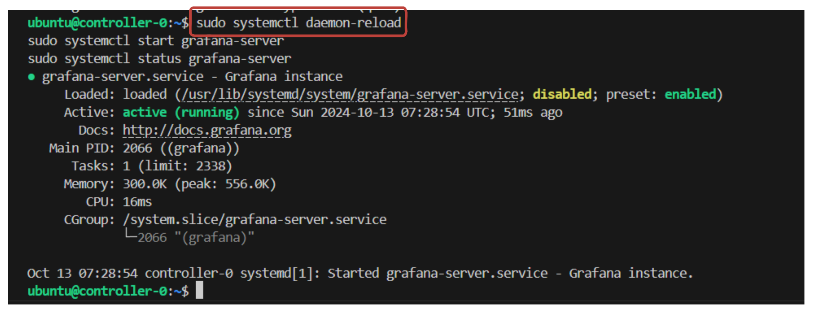

**7. Configure the Grafana server to start at boot using systemd**

```sh
sudo systemctl enable grafana-server.service
```

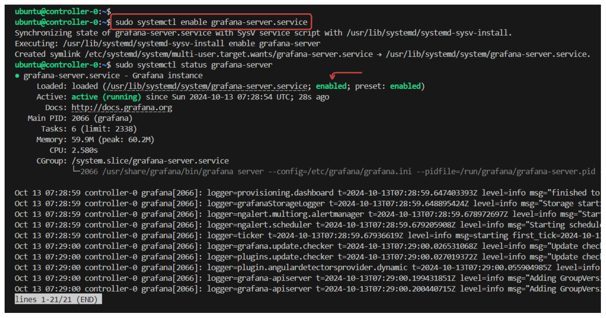

## Querying Logs with Grafana

### Setting up Grafana Data Source for Loki
1. Open Grafana and go to **Connections > Add Data Source**.
2. Select **Loki** as the data source and configure the URL (e.g., `http://<LOKI_SERVER_PUBLIC_IP>:3100` if Grafana is running on the same machine as Loki).

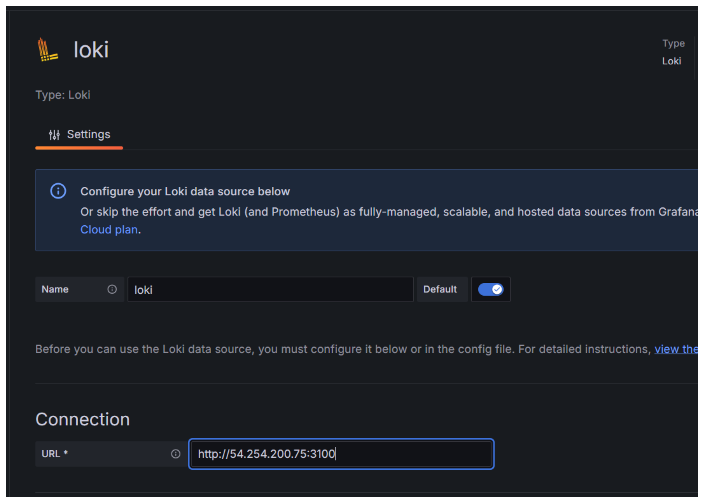

3. Save the data source and test the connection to ensure it works.

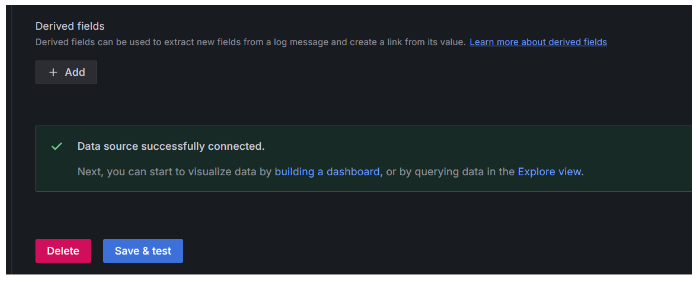

### Exploring Logs in Grafana

1. Go to **Explore** and select Loki as the data source.
2. Use the query builder to select labels like `job=varlogs` and view the logs: Example query for logs from `/var/log/syslog`:

    ```bash
    {job="varlogs", filename="/var/log/syslog"}
    ```
    

3. You can filter logs by specific keywords or regular expressions to narrow down results, such as searching for logs containing the term "systemd":

   ```bash
   {job="varlogs"} |= "systemd"
   ```

   
---

## Adding Application Logs to Promtail

Here’s a simple **Node.js** application that will run on `node-0` with basic **CRUD** (Create, Read, Update, Delete) operations using **Express.js** and **File System (fs)** to log requests in a log file.

### 1. **Create the Project Directory**

```bash
mkdir simple-crud-app
cd simple-crud-app
```

### 2. **Initialize a New Node.js Project**

Install npm
```sh
sudo apt install npm
```


Run the following command to create a new `package.json` file:
```bash
npm init -y
```


### 3. **Install Required Dependencies**

Install **Express.js** and **Nodemon** (optional, for automatic server reload during development):

```bash
npm install express
npm install --save-dev nodemon
```

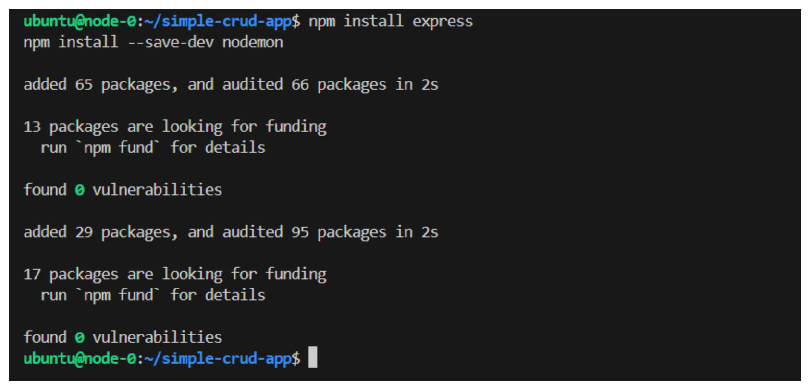

### 4. **Create Application Files**

#### 4.1 **Create `app.js`**

In the root directory of your project, create an `app.js` file for the application logic.

```bash
touch app.js
```

#### 4.2 **Write the Application Logic**

```javascript
const express = require('express');
const fs = require('fs');
const app = express();
const port = 4000;

app.use(express.json()); // Parse JSON bodies

// Simple in-memory data storage (can be replaced with a database)
let users = [];

// Helper function to log requests
const logRequest = (req, res, next) => {
    const log = `${new Date().toISOString()} - ${req.method} ${req.url} \n`;
    fs.appendFileSync('app.log', log, (err) => {
        if (err) {
            console.error('Error writing to log file', err);
        }
    });
    next();
};

// Apply log middleware
app.use(logRequest);

// CRUD Operations

// Create a new user (POST)
app.post('/users', (req, res) => {
    const user = req.body;
    users.push(user);
    res.status(201).json({ message: 'User created', user });
});

// Read all users (GET)
app.get('/users', (req, res) => {
    res.status(200).json(users);
});

// Read a specific user by ID (GET)
app.get('/users/:id', (req, res) => {
    const userId = req.params.id;
    const user = users.find(u => u.id === userId);
    if (!user) {
        return res.status(404).json({ message: 'User not found' });
    }
    res.status(200).json(user);
});

// Update a user (PUT)
app.put('/users/:id', (req, res) => {
    const userId = req.params.id;
    const newUser = req.body;
    const userIndex = users.findIndex(u => u.id === userId);

    if (userIndex === -1) {
        return res.status(404).json({ message: 'User not found' });
    }

    users[userIndex] = newUser;
    res.status(200).json({ message: 'User updated', newUser });
});

// Delete a user (DELETE)
app.delete('/users/:id', (req, res) => {
    const userId = req.params.id;
    const userIndex = users.findIndex(u => u.id === userId);

    if (userIndex === -1) {
        return res.status(404).json({ message: 'User not found' });
    }

    users.splice(userIndex, 1);
    res.status(200).json({ message: 'User deleted' });
});

// Start the server
app.listen(port, () => {
    console.log(`Server running on http://localhost:${port}`);
});
```

#### 4.3 **Create `app.log`**

Create an empty file to store the request logs.

```bash
touch app.log
```

### 5. **Configure Nodemon for Automatic Reloading**

In the `package.json` file, replace the `scripts` section with the following to use **Nodemon** for development:

```json
"scripts": {
  "start": "node app.js",
  "dev": "nodemon app.js"
}
```

Now, running `npm run dev` will start the server with automatic reloading.

### 6. **Run the Application**

Run the application using:
```bash
npm run dev
```

The server will start at `http://localhost:4000`.

### 7. **Test the Application**

You can test the CRUD operations using **Postman**, **curl**, or any HTTP client.

#### Example: Create a User (POST)
```bash
curl -X POST http://localhost:4000/users \
-H 'Content-Type: application/json' \
-d '{"id": "1", "name": "John Doe"}'
```

#### Example: Get All Users (GET)
```bash
curl http://localhost:4000/users
```

#### Example: Update a User (PUT)
```bash
curl -X PUT http://localhost:4000/users/1 \
-H 'Content-Type: application/json' \
-d '{"id": "1", "name": "Jane Doe"}'
```

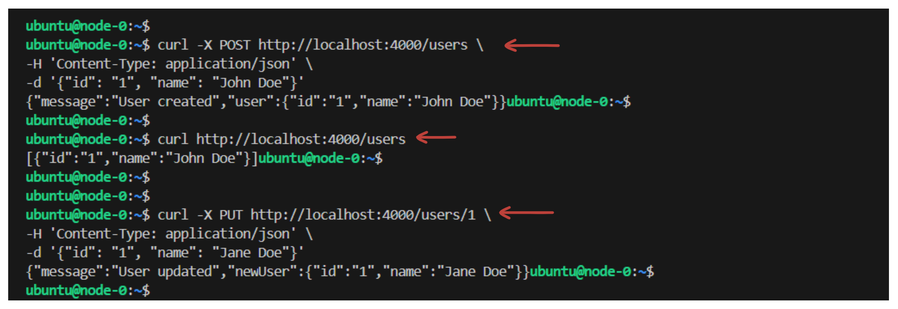

#### Example: Delete a User (DELETE)
```bash
curl -X DELETE http://localhost:4000/users/1
```

### 8. **Check the Log File**

All requests will be logged in the `app.log` file in the same directory.

Each log entry will look like this:


---

This application provides a basic CRUD structure and logs requests to `app.log`. You can expand it by connecting to a database like **MongoDB** or **MySQL** if needed.

### Update Promtail Configuration for Application Logs

**1. Open the Promtail configuration file (`promtail-local-config.yaml`).**

**2. Add a new scrape job to capture logs from the application's log directory:**

```yaml
- job_name: api
static_configs:
    - targets:
        - localhost
    labels:
        job: api_logs
        __path__: /home/ubuntu/simple-crud-app/*log
```

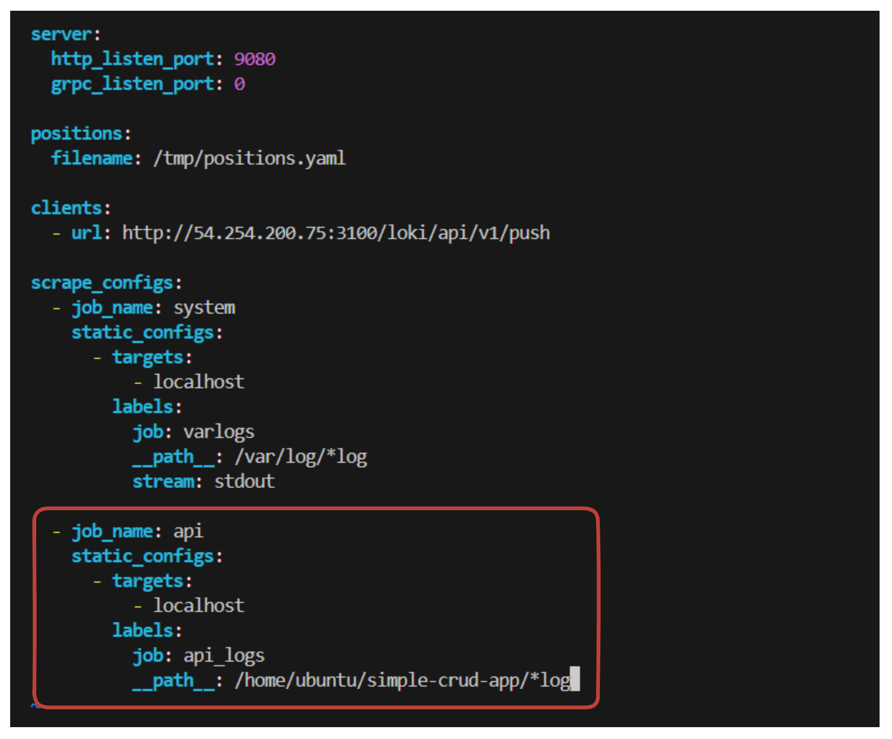

**3. Restart Promtail to apply the changes:**

```bash
./promtail-linux-amd64 -config.file=promtail-local-config.yaml
```


### Exploring Logs in Grafana

1. Go to **Explore** and select Loki as the data source.
2. Use the query builder to select labels like `job=varlogs` and view the logs: Example query for logs from `/var/log/syslog`:

    ```bash
    {filename="/home/ubuntu/simple-crud-app/app.log"} |= ``
    ```
    

3. You will get the `app.log` file information:

    
---

## 6. Conclusion

By following the steps above, you have set up a Loki instance to collect logs from multiple servers using Promtail agents. You can now explore and query your logs in Grafana to monitor application and system-level logs effectively. For advanced configurations, refer to the Loki and Promtail documentation for customization options such as using cloud storage, setting up retention policies, and handling large-scale log ingestion.