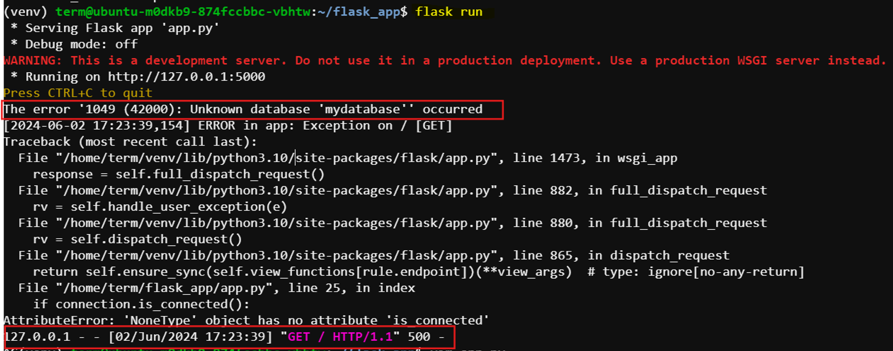
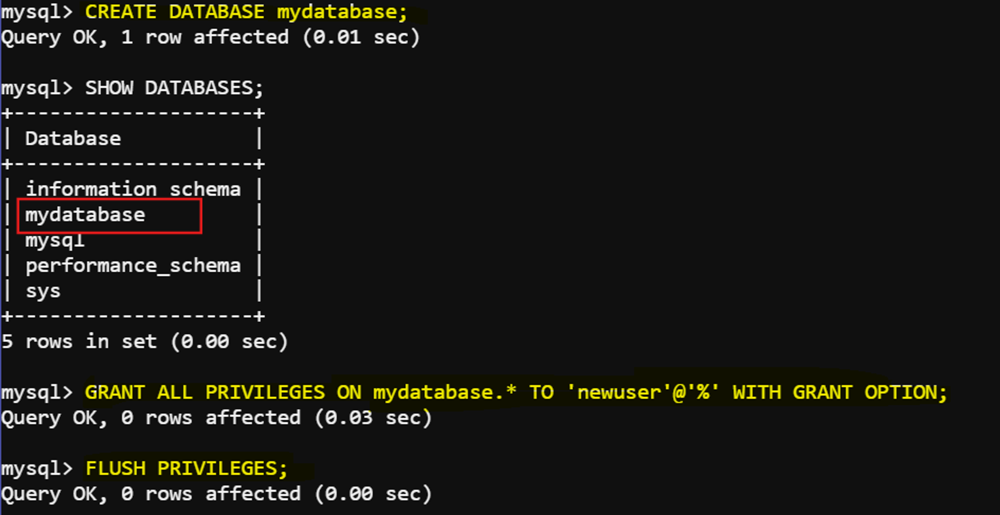

# Connect Flask App with MySQL  

Creating a Flask application that connects to a MySQL container using the new user involves several steps. Below are the steps to create and run the Flask app, including installing necessary packages, setting up the Flask app, and connecting it to the MySQL database.

## Run the MySQL container

```jsx
docker run --name mysql-container -e MYSQL_ROOT_PASSWORD=root -p 3306:3306 -d mysql:latest
```

## Access MySQL Server in Docker Container

```bash
sudo docker exec -it mysql-container mysql -uroot -proot
```

This command runs the MySQL client inside the Docker container named `mysql-container`, logging in as the `root` user with the password `root`.

## Create a New MySQL User

```sql
CREATE USER 'newuser'@'%' IDENTIFIED BY 'newpassword';
GRANT ALL PRIVILEGES ON *.* TO 'newuser'@'%' WITH GRANT OPTION;
FLUSH PRIVILEGES;
```

These SQL commands are executed within the MySQL client to:

1. Create a new user `newuser` with the password `newpassword`.
2. Grant all privileges on all databases and tables to `newuser` with the ability to grant those privileges to others.
3. Refresh the MySQL privilege tables to ensure the changes take effect.


## Install Python and Create a Virtual Environment

```bash
sudo apt-get update
sudo apt install python3.10-venv
python3 -m venv venv
source venv/bin/activate
```

## nstall Flask and MySQL Connector

```bash
pip install flask mysql-connector-python
```

## Create the Flask Application

Full Example Directory Structure

```
flask_app/
├── app.py
├── venv/
```

```bash
mkdir flask_app
cd flask_app
```

## Edit `app.py` :

```python
from flask import Flask, jsonify
import mysql.connector
from mysql.connector import Error

app = Flask(__name__)

def create_connection():
    connection = None
    try:
        connection = mysql.connector.connect(
            host="localhost",
            user="newuser",
            password="newpassword",
            database="mydatabase"
        )
        if connection.is_connected():
            print("Connected to MySQL database")
    except Error as e:
        print(f"The error '{e}' occurred")
    return connection

@app.route('/')
def index():
    connection = create_connection()
    if connection.is_connected():
        return jsonify(message="Connected to MySQL database")
    else:
        return jsonify(message="Failed to connect to MySQL database"), 500

if __name__ == "__main__":
    app.run(debug=True)

```

## Configure and Run the Flask App

**Set the Environment Variables for Flask**

In the terminal, set the environment variables (Linux/Mac):

```bash
export FLASK_APP=app.py
export FLASK_ENV=development
```

## **Run the Flask Application**

```bash
flask run
```

If we use the following command:

```bash
curl http://127.0.0.1:5000
```

We may get an error as follows.



Seems like there is no database named `mydatabase`. Let's solve the issue.

Let's see if there is any database of such name using the following command:

```bash
mysql -h 127.0.0.1 -u root -proot
````

```bash
SHOW DATABASES;
```


## Install MySQL Client

```bash
sudo apt-get update
sudo apt-get install mysql-client
```

These commands update the package lists for upgrades and new package installations, then install the MySQL client tools.

## Create `mydatabase` Database

Create the  `mydatabase`  and Verify Database Creation. 

```bash
mysql -h 127.0.0.1 -u root -proot
````

```bash
CREATE DATABASE mydatabase; 
SHOW DATABASES;
```

Grant Permissions to the New User (if not already done).

```bash
GRANT ALL PRIVILEGES ON mydatabase. * TO 'newuser'@'%' WITH GRANT OPTIONS;
FLUSH PRIVILEGES;
```




## **Run the Flask Application again**

```bash
flask run
```


## Verify the Connection
    
```bash
curl http://127.0.0.1:5000
```


    

### Notes:

- Ensure the `newuser` and `newpassword` match the credentials you created earlier.
- Adjust `host`, `user`, `password`, and `database` in `create_connection` function according to your setup.
- The `localhost` in the Flask app code assumes that the MySQL container is running on the same host as the Flask app. If it’s running on a different host, use the appropriate IP address.

By following these steps, you will create a Flask application that connects to your MySQL container using the new user you created.