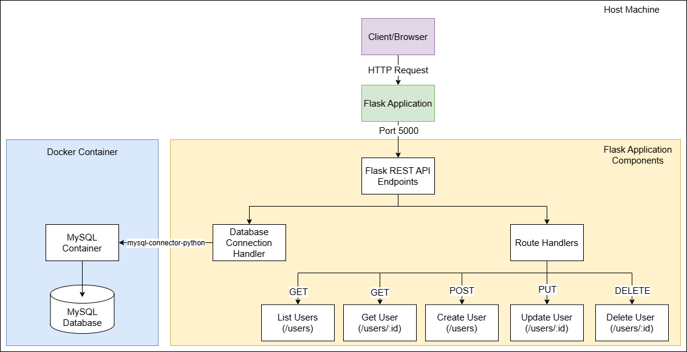
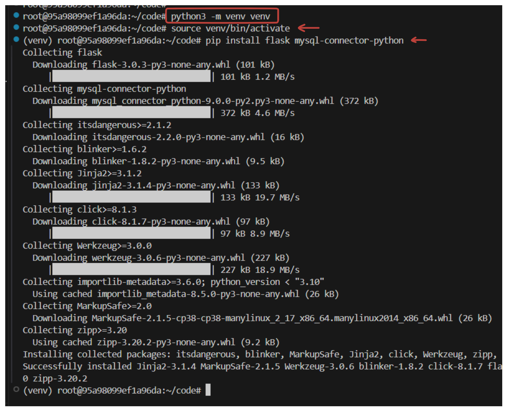
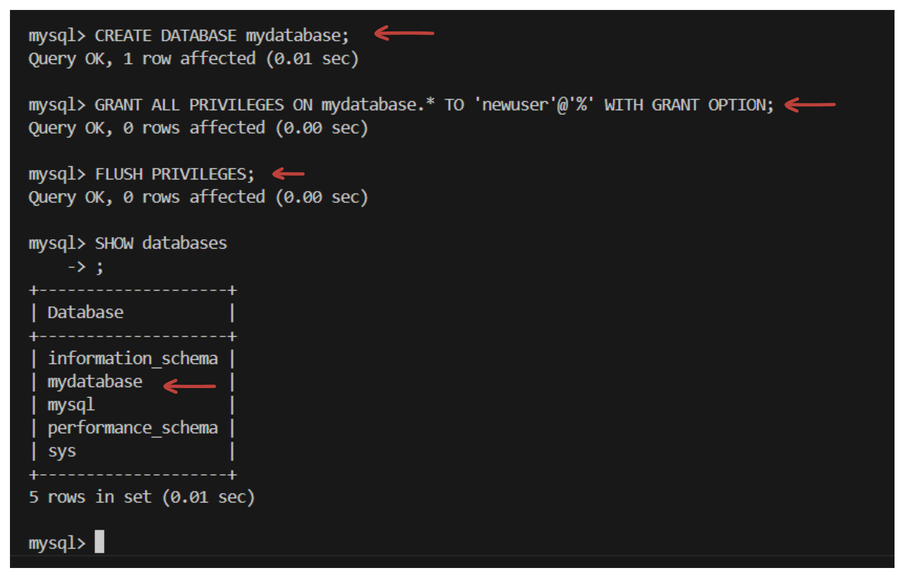
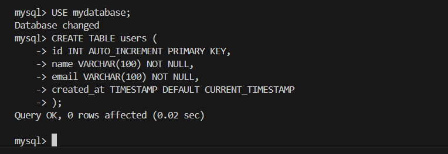

# Flask REST API with MySQL Container

This lab walks you through creating a Flask REST API that connects to a MySQL database running in a Docker container. We'll also create a new MySQL user specifically for this API to enhance security and manage access.

## Overview of Steps
1. Set up MySQL in Docker: Start a MySQL container with a root user and password.
2. Create a new MySQL user: Add a dedicated user with privileges for this API.
3. Create a Flask application: Build and configure the Flask API to interact with MySQL.
4. Connect to MySQL and test the API endpoints: Verify everything works and handle sample API requests.



## Run the MySQL Container

Start a MySQL container in Docker with the following command, which creates a MySQL server accessible on port 3306:

```bash
docker run --name mysql-container -e MYSQL_ROOT_PASSWORD=root -p 3306:3306 -d mysql:latest
```


>NOTE: Replace `root` with your desired root password.

## Access MySQL Server in Docker Container

Access the MySQL server to create a new user and manage databases:

```bash
sudo docker exec -it mysql-container mysql -u root -p
```


This command runs the MySQL client inside the Docker container named `mysql-container`, logging in as the `root` user with the password `root`.

## Create a New MySQL User

Run the following SQL commands in the MySQL client to create a new user:

```sql
CREATE USER 'newuser'@'%' IDENTIFIED BY 'newpassword';
GRANT ALL PRIVILEGES ON *.* TO 'newuser'@'%' WITH GRANT OPTION;
FLUSH PRIVILEGES;
```

These SQL commands are executed within the MySQL client to:

- Create a new user `newuser` with the password `newpassword`.
- Grant all privileges on all databases and tables to `newuser` with the ability to grant those privileges to others.
- Refresh the MySQL privilege tables to ensure the changes take effect.

>NOTE: Ensure the newuser credentials match those used in your Flask application’s database connection.

## Create the Flask Application

**Create a virtual environment and install the necessary packages:**

1. Install the virtual environment package (if not already installed).
2. Set up a virtual environment and install Flask and the MySQL connector:

```bash
sudo apt update
sudo apt install python3.8-venv
python3 -m venv venv
source venv/bin/activate
pip install flask mysql-connector-python
```


**Create the Flask Application and files**

Example Directory Structure

```bash
flask_app/
├── app.py
```

Create the directory structure for your Flask app:

```bash
mkdir flask_app
cd flask_app
```

**Build the Flask API Application**

Create a file named `app.py` with the following content:

```py
from flask import Flask, jsonify, request
import mysql.connector
from mysql.connector import Error

app = Flask(__name__)

# Database connection
def get_db_connection():
    connection = None
    try:
        connection = mysql.connector.connect(
            host="localhost",
            user="newuser",
            password="newpassword",
            database="mydatabase"
        )
        if connection.is_connected():
            print("Connected to MySQL database")
    except Error as e:
        print(f"The error '{e}' occurred")
    return connection

@app.route('/')
def index():
    conn = get_db_connection()
    if conn.is_connected():
        return jsonify(message="Connected to MySQL database")
    else:
        return jsonify(message="Failed to connect to MySQL database"), 500

@app.route('/users', methods=['GET'])
def get_users():
    try:
        conn = get_db_connection()
        cursor = conn.cursor(dictionary=True)
        cursor.execute('SELECT * FROM users')
        users = cursor.fetchall()
        return jsonify(users)
    except Error as e:
        return jsonify({"error": str(e)}), 500
    finally:
        cursor.close()
        conn.close()

@app.route('/users/<int:user_id>', methods=['GET'])
def get_user(user_id):
    try:
        conn = get_db_connection()
        cursor = conn.cursor(dictionary=True)
        cursor.execute('SELECT * FROM users WHERE id = %s', (user_id,))
        user = cursor.fetchone()
        if user:
            return jsonify(user)
        else:
            return jsonify({"error": "User not found"}), 404
    except Error as e:
        return jsonify({"error": str(e)}), 500
    finally:
        cursor.close()
        conn.close()

@app.route('/users', methods=['POST'])
def add_user():
    new_user = request.get_json()
    try:
        conn = get_db_connection()
        cursor = conn.cursor()
        cursor.execute('INSERT INTO users (name, email) VALUES (%s, %s)',
                       (new_user['name'], new_user['email']))
        conn.commit()
        return jsonify({"id": cursor.lastrowid}), 201
    except Error as e:
        return jsonify({"error": str(e)}), 500
    finally:
        cursor.close()
        conn.close()

@app.route('/users/<int:user_id>', methods=['PUT'])
def update_user(user_id):
    update_user = request.get_json()
    try:
        conn = get_db_connection()
        cursor = conn.cursor()
        cursor.execute('UPDATE users SET name = %s, email = %s WHERE id = %s',
                       (update_user['name'], update_user['email'], user_id))
        conn.commit()
        if cursor.rowcount == 0:
            return jsonify({"error": "User not found"}), 404
        return jsonify({"message": "User updated successfully"})
    except Error as e:
        return jsonify({"error": str(e)}), 500
    finally:
        cursor.close()
        conn.close()

@app.route('/users/<int:user_id>', methods=['DELETE'])
def delete_user(user_id):
    try:
        conn = get_db_connection()
        cursor = conn.cursor()
        cursor.execute('DELETE FROM users WHERE id = %s', (user_id,))
        conn.commit()
        if cursor.rowcount == 0:
            return jsonify({"error": "User not found"}), 404
        return jsonify({"message": "User deleted successfully"})
    except Error as e:
        return jsonify({"error": str(e)}), 500
    finally:
        cursor.close()
        conn.close()

if __name__ == '__main__':
    app.run(debug=True)
```

**Configure and Run the Flask App**

1. Set environment variables to enable debug mode and specify the application file:

    ```bash
    export FLASK_APP=app.py
    export FLASK_ENV=development
    ```

2. Run the flask application

    ```bash
    flask run
    ```
3. Check API endpoints ('/'):

    ```bash
    curl localhost:5000
    ```

    

Here we can see, there is no database named `mydatabase`. So we have to create a database. To do that we can use `MySQL Client`.

## Install MySQL Client

To create the mydatabase database from the MySQL client, install MySQL tools:

```bash
sudo apt-get update
sudo apt-get install mysql-client
```

These commands update the package lists for upgrades and new package installations, then install the MySQL client tools.

## Database Creation

Create Database named `mydatabase` and verify Database Creation. Grant Permissions to the New User (if not already done).

```bash
mysql -h 127.0.0.1 -u root -p
```

```sql
CREATE DATABASE mydatabase;
GRANT ALL PRIVILEGES ON mydatabase.* TO 'newuser'@'%' WITH GRANT OPTION;
FLUSH PRIVILEGES;
```


## Create table in the `mydatabase`

To perform api endpoints we have to create a `user` table in the `mydatabase`

**1. Use the database**

```bash
USE mydatabase;
```

**3. Create the `users` Table:**

Create the **`users`** table with the necessary columns. Here is an example SQL statement to create the table with **`id`**, **`name`**, and **`email`** columns:

```sql
CREATE TABLE users (
	id INT AUTO_INCREMENT PRIMARY KEY,
	name VARCHAR(100) NOT NULL,
	email VARCHAR(100) NOT NULL,
	created_at TIMESTAMP DEFAULT CURRENT_TIMESTAMP
);
```



**4. Verify Table Creation:**

Check that the table was created successfully:

```sql
SHOW TABLES;
```


**5. Exit MySQL:**

Exit the MySQL shell:

```sql
EXIT;
```

## Test API Endpoints

**1. Test Database Connection**

```sh
curl localhost:5000
```


**2. Add Users:**

```sh
curl -X POST -H "Content-Type: application/json" -d '{"name": "John Doe", "email": "john@example.com"}' http://localhost:5000/users
```


**3. Get Users**

```sh
curl http://localhost:5000/users
```
**3. Get User by ID**

```bash
curl http://localhost:5000/users/<user_id>
```


Replace `user_id` with the ID of the user you want to retrieve.

**4. Delete User by ID:**

```bash
curl -X DELETE http://localhost:5000/users/<user_id>
```

Replace **`<user_id>`** with the actual ID of the user you want to delete.


### Notes:

- Ensure the `newuser` and `newpassword` match the credentials you created earlier.
- Adjust `host`, `user`, `password`, and `database` in `create_connection` function according to your setup.
- The `localhost` in the Flask app code assumes that the MySQL container is running on the same host as the Flask app. If it’s running on a different host, use the appropriate IP address.

By following these steps, you will create a Flask application that connects to your MySQL container using the new user you created.