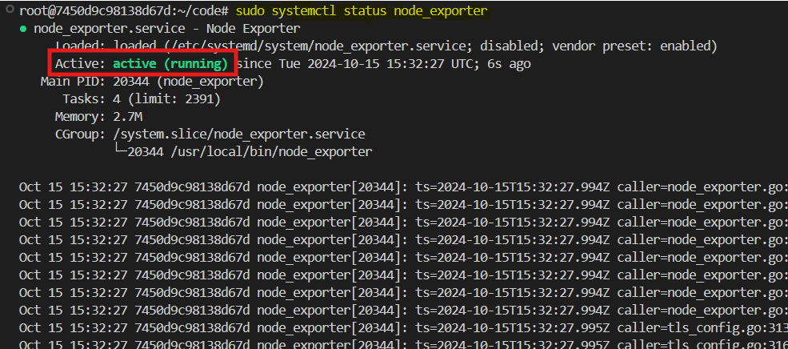

# Node Exporter Installation

### Node Exporter

Node Exporter is a key component in monitoring system-level metrics for Linux hosts, providing detailed information such as CPU usage, memory, disk I/O, and other system-level activities. It works by collecting these metrics and exposing them on an HTTP endpoint, which Prometheus can scrape and monitor. Node Exporter is highly efficient and is the go-to solution for monitoring bare-metal servers or virtual machines in production environments.


### In this lab, we will cover two ways to install `Node Exporter`:

1. **Binary Installation** – Quick setup by directly running the binary file.
2. **SystemD Installation** – Configure Node Exporter to run as a background service managed by SystemD.


## **Binary Installation of Node Exporter**

### **Step 1: Download Node Exporter**
1. Navigate to the Prometheus [download page](https://prometheus.io/download/#node_exporter).
2. Copy the URL for the desired Node Exporter version.

   Example:
   ```bash
   wget https://github.com/prometheus/node_exporter/releases/download/v1.8.2/node_exporter-1.8.2.linux-amd64.tar.gz
   ```

### **Step 2: Extract the Tar File**
1. Untar the downloaded file:
   ```bash
   tar -xvf node_exporter-1.8.2.linux-amd64.tar.gz
   ```

2. Move into the extracted folder:
   ```bash
   cd node_exporter-1.8.2.linux-amd64
   ```

### **Step 3: Start Node Exporter**
1. Run the Node Exporter executable:
   ```bash
   ./node_exporter
   ```

   By default, Node Exporter runs on port `9100`.

### **Step 4: Verify the Metrics**
1. Open a new terminal and run the following `curl` command to test if the Node Exporter is running:
   ```bash
   curl http://localhost:9100/metrics
   ```

   This will output all the metrics collected by Node Exporter.


The problem with this step is that `Node Exporter` runs in the foreground and stops if the terminal is closed. Additionally, it won't automatically start after a system reboot, making it less reliable for long-term monitoring.


## **SystemD Installation of Node Exporter**

SystemD installation is important because it allows Node Exporter to run as a background service, ensuring it automatically starts on system boot and can be easily managed (started, stopped, restarted) using `systemctl` commands. This makes Node Exporter more reliable and easier to maintain in production environments compared to running it manually in the foreground.

### **Step 1: Move the Node Exporter Binary**
1. After downloading and extracting Node Exporter as described in the **Binary Installation**, move the binary to `/usr/local/bin`:
   ```bash
   sudo mv node_exporter /usr/local/bin/
   ```

   You can check as follows:

   

### **Step 2: Create a Node Exporter User**
1. Create a system user for Node Exporter without a home directory or login:
   ```bash
   sudo useradd --no-create-home --shell /bin/false node_exporter
   ```

### **Step 3: Set Ownership of the Binary**
1. Assign ownership of the Node Exporter binary to the newly created user:
   ```bash
   sudo chown node_exporter:node_exporter /usr/local/bin/node_exporter
   ```

### **Step 4: Create the Node Exporter SystemD Service**
1. Create a new service file for Node Exporter:
   ```bash
   sudo nano /etc/systemd/system/node_exporter.service
   ```

2. Add the following configuration to the service file:
   ```ini
   [Unit]
   Description=Node Exporter
   Wants=network-online.target
   After=network-online.target

   [Service]
   User=node_exporter
   Group=node_exporter
   ExecStart=/usr/local/bin/node_exporter

   [Install]
   WantedBy=default.target
   ```

   The service file for Node Exporter defines how the system should manage the service:

    - **[Unit]**: Describes the service and specifies that it should start after the network is available.
    - **[Service]**: Defines the user, group, and the command to run the Node Exporter binary.
    - **[Install]**: Specifies that the service should be enabled to start automatically on system boot.

    This configuration ensures Node Exporter runs as a managed service, with system-level controls for starting and stopping.

### **Step 5: Reload SystemD and Start Node Exporter**
1. Reload the systemd daemon to recognize the new service:
   ```bash
   sudo systemctl daemon-reload
   ```

2. Start the Node Exporter service:
   ```bash
   sudo systemctl start node_exporter
   ```

3. Check the status to ensure it's running:
   ```bash
   sudo systemctl status node_exporter
   ```

    Expected status:

    

### **Step 6: Enable Node Exporter to Start on Boot**
1. To enable Node Exporter on system startup:
   ```bash
   sudo systemctl enable node_exporter
   ```

### **Step 7: Verify the Metrics**
1. Use `curl` to check if Node Exporter is running correctly:
   ```bash
   curl http://localhost:9100/metrics
   ```

   You should see all the metrics being served by Node Exporter.


## **Conclusion**

You've now successfully installed Node Exporter using both the binary and systemd methods. The metrics can now be scraped by Prometheus by adding this target to your Prometheus configuration.