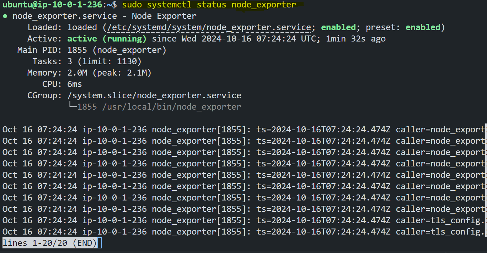
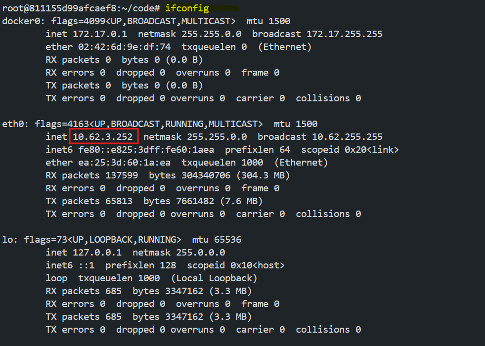

# Configuring Prometheus to Monitor an AWS EC2 Instance using Terraform and Node Exporter

In this lab, you will configure Prometheus on `Poridhi's VM` to monitor an AWS EC2 instance using Node Exporter for metrics collection. We will use Terraform to create the AWS infrastructure, install Node Exporter on the EC2 instance, and validate the Prometheus configuration using Promtool.


**Prometheus**: An open-source monitoring system that collects and stores metrics from configured targets.

**Node Exporter**: A tool used to expose hardware and OS metrics for monitoring via Prometheus.

**Promtool**: A command-line utility provided by Prometheus to validate configuration files, ensuring there are no syntax errors.

**Terraform**: An infrastructure as code tool that allows you to define and provision AWS resources in a declarative manner.

## Set Up Infrastructure with Terraform

Here we are going to create a simple VPC, Subnet, Internet Gateway, Route Table, Route Table Association, Security Group, Key Pair, and EC2 Instance using Terraform.


1. **Configure AWS CLI**:
   - Set up your AWS credentials for Terraform to use:
   
   ```bash
   aws configure
   ```
   

   *Note: Install `AWS CLI` and `Terraform` if you are working on your local machine ,as we are working on `Poridhi's VM` ,we have already installed `AWS CLI` and `Terraform`.*
   

2. **Create an SSH Key Pair**:

   - Create a folder named `terraform-aws-prometheus`.
   
   ```bash
   mkdir terraform-aws-prometheus
   ```

   - Generate a key pair to use for accessing the EC2 instance:
   
   ```bash
   ssh-keygen -t rsa -b 4096 -f prometheus_key_pair
   ```
   

   *This command will generate `prometheus_key_pair` (private key) and `prometheus_key_pair.pub` (public key) files.*

3. **Write the Terraform Script**:

   - Create a `main.tf` file with the following content:

    ```hcl
    provider "aws" {
      region = "ap-southeast-1"
    }

    resource "aws_vpc" "prometheus_vpc" {
      cidr_block = "10.0.0.0/16"
      enable_dns_support = true
      enable_dns_hostnames = true
    }

    resource "aws_subnet" "public_subnet" {
      vpc_id                  = aws_vpc.prometheus_vpc.id
      cidr_block              = "10.0.1.0/24"
      map_public_ip_on_launch = true
      availability_zone       = "ap-southeast-1a"
    }

    resource "aws_internet_gateway" "igw" {
      vpc_id = aws_vpc.prometheus_vpc.id
    }

    resource "aws_route_table" "public_route_table" {
      vpc_id = aws_vpc.prometheus_vpc.id

      route {
        cidr_block = "0.0.0.0/0"
        gateway_id = aws_internet_gateway.igw.id
      }
    }

    resource "aws_route_table_association" "route_table_association" {
      subnet_id      = aws_subnet.public_subnet.id
      route_table_id = aws_route_table.public_route_table.id
    }

    resource "aws_security_group" "prometheus_sg" {
      vpc_id      = aws_vpc.prometheus_vpc.id
      description = "Allow HTTP, Node Exporter, and SSH access"

      ingress {
        from_port   = 22
        to_port     = 22
        protocol    = "tcp"
        cidr_blocks = ["0.0.0.0/0"]
      }

      ingress {
        from_port   = 9090
        to_port     = 9090
        protocol    = "tcp"
        cidr_blocks = ["0.0.0.0/0"]
      }

      ingress {
        from_port   = 9100
        to_port     = 9100
        protocol    = "tcp"
        cidr_blocks = ["0.0.0.0/0"]
      }

      egress {
        from_port   = 0
        to_port     = 0
        protocol    = "-1"
        cidr_blocks = ["0.0.0.0/0"]
      }
    }

    resource "aws_key_pair" "prometheus_key_pair" {
      key_name   = "prometheus_key_pair"
      public_key = file("prometheus_key_pair.pub")
    }

    resource "aws_instance" "prometheus_instance" {
      instance_type          = "t2.micro"
      ami                    = "ami-047126e50991d067b" 
      subnet_id              = aws_subnet.public_subnet.id
      key_name               = aws_key_pair.prometheus_key_pair.key_name
      vpc_security_group_ids = [aws_security_group.prometheus_sg.id]

      tags = {
        Name = "PrometheusNodeInstance"
      }
    }

    output "public_ip" {
      value = aws_instance.prometheus_instance.public_ip
    }
    ```

4. **Deploy the Terraform Infrastructure**:
   
   ```bash
   terraform init
   terraform apply
   ```
   
   - Review the proposed changes and confirm to deploy the infrastructure.

   

### Install Prometheus and Node Exporter

1. **Create Installation Scripts**:

   - **Create `prometheus.sh` to Install Prometheus on `Poridhi's VM` with the following content**:
    
    ```bash
    #!/bin/bash
    
    # Variables
    PROM_VERSION="2.53.2"
    PROM_USER="prometheus"
    PROM_DIR="/etc/prometheus"
    PROM_LIB_DIR="/var/lib/prometheus"
    PROM_BINARY_URL="https://github.com/prometheus/prometheus/releases/download/v${PROM_VERSION}/prometheus-${PROM_VERSION}.linux-amd64.tar.gz"
    PROM_BIN_PATH="/usr/local/bin"
    
    # Install wget and tar
    sudo apt-get update && sudo apt-get install -y wget tar
    
    # Download and extract Prometheus
    wget $PROM_BINARY_URL && tar -xvzf prometheus-${PROM_VERSION}.linux-amd64.tar.gz
    
    # Move binaries and config files
    sudo mv prometheus-${PROM_VERSION}.linux-amd64/{prometheus,promtool} $PROM_BIN_PATH/
    sudo mkdir -p $PROM_DIR $PROM_LIB_DIR && sudo mv prometheus-${PROM_VERSION}.linux-amd64/{prometheus.yml,consoles,console_libraries} $PROM_DIR/
    
    # Create Prometheus user and assign permissions
    sudo useradd --no-create-home --shell /bin/false $PROM_USER
    sudo chown -R $PROM_USER:$PROM_USER $PROM_DIR $PROM_LIB_DIR
    
    # Create systemd service file
    sudo tee /etc/systemd/system/prometheus.service > /dev/null <<EOT
    [Unit]
    Description=Prometheus Monitoring System
    Wants=network-online.target
    After=network-online.target
    
    [Service]
    User=$PROM_USER
    ExecStart=$PROM_BIN_PATH/prometheus --config.file=$PROM_DIR/prometheus.yml --storage.tsdb.path=$PROM_LIB_DIR
    
    [Install]
    WantedBy=multi-user.target
    EOT
    
    # Reload systemd, enable and start Prometheus
    sudo systemctl daemon-reload
    sudo systemctl enable --now prometheus
    
    # Check status
    sudo systemctl status prometheus
    ```

   - Save this script and run it:
   
    ```bash
    chmod +x prometheus.sh
    ./prometheus.sh
    ```
    This will install Prometheus on the EC2 instance.You can verify the installation by checking the status of the Prometheus service:

    ```bash
    sudo systemctl status prometheus
    ```

    

2. **Create `exporter.sh` to Install Node Exporter on EC2 Instance**:
   - `ssh` into the EC2 instance.

    ```bash
    ssh -i "prometheus_key_pair" ubuntu@<public-ip>
    ```

    You can get the public IP of the EC2 instance from the `terraform output` command.

    ```bash
    terraform output
    ```
    

   - **Create `exporter.sh` script**:

   ```bash
   #!/bin/bash

   # Variables
   NODE_EXPORTER_VERSION="1.8.2"
   NODE_EXPORTER_USER="node_exporter"
   NODE_EXPORTER_BINARY_URL="https://github.com/prometheus/node_exporter/releases/download/v${NODE_EXPORTER_VERSION}/node_exporter-${NODE_EXPORTER_VERSION}.linux-amd64.tar.gz"
   NODE_EXPORTER_BIN_PATH="/usr/local/bin"

   # Install wget and tar
   sudo apt-get update && sudo apt-get install -y wget tar

   # Download and extract Node Exporter
   wget $NODE_EXPORTER_BINARY_URL && tar -xvzf node_exporter-${NODE_EXPORTER_VERSION}.linux-amd64.tar.gz

   # Move Node Exporter binary
   sudo mv node_exporter-${NODE_EXPORTER_VERSION}.linux-amd64/node_exporter $NODE_EXPORTER_BIN_PATH/

   # Create a Node Exporter user (non-root)
   sudo useradd --no-create-home --shell /bin/false $NODE_EXPORTER_USER

   # Set ownership of the binary
   sudo chown $NODE_EXPORTER_USER:$NODE_EXPORTER_USER $NODE_EXPORTER_BIN_PATH/node_exporter

   # Create a systemd service file
   sudo tee /etc/systemd/system/node_exporter.service > /dev/null <<EOT
   [Unit]
   Description=Node Exporter
   Wants=network-online.target
   After=network-online.target

   [Service]
   User=$NODE_EXPORTER_USER
   Group=$NODE_EXPORTER_USER
   ExecStart=$NODE_EXPORTER_BIN_PATH/node_exporter

   [Install]
   WantedBy=multi-user.target
   EOT

   # Reload systemd, enable and start Node Exporter
   sudo systemctl daemon-reload
   sudo systemctl enable --now node_exporter

   # Check status
   sudo systemctl status node_exporter
   ```

   - Run the script:
   
   ```bash
   chmod +x exporter.sh
   ./exporter.sh
   ```

   This will install Node Exporter on the EC2 instance.You can verify the installation by checking the status of the Node Exporter service:

   ```bash
   sudo systemctl status node_exporter
   ```

   

### Configure Prometheus to Monitor the Node

1. **Update Prometheus Configuration File**:
   - Edit the `prometheus.yml` file in `Poridhi's VM` to add a new job named 'node'. Replace `<PUBLIC_IP>` with the actual public IP of your EC2 instance.

   ```bash
   sudo vim /etc/prometheus/prometheus.yml
   ```

   ```yaml
   scrape_configs:
     - job_name: 'prometheus'
       static_configs:
         - targets: ['localhost:9090']

     - job_name: 'node'
       static_configs:
         - targets: ['<PUBLIC_IP>:9100']
   ```

   

2. **Validate Prometheus Configuration**:
   - Use Promtool to validate the Prometheus configuration file:
   
   ```bash
   promtool check config /etc/prometheus/prometheus.yml
   ```

   

   *Promtool is a command-line utility provided by Prometheus to validate configuration files, ensuring there are no syntax errors.*

3. **Restart Prometheus Service**:

   ```bash
   sudo systemctl restart prometheus
   ```

4. **Verify Node Exporter Metrics in Prometheus GUI**

   - Find the `eth0` IP address for the `Poridhi's VM` currently you are running by using the command:

      ```bash
      ifconfig
      ```
      
    
   - Go to Poridhi's `LoadBalancer`and Create a `LoadBalancer` with the `eht0` IP and port `9090`.

      

    - By using the Provided `URL` by `LoadBalancer`, you can access the Prometheus web interface from any browser.

    -  Click on the **"Status"** tab in the top menu and select **"Targets"** in Prometheus GUI.

       
       
       You should see a target named `node` with the URL `http://<PUBLIC_IP>:9100/metrics`. The `UP` status indicates that Node Exporter is successfully running and scraping metrics from the EC2 instance.

## **Cleanup**
   - To avoid incurring AWS charges, destroy the resources created by Terraform:
   
   ```bash
   terraform destroy
   ```
   - Confirm to destroy all infrastructure.

### Summary

   - You have successfully set up a monitoring solution using Prometheus and Node Exporter.
   - Prometheus is running on your local machine, while Node Exporter is running on an EC2 instance to expose system-level metrics.
   - You created the infrastructure using Terraform, installed Prometheus and Node Exporter, configured Prometheus to scrape metrics, validated the configuration using Promtool, and verified connectivity through the Prometheus GUI.