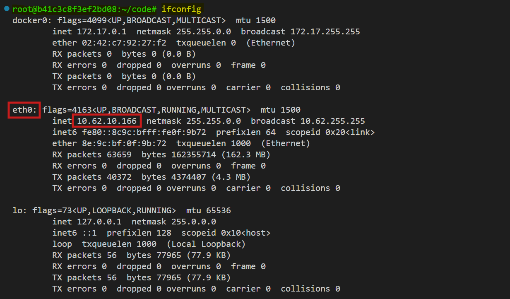
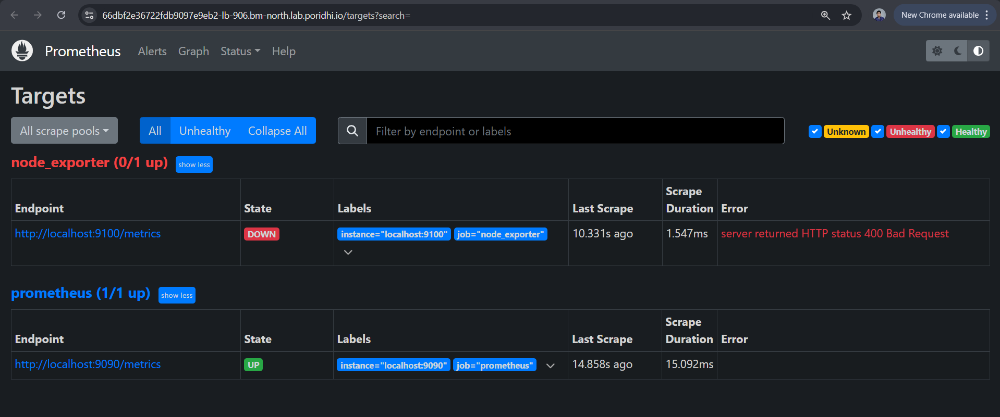
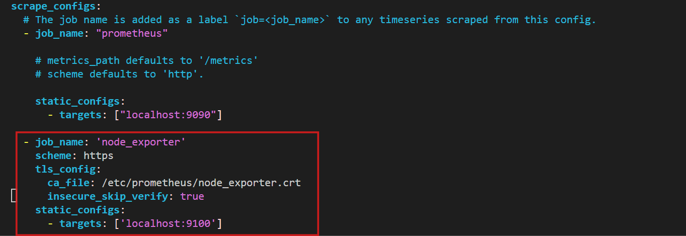
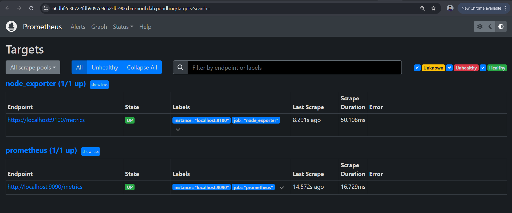

# **Prometheus HTTPS Setup for Secure Scraping**

Prometheus components don't have built-in security features like encryption or authentication. Without extra tools to secure them, all data between Prometheus and its components is sent as plain text, and anyone who knows the address can access them without restrictions. To secure the metrics endpoints, we will enable HTTPS for both Prometheus and Node Exporter using TLS. This guide walks you through configuring TLS, setting up Prometheus to scrape Node Exporter over HTTPS, and verifying that the metrics are securely transmitted.


## **Task Overview**

1. Install and configure Prometheus and Node Exporter.
2. Generate a TLS certificate for Node Exporter.
3. Configure Node Exporter to use HTTPS.
4. Update Prometheus to use HTTPS for scraping Node Exporter.
5. Verify the HTTPS configuration in the Prometheus UI.

  

## **Setup Prometheus and Node Exporter**

### **1. Setup Script for Prometheus**

Create a setup script to automate the installation of Prometheus.

- #### **Create a Script as `prometheus.sh`**

  ```bash
  #!/bin/bash

  # Variables
  PROM_VERSION="2.53.2"
  PROM_USER="prometheus"
  PROM_DIR="/etc/prometheus"
  PROM_LIB_DIR="/var/lib/prometheus"
  PROM_BINARY_URL="https://github.com/prometheus/prometheus/releases/download/v${PROM_VERSION}/prometheus-${PROM_VERSION}.linux-amd64.tar.gz"
  PROM_BIN_PATH="/usr/local/bin"

  # Install wget and tar
  sudo apt-get update && sudo apt-get install -y wget tar

  # Download and extract Prometheus
  wget $PROM_BINARY_URL && tar -xvzf prometheus-${PROM_VERSION}.linux-amd64.tar.gz

  # Move binaries and config files
  sudo mv prometheus-${PROM_VERSION}.linux-amd64/{prometheus,promtool} $PROM_BIN_PATH/
  sudo mkdir -p $PROM_DIR $PROM_LIB_DIR && sudo mv prometheus-${PROM_VERSION}.linux-amd64/{prometheus.yml,consoles,console_libraries} $PROM_DIR/

  # Create Prometheus user and assign permissions
  sudo useradd --no-create-home --shell /bin/false $PROM_USER
  sudo chown -R $PROM_USER:$PROM_USER $PROM_DIR $PROM_LIB_DIR

  # Create systemd service file
  sudo tee /etc/systemd/system/prometheus.service > /dev/null <<EOT
  [Unit]
  Description=Prometheus Monitoring System
  Wants=network-online.target
  After=network-online.target

  [Service]
  User=$PROM_USER
  ExecStart=$PROM_BIN_PATH/prometheus --config.file=$PROM_DIR/prometheus.yml --storage.tsdb.path=$PROM_LIB_DIR

  [Install]
  WantedBy=multi-user.target
  EOT

  # Reload systemd, enable and start Prometheus
  sudo systemctl daemon-reload
  sudo systemctl enable --now prometheus

  # Check status
  sudo systemctl status prometheus
  ```

- #### **Run the Script:**

  ```bash
  chmod +x prometheus.sh
  sudo ./prometheus.sh
  ```

### **2. Setup Script for Node Exporter**

Similarly, create a setup script for Node Exporter.  

- #### **Create a Script as `exporter.sh`**

  ```bash
  #!/bin/bash

  # Variables
  NODE_EXPORTER_VERSION="1.8.2"
  NODE_EXPORTER_USER="node_exporter"
  NODE_EXPORTER_BINARY_URL="https://github.com/prometheus/node_exporter/releases/download/v${NODE_EXPORTER_VERSION}/node_exporter-${NODE_EXPORTER_VERSION}.linux-amd64.tar.gz"
  NODE_EXPORTER_BIN_PATH="/usr/local/bin"

  # Install wget and tar
  sudo apt-get update && sudo apt-get install -y wget tar

  # Download and extract Node Exporter
  wget $NODE_EXPORTER_BINARY_URL && tar -xvzf node_exporter-${NODE_EXPORTER_VERSION}.linux-amd64.tar.gz

  # Move Node Exporter binary
  sudo mv node_exporter-${NODE_EXPORTER_VERSION}.linux-amd64/node_exporter $NODE_EXPORTER_BIN_PATH/

  # Create a Node Exporter user (non-root)
  sudo useradd --no-create-home --shell /bin/false $NODE_EXPORTER_USER

  # Set ownership of the binary
  sudo chown $NODE_EXPORTER_USER:$NODE_EXPORTER_USER $NODE_EXPORTER_BIN_PATH/node_exporter

  # Create a systemd service file
  sudo tee /etc/systemd/system/node_exporter.service > /dev/null <<EOT
  [Unit]
  Description=Node Exporter
  Wants=network-online.target
  After=network-online.target

  [Service]
  User=$NODE_EXPORTER_USER
  Group=$NODE_EXPORTER_USER
  ExecStart=$NODE_EXPORTER_BIN_PATH/node_exporter

  [Install]
  WantedBy=multi-user.target
  EOT

  # Reload systemd, enable and start Node Exporter
  sudo systemctl daemon-reload
  sudo systemctl enable --now node_exporter

  # Check status
  sudo systemctl status node_exporter
  ```

- #### **Run the Script:**

  ```bash
  chmod +x exporter.sh
  sudo ./exporter.sh
  ```

### **3. Expose Prometheus UI and Node Exporter Metrics**

- Get the `IP` to create a load balancer:

  ```bash
  ifconfig
  ```

  Here copy the `IP` from `eth0` interface:

  

- Create a load balancer from `Poridhi Lab` by providing the `IP` and `port: 9090`.

  

- Access the UI by opening the load balancer URL from browser. Go to *status > target*. We can see that prometheus has only one target and it is prometheus itself. Currently, it doesn't have `node_exporter` as its target to scrape. We have to configure the prometheus to scrape the `node_exporter`. 

  

- Access the Node exporter metrics by creating another load balancer from `Poridhi Lab` using the `port: 9100`.

  

### **4. Configure Prometheus to Scrape Node Exporter**

Prometheus needs to be configured to scrape the metrics from Node Exporter.

- **Edit Prometheus Configuration:**

  ```bash
  sudo vi /etc/prometheus/prometheus.yml
  ```

- Add the following job under the `scrape_configs` section:

  ```yaml
  - job_name: 'node_exporter'
    static_configs:
      - targets: ['localhost:9100']
  ```

- **Restart Prometheus:**

  ```bash
  sudo systemctl daemon-reload
  sudo systemctl restart prometheus
  ```

- **Access/Reload the prometheus UI**

  Now you can see that the Prometheus is scraping the `node_exporter`. It may take a while to get the `up` state:

  

## **Generate a TLS Certificate for Node Exporter**

Use the `openssl` command below to generate a self-signed certificate and private key for Node Exporter:

```bash
openssl req -new -newkey rsa:2048 -days 365 -nodes -x509 \
-keyout node_exporter.key -out node_exporter.crt \
-subj "/C=US/ST=California/L=Oakland/O=MyOrg/CN=localhost" \
-addext "subjectAltName = DNS:localhost"
```

This command will generate a `node_exporter.key` file and a `node_exporter.crt` file, which will serve as our certificates. When we run `ls -l`, we should see both the certificate and key files listed.


## **Configure Node Exporter to Use HTTPS**

- Create a folder named `node_exporter` in `/etc/` directory.

  ```bash
  sudo mkdir -p /etc/node_exporter
  ```

- Move the generated certificate and key to the `node_exporter` directory:

  ```bash
  sudo mv node_exporter.* /etc/node_exporter/
  ```

- Create a web configuration file for Node Exporter to enable TLS:

  ```bash
  sudo vi /etc/node_exporter/config.yml
  ```

  Add the following content:

  ```yaml
  tls_server_config:
    cert_file: node_exporter.crt
    key_file: node_exporter.key
  ```

- Update the permission to the folder for the user `node_exporter`:

  ```bash
  sudo chown -R node_exporter:node_exporter /etc/node_exporter
  ```

- Update the Node Exporter systemd service to use the web configuration:

  ```bash
  sudo vi /etc/systemd/system/node_exporter.service
  ```

  

  Modify the `ExecStart` directive:

  ```ini
  ExecStart=/usr/local/bin/node_exporter \
    --web.config.file=/etc/node_exporter/config.yml
  ```

- Reload systemd and restart Node Exporter to apply the changes:

  ```bash
  sudo systemctl daemon-reload
  sudo systemctl restart node_exporter
  ```

- Check the status of `node_exporter` services, and check if the TLS is enabled using:

  ```bash
  sudo systemctl status node_exporter
  ```

  

Here, we can see that `TLS is enabled` in the `node_exporter` service.

### Verify the Metrics Locally

Now, if we do a curl for the metrics path, we will specifically use `https`.

```bash 
curl https://localhost:9100/metrics
```


We'll get an error for this command. This only occurs just because we use self-signed certificates, so it's not able to identify us properly. If we had used certificates from a trusted authority, like Let's Encrypt, then we wouldn't encounter this issue. 

When using `curl`, we need to include the `-k` flag to allow an insecure connection.

```bash 
curl -k https://localhost:9100/metrics
```


Now we have Encryption enabled at the Node exporter level.

## **Configure Prometheus to Use HTTPS for Scraping Node Exporter**

As we have Node Metrics publishing on HTTPS, we might see an error on Prometheus with the Updated node exporter as `down`.



To enable HTTPS for scraping, we need to update Prometheus configuration to get metrics from nodes with HTTPS endpoints.

### **(a) Copy the Certificate**

- Copy the `node_exporter.crt` file from the node exporter server to the Prometheus server at `/etc/prometheus`:

  ```bash
  sudo cp /etc/node_exporter/node_exporter.crt /etc/prometheus/
  ```

- Update the permission to the CRT file using:

  ```bash
  sudo chown -R prometheus:prometheus /etc/prometheus
  ```

### **(b) Update the Prometheus Configuration to Use HTTPS**

- Edit the Prometheus configuration file:

  ```bash
  sudo vi /etc/prometheus/prometheus.yml
  ```

- Change the following scrape configuration for Node Exporter under `scrape_configs`:

  ```yaml
  scrape_configs:
    - job_name: 'node_exporter'
      scheme: https
      tls_config:
        ca_file: /etc/prometheus/node_exporter.crt
        insecure_skip_verify: true
      static_configs:
        - targets: ['localhost:9100']
  ```

  The `scheme: https` tells Prometheus to use HTTPS, and `insecure_skip_verify: true` is added because we are using a self-signed certificate.

  

### **(c) Restart the Prometheus Service**

- Restart Prometheus to apply the configuration changes:

  ```bash
  sudo systemctl daemon-reload
  sudo systemctl restart prometheus
  ```

## **Verify the HTTPS Configuration**

Access the Prometheus UI using the `Poridhi's Load Balancer` you created earlier. Navigate to **Status -> Targets** to view the status of the scraped targets.

  

- If the configuration is correct, both the Prometheus and Node Exporter targets should be listed as **UP**.
- If the Node Exporter target is **DOWN**, you may see an error code indicating the problem (e.g., `401 Unauthorized` or `TLS handshake failure`). Double-check the certificate and configuration settings.

## **Conclusion**

You've successfully configured Prometheus to scrape Node Exporter over HTTPS, ensuring secure communication. This ensures that sensitive monitoring data remains protected during transit, enhancing the overall security of your environment. With this setup, you are better equipped to maintain a reliable and secure monitoring infrastructure.