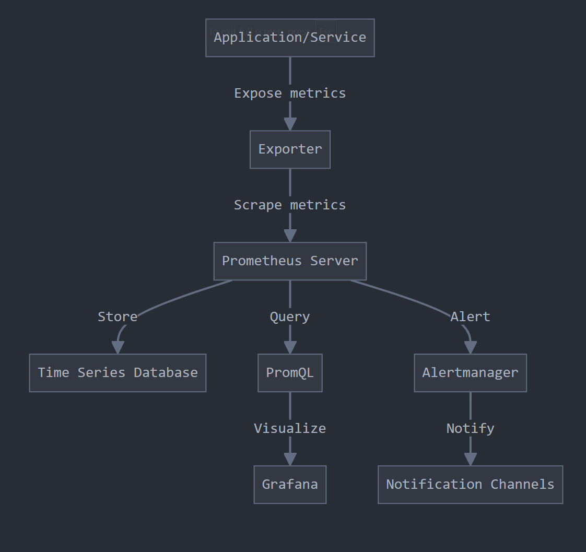
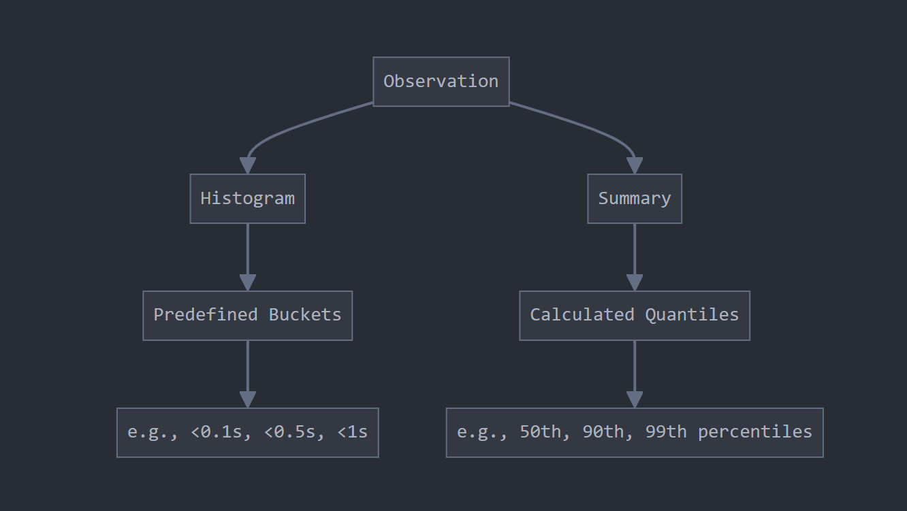

# **Introduction to Prometheus Metrics**

Monitoring is a crucial aspect of managing any modern application, and Prometheus has emerged as one of the most powerful open-source monitoring systems available today. At the heart of Prometheus are **metrics**, which provide valuable insights into the state and performance of your system. By understanding how to create, collect, and query these metrics, you can effectively monitor your application's health, performance, and reliability in real-time.



This lab is designed to introduce you to the core concepts of Prometheus metrics, their structure, and the various metric types available. We will explore how to use **labels** to add granularity to metrics, the importance of **time series**, and how to differentiate between key metric types like **Counters**, **Gauges**, **Histograms**, and **Summaries**. By the end of this lab, you will have hands-on experience with creating, labeling, and querying Prometheus metrics.

## **Topics Covered**
1. What are Prometheus Metrics?
2. Time Series in Prometheus
3. Metric Attributes
4. Types of Prometheus Metrics
5. Metric Naming Rules
6. Using Labels in Prometheus
7. Internal and Default Labels
8. Hands-On Exercises


## **1. What are Prometheus Metrics?**

In Prometheus, a metric is a data point collected from an application or system, structured with three key properties:
- **Metric Name**: A descriptive name that indicates the system aspect being measured.
- **Labels**: Key-value pairs that provide additional information, helping to identify which part of the system the metric relates to.
- **Metric Value**: The numerical value representing the state of the metric at a specific point in time.

### **Example:**
```
node_cpu_seconds_total{cpu="0", mode="idle"} 258277.86
```
In this example:
- **Metric Name**: `node_cpu_seconds_total` represents the total CPU usage in seconds.
- **Labels**: `cpu="0"` specifies which CPU core, and `mode="idle"` tells us the CPU was idle during this period.
- **Metric Value**: `258277.86` is the number of seconds spent in idle mode.


## **2. Time Series in Prometheus**

A **time series** in Prometheus is a stream of timestamped values sharing the same metric name and set of labels. Time series enable you to track how a specific metric value changes over time.

### **Scrape Interval**
Prometheus scrapes metrics from targets (e.g., an application) at defined intervals (e.g., every 15 or 30 seconds). Each metric collected is stored along with a **Unix timestamp**, which records the time when the data was collected.

### **Example:**
```
node_cpu_seconds_total{cpu="0", instance="server1"}
node_cpu_seconds_total{cpu="1", instance="server1"}
```
In this example, `node_cpu_seconds_total` is collected for two CPUs (`cpu="0"` and `cpu="1"`) on `server1`. Each combination of a metric and its labels is a unique **time series**.


## **3. Metric Attributes**

Prometheus metrics include two important attributes:
- **Help Attribute**: Describes what the metric represents.
- **Type Attribute**: Defines the type of metric (Counter, Gauge, Histogram, or Summary).


## **4. Types of Prometheus Metrics**


Prometheus provides four main metric types. Understanding when and how to use each type is crucial for accurate monitoring.

### **a. Counter**

- **Definition**: A **Counter** is a metric that only increases. It is used to count occurrences of events like requests, errors, or job executions.
  
- **Use Case**: Counters are ideal for tracking metrics that should never decrease, such as:
  - The total number of HTTP requests.
  - The number of completed tasks or jobs.
  - The total number of errors or failures.

- **Example**:
    ```
    http_requests_total{method="GET", status="200"} 1000
    ```
    This counter tracks the total number of successful `GET` requests (`status="200"`).

- **Key Point**: Counters should always increase. If a counter resets (e.g., after a system restart), it begins counting from 0 again.


### **b. Gauge**

- **Definition**: A **Gauge** measures a value that can **increase or decrease** over time, representing a current state or value at a specific moment.
  
- **Use Case**: Gauges are used to track values that can fluctuate, such as:
  - **CPU usage**.
  - **Memory consumption**.
  - **Number of active sessions or requests**.

- **Example**:
    ```
    node_memory_MemFree_bytes 2048576000
    ```
    This gauge metric tracks the current free memory in bytes.

- **Key Point**: Unlike counters, gauges can go up and down. This makes them suitable for tracking metrics like system resources, which naturally fluctuate over time.


### **c. Histogram**

- **Definition**: A **Histogram** samples observations (e.g., durations or sizes) and counts them in configurable **buckets**. It is commonly used to measure **how long** or **how large** something is.

- **Use Case**: Histograms are ideal for tracking **response times** or **request sizes**, where you want to group data into meaningful buckets.
  
- **Example**:
    ```
    http_request_duration_seconds_bucket{le="0.5"} 240
    http_request_duration_seconds_bucket{le="1"} 290
    ```
    Here, the histogram measures HTTP request duration:
    - `240 requests` completed in under `0.5` seconds.
    - `290 requests` completed in under `1` second.

    The buckets are **cumulative**, meaning the `1-second` bucket includes all requests from the smaller `0.5-second` bucket as well.

#### **Use Case Example**:
For tracking **response times**:
```
< 0.2s    5 requests
< 0.5s   10 requests
< 1s      15 requests
< 2s      20 requests
```
This setup shows how many requests were completed within each time range.

- **Key Point**: Histograms provide detailed insights into the distribution of metrics like response times or file sizes by placing them into buckets.


### **d. Summary**

- **Definition**: A **Summary** is similar to a histogram but focuses on **quantiles**, allowing you to measure the percentage of observations that fall below a specific threshold (e.g., 95% of requests completed within 1 second).
  
- **Use Case**: Summaries are useful for measuring **percentiles** of response times or other observations without needing to define buckets in advance.
  
- **Example**:
    ```
    http_request_duration_seconds{quantile="0.5"} 0.35
    http_request_duration_seconds{quantile="0.9"} 0.65
    ```
    This summary tells us:
    - 50% of requests were completed in under `0.35 seconds`.
    - 90% of requests were completed in under `0.65 seconds`.

#### **Use Case Example**:
For tracking **response time percentiles**:
```
20% of requests finished within 0.3s
50% of requests finished within 0.8s
80% of requests finished within 1s
```
This provides an understanding of performance across different percentiles.

- **Key Point**: Summaries allow you to observe metric distributions in real-time, presenting percentile-based data instead of grouping observations into predefined buckets.


### Histogram vs Summary




## **5. Metric Naming Rules**

When creating metrics in Prometheus, it is important to follow naming conventions:
- Metric names should only include **ASCII letters**, **numbers**, **underscores**, and **colons**.
- The names must match the following regex: `[a-zA-Z_:][a-zA-Z0-9_:]*`.
  
**Note**: Colons are reserved for **recording rules** in Prometheus and should not be used in custom metric names.


## **6. Labels in Prometheus**

- **Definition**: Labels are **key-value pairs** that add context to metrics, allowing you to filter and categorize data. A metric can have multiple labels to provide more detail, such as separating by CPU core, HTTP method, or API endpoint.
  
- **Example**:
    ```
    http_requests_total{method="GET", path="/api/v1/users"} 100
    http_requests_total{method="POST", path="/api/v1/users"} 50
    ```

This allows you to track the number of requests based on both HTTP method and API endpoint. You can query Prometheus based on these labels to get more granular insights.

### **Label Regex**:
Labels must follow this pattern: `[a-zA-Z0-9_]*`.

#### **Use Case Example**:
For an e-commerce application:
```
requests_total{path="/auth", method="POST"}
requests_total{path="/user", method="GET"}
requests_total{path="/cart", method="POST"}
```
Using labels enables you to easily sum requests across different paths and methods:
```
sum(requests_total)
```


## **7. Internal and Default Labels**

Prometheus automatically assigns two **default labels** to every metric:
- **Instance**: Specifies the target server being scraped.
- **Job**: Specifies the job name defined in the `prometheus.yml` configuration.

Internally, Prometheus treats the **metric name** as just another label. The **metric name** is represented with the label `__name__`.

### **Example:**
For the metric `node_cpu_seconds_total{cpu="0", instance="server1"}`, Prometheus considers the metric name itself as a label:
```
{__name__="node_cpu_seconds_total", cpu="0", instance="server1"}
```


## **Hands-On Exercises**

### **1. Viewing Metrics in Prometheus**
- Start Prometheus and scrape a target (e.g., Node Exporter).
- Query basic metrics like `node_cpu_seconds_total` to observe how labels are used to differentiate time series.

### **2. Create Custom Metrics**
- Define a simple **counter metric** in a sample application (e.g., total number of HTTP requests).
- Add labels for different HTTP methods and paths , then visualize the results in Pometheus.

### **3. Working with Histogram and Summary Metrics**
- Add a **histogram metric** to track request durations with predefined buckets.
- Add a **summary metric** to calculate request percentiles (e.g., 50th, 90th percentiles).
- Query both histogram and summary metrics to compare how data is structured and visualized.


## **Conclusion**
In this lab, you’ve learned the fundamental concepts of Prometheus metrics, including metric types (Counter, Gauge, Histogram, and Summary), the importance of labels, and how Prometheus structures time series data. Understanding these concepts is essential for effectively monitoring applications and extracting valuable insights from your metrics.


This full document covers all the required details, explanations, and examples, as well as hands-on exercises to deepen your understanding of Prometheus metrics.