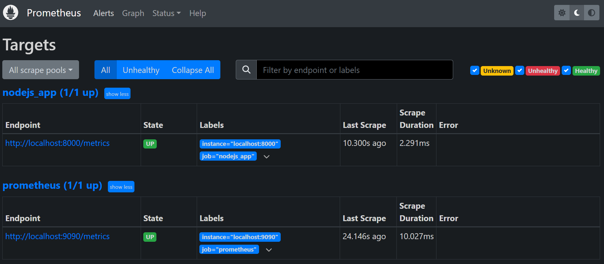
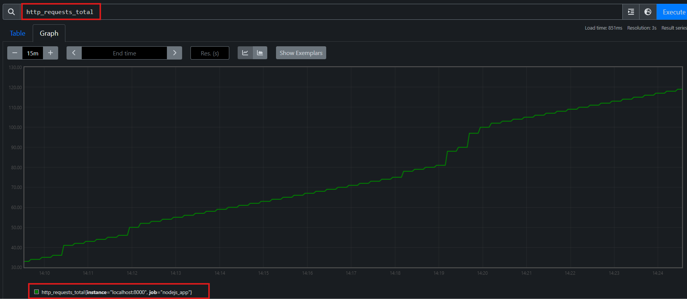
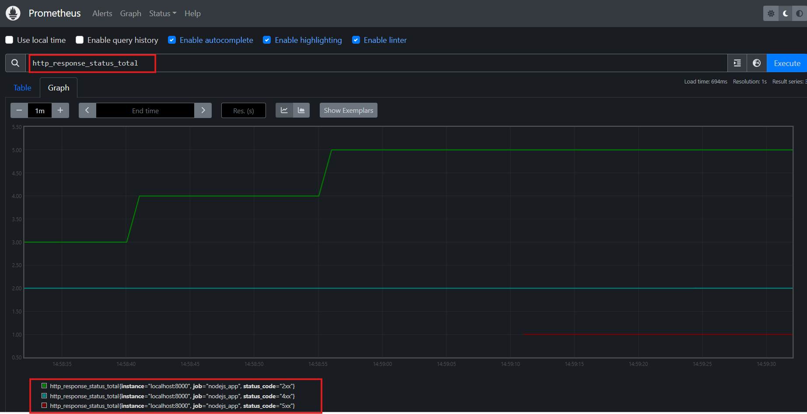
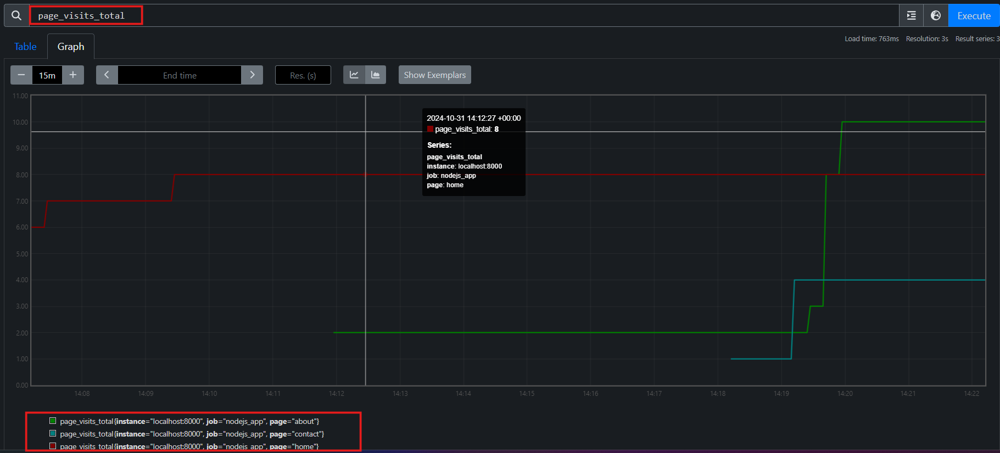
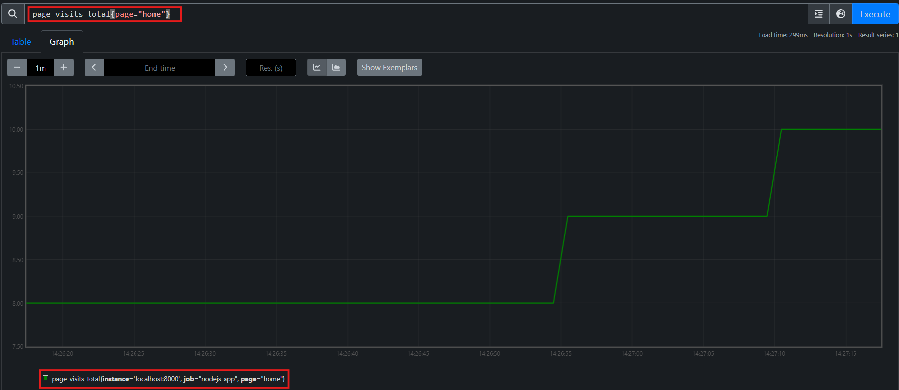
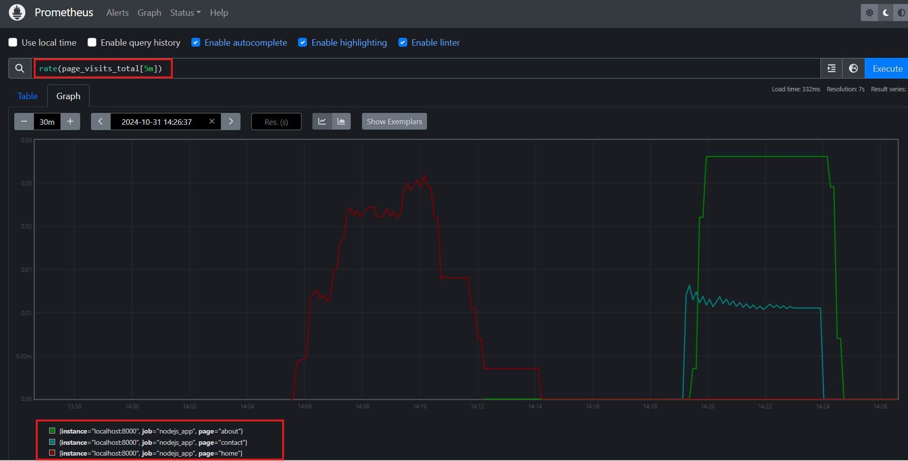
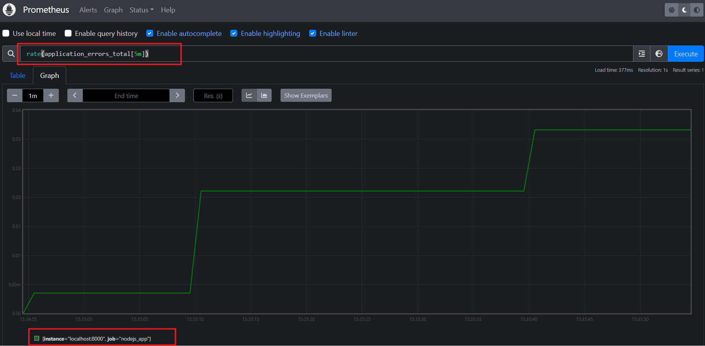
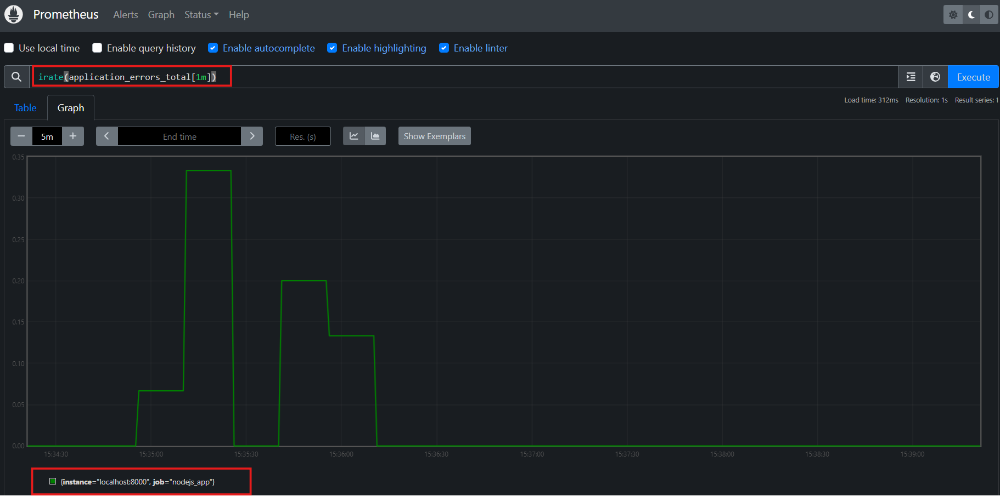

# Monitoring Requests and Errors with Counters

Monitoring is essential for understanding the performance and behavior of web applications. Prometheus is a robust monitoring and alerting tool that collects metrics and allows for detailed analysis using PromQL (Prometheus Query Language). In this lab, we will set up a Node.js application that exposes custom metrics, install and configure Prometheus to monitor these metrics, and utilize PromQL to analyze the collected data.


### Scenario
You are managing a web application and need to monitor several key metrics:
- The total number of HTTP requests.
- The status codes of responses (e.g., `2xx`, `4xx`, `5xx`).
- The number of visits to different pages.
- Occurrences of errors.

Tracking these metrics provides valuable insights into traffic trends, error occurrences, and overall system health. This lab will guide you through setting up a Node.js application to expose custom metrics, configuring Prometheus to scrape those metrics, and using PromQL to analyze the data.

### Directory Structure
```sh
project_root/
├── nodejs_app/
│   └── app.js               # Node.js application file
├── Prometheus/
    └── prometheus.sh        # Script to install Prometheus
```

### Set Up the Node.js Application

1. **Create a new directory for the Node.js app:**
   ```bash
   mkdir nodejs_app
   cd nodejs_app
   ```

2. **Initialize a new Node.js project:**
   ```bash
   npm init -y
   ```

3. **Install the required dependencies:**
   ```bash
   npm install express prom-client
   ```

4. **Create the Node.js application (`app.js`):**
   ```javascript
   const express = require('express');
   const promClient = require('prom-client');

   const app = express();
   const port = 8000;

   // Create Prometheus counters
   const httpRequestCounter = new promClient.Counter({
      name: 'http_requests_total',
      help: 'Total number of HTTP requests'
   });

   const httpStatusCounter = new promClient.Counter({
      name: 'http_response_status_total',
      help: 'Total number of HTTP responses, categorized by status code',
      labelNames: ['status_code']
   });

   const pageVisitCounter = new promClient.Counter({
      name: 'page_visits_total',
      help: 'Total number of visits to different pages',
      labelNames: ['page']
   });

   const errorCounter = new promClient.Counter({
      name: 'application_errors_total',
      help: 'Total number of errors in the application'
   });

   // Middleware to count all HTTP requests
   app.use((req, res, next) => {
      httpRequestCounter.inc(); // Increment the total HTTP request counter
      next();
   });

   // Route for the home page
   app.get('/', (req, res) => {
      pageVisitCounter.inc({ page: 'home' }); // Increment the counter for home page visits
      httpStatusCounter.inc({ status_code: '2xx' });
      res.send('Welcome to the Home Page');
   });

   // Route for the about page
   app.get('/about', (req, res) => {
      pageVisitCounter.inc({ page: 'about' }); // Increment the counter for about page visits
      httpStatusCounter.inc({ status_code: '2xx' });
      res.send('Welcome to the About Page');
   });

   // Route for the contact page
   app.get('/contact', (req, res) => {
      pageVisitCounter.inc({ page: 'contact' }); // Increment the counter for contact page visits
      httpStatusCounter.inc({ status_code: '2xx' });
      res.send('Welcome to the Contact Page');
   });

   // Simulate an error route
   app.get('/error', (req, res) => {
      const isError = Math.random() > 0.5; // Randomly simulate an error
      if (isError) {
         errorCounter.inc(); // Increment the error counter
         httpStatusCounter.inc({ status_code: '5xx' }); // Increment the counter for 5xx status code
         res.status(500).send('An error occurred');
      } else {
         httpStatusCounter.inc({ status_code: '2xx' });
         res.send('No error this time');
      }
   });

   // Endpoint to expose Prometheus metrics
   app.get('/metrics', async (req, res) => {
      res.set('Content-Type', promClient.register.contentType);
      res.end(await promClient.register.metrics());
   });

   // Middleware to handle 404 Not Found
   app.use((req, res) => {
      httpStatusCounter.inc({ status_code: '4xx' }); // Increment the counter for 4xx status codes
      res.status(404); // Set the status to 404
      res.send('Page Not Found'); // Send 404 response
   });

   app.listen(port, () => {
      console.log(`Node.js app running on http://localhost:${port}`);
   });
   ```
   - This code sets up a basic Node.js application that exposes Prometheus metrics. It includes counters for HTTP requests, response status codes, page visits, and application errors. The application listens on port 8000 and exposes a `/metrics` endpoint to serve the Prometheus metrics.

5. **Run the Node.js application:**
   ```bash
   node app.js
   ```

### Install Prometheus

1. **Create a script (`prometheus.sh`) to install Prometheus:**
   ```bash
   #!/bin/bash

   # Variables
   PROM_VERSION="2.53.2"
   PROM_USER="prometheus"
   PROM_DIR="/etc/prometheus"
   PROM_LIB_DIR="/var/lib/prometheus"
   PROM_BINARY_URL="https://github.com/prometheus/prometheus/releases/download/v${PROM_VERSION}/prometheus-${PROM_VERSION}.linux-amd64.tar.gz"
   PROM_BIN_PATH="/usr/local/bin"

   # Install wget and tar
   sudo apt-get update && sudo apt-get install -y wget tar

   # Download and extract Prometheus
   wget $PROM_BINARY_URL && tar -xvzf prometheus-${PROM_VERSION}.linux-amd64.tar.gz

   # Move binaries and config files
   sudo mv prometheus-${PROM_VERSION}.linux-amd64/{prometheus,promtool} $PROM_BIN_PATH/
   sudo mkdir -p $PROM_DIR $PROM_LIB_DIR && sudo mv prometheus-${PROM_VERSION}.linux-amd64/{prometheus.yml,consoles,console_libraries} $PROM_DIR/

   # Create Prometheus user and assign permissions
   sudo useradd --no-create-home --shell /bin/false $PROM_USER
   sudo chown -R $PROM_USER:$PROM_USER $PROM_DIR $PROM_LIB_DIR

   # Create systemd service file
   sudo tee /etc/systemd/system/prometheus.service > /dev/null <<EOT
   [Unit]
   Description=Prometheus Monitoring System
   Wants=network-online.target
   After=network-online.target

   [Service]
   User=$PROM_USER
   ExecStart=$PROM_BIN_PATH/prometheus --config.file=$PROM_DIR/prometheus.yml --storage.tsdb.path=$PROM_LIB_DIR

   [Install]
   WantedBy=multi-user.target
   EOT

   # Reload systemd, enable and start Prometheus
   sudo systemctl daemon-reload
   sudo systemctl enable --now prometheus

   # Check status
   sudo systemctl status prometheus
   ```

2. **Run the installation script:**
   ```bash
   chmod +x prometheus.sh
   ./prometheus.sh
   ```

### Configure Prometheus to Scrape Metrics from the Node.js App

1. **Edit the Prometheus configuration file (`/etc/prometheus/prometheus.yml`):**
   ```yaml
   scrape_configs:
     - job_name: "nodejs_app"
       static_configs:
         - targets: ["localhost:8000"]
   ```

2. **Validate and restart Prometheus:**
   ```bash
   promtool check config /etc/prometheus/prometheus.yml
   sudo systemctl restart prometheus
   ```

3. **Check Prometheus targets:**
   - Find the `eth0` IP address for the `Poridhi's VM` currently you are running by using the command:

    ```bash
    ifconfig
    ```
    
    
   - Go to Poridhi's `LoadBalancer`and Create a `LoadBalancer` with the `eht0` IP and port `9090`.

    

   - By using the Provided `URL` by `LoadBalancer`, you can access the Prometheus web interface from any browser.

   -  Click on the **"Status"** tab in the top menu and select **"Targets"** in Prometheus GUI.

      You should see a target named `nodejs_app` with the URL `http://localhost:8000/metrics`. The `UP` status indicates that the Node.js app is successfully running and scraping metrics.
      
      

  
### PromQL Queries

In Graph Tab of Prometheus GUI, you can use the following PromQL queries to analyze the collected metrics:

#### 1. **Total HTTP Requests (`http_requests_total`)**

- **Basic Query**:
   ```promql
   http_requests_total
   ```
   
   - Returns the total number of HTTP requests received by the application.

- **Rate of HTTP Requests**:
   ```promql
   rate(http_requests_total[1m])
   ```
   
   - Calculates the average rate of HTTP requests per second over the last 1 minute, helping to understand the current request rate trend.

#### 2. **HTTP Response Status Codes (`http_response_status_total`)**

- **Basic Query**:
   ```promql
   http_response_status_total
   ```
   
   - Returns the total number of HTTP responses, categorized by status code (e.g., `2xx`, `4xx`, `5xx`).

- **Filter by Status Code Category (e.g., `2xx`)**:
   ```promql
   http_response_status_total{status_code="2xx"}
   ```
   - Shows the total number of HTTP responses that fall under the `2xx` category, which indicates successful requests.

- **Rate of `5xx` Errors**:
   ```promql
   rate(http_response_status_total{status_code="5xx"}[1m])
   ```
   - Calculates the rate of HTTP `5xx` errors per second over the last 1 minute, useful for monitoring server error trends.

- **Percentage of `4xx` Client Errors**:
   ```promql
   sum(rate(http_response_status_total{status_code="4xx"}[1m])) / sum(rate(http_response_status_total[1m])) * 100
   ```
   
   - Computes the percentage of `4xx` (client error) responses relative to all responses over the last 1 minute.

#### 3. **Page Visits (`page_visits_total`)**

- **Basic Query**:
   ```promql
   page_visits_total
   ```
   
   - Shows the total number of page visits for all pages.

- **Filter by Specific Page (e.g., `home`)**:
   ```promql
   page_visits_total{page="home"}
   ```
   
   - Displays the total number of visits to the home page.

- **Rate of Page Visits**:
   ```promql
   rate(page_visits_total[5m])
   ```
   
   - Calculates the rate of page visits per second over the last 5 minutes for all pages.

- **Sum Across All Pages**:
   ```promql
   sum(rate(page_visits_total[5m]))
   ```
   
   - Aggregates the visit rate across all pages over the last 5 minutes to get an overall view of page traffic.

#### 4. **Application Errors (`application_errors_total`)**

- **Basic Query**:
   ```promql
   application_errors_total
   ```
   
   - Shows the total number of errors that occurred in the application.

- **Rate of Errors**:
   ```promql
   rate(application_errors_total[5m])
   ```
   
   - Calculates the rate of errors occurring over the last 5 minutes.

- **Instantaneous Rate of Errors**:
   ```promql
   irate(application_errors_total[1m])
   ```
   
   - Provides the instantaneous rate of error occurrences over the last 1 minute, useful for identifying sudden error spikes.

#### 5. **Combining Queries**

- **Comparing Rates of `2xx` and `5xx` Responses**:
   ```promql
   rate(http_response_status_total{status_code="2xx"}[1m]) / rate(http_response_status_total{status_code="5xx"}[1m])
   ```
   - Compares the rate of successful (`2xx`) responses to the rate of server errors (`5xx`) over the last 1 minute.

- **Overall Error Rate Percentage (Including Both `4xx` and `5xx`)**:
   ```promql
   sum(rate(http_response_status_total{status_code=~"4xx|5xx"}[1m])) / sum(rate(http_response_status_total[1m])) * 100
   ```
   - Calculates the percentage of `4xx` and `5xx` errors combined, relative to all responses over the last 1 minute.

### Summary
In this lab, you learned how to set up a Node.js application with custom metrics, configure Prometheus to monitor the metrics, and use PromQL to analyze them. The provided PromQL queries allow you to gain insights into the application's traffic, errors, and performance.