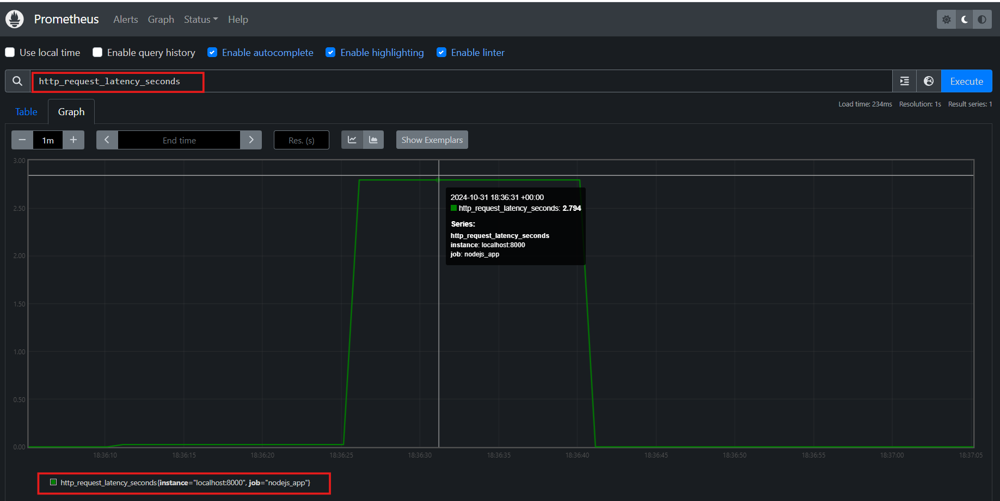
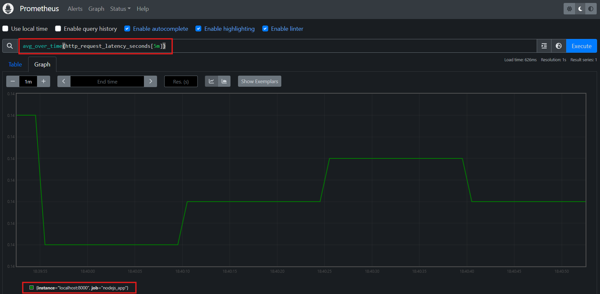

# Tracking App Performance with Gauges

Monitoring applications is crucial for understanding their performance and behavior. Prometheus provides various types of metrics, such as Counters, Gauges, Histograms, and Summaries, to collect and analyze data. A Gauge is used to measure values that can increase or decrease over time, such as CPU usage, memory usage, or request latency. In this lab, we will create a simple Node.js application that uses a Gauge to track the latency of requests to different endpoints.


### Scenario
You are managing a web application and want to monitor the latency of HTTP requests. Tracking request latency can help identify performance bottlenecks and understand how different endpoints respond under varying loads. This lab will guide you through setting up a Node.js application that exposes a Gauge metric for request latency and configuring Prometheus to monitor the application.

### Directory Structure
```sh
project_root/
├── nodejs_app/
│   └── app.js               # Node.js application file
├── Prometheus/
    └── prometheus.sh        # Script to install Prometheus
```

### Set Up the Node.js Application

1. **Create a new directory for the Node.js app:**
   ```bash
   mkdir gauge_example
   cd gauge_example
   ```

2. **Initialize a new Node.js project:**
   ```bash
   npm init -y
   ```

3. **Install the required dependencies:**
   ```bash
   npm install express prom-client
   ```

4. **Create the Node.js application (`app.js`):**
   ```javascript
   const express = require('express');
   const promClient = require('prom-client');

   const app = express();
   const port = 8000;

   // Create a Prometheus Gauge
   const requestLatency = new promClient.Gauge({
       name: 'http_request_latency_seconds',
       help: 'Latency of HTTP requests in seconds'
   });

   // Middleware to measure request latency
   app.use((req, res, next) => {
       const start = Date.now();

       res.on('finish', () => {
           const latencyInSeconds = (Date.now() - start) / 1000;
           requestLatency.set(latencyInSeconds); // Update the Gauge with the latency
           console.log(`Request to ${req.path} took ${latencyInSeconds} seconds`);
       });

       next();
   });

   // Simple route for the home page
   app.get('/', (req, res) => {
       // Simulate some processing delay
       setTimeout(() => {
           res.send('Welcome to the Home Page');
       }, Math.random() * 2000); // Random delay between 0 and 2 seconds
   });

   // Another route to simulate different latency
   app.get('/about', (req, res) => {
       // Simulate some processing delay
       setTimeout(() => {
           res.send('Welcome to the About Page');
       }, Math.random() * 3000); // Random delay between 0 and 3 seconds
   });

   // Endpoint to expose Prometheus metrics
   app.get('/metrics', async (req, res) => {
       res.set('Content-Type', promClient.register.contentType);
       res.end(await promClient.register.metrics());
   });

   // Start the server
   app.listen(port, () => {
       console.log(`Node.js app running on http://localhost:${port}`);
   });
   ```

   
   - **Gauge Creation**:

     ```javascript
     const requestLatency = new promClient.Gauge({
         name: 'http_request_latency_seconds',
         help: 'Latency of HTTP requests in seconds'
     });
     ```
     - A Gauge named `http_request_latency_seconds` is created to measure the latency of HTTP requests.

   - **Middleware to Measure Latency**:
     - The middleware measures the time taken for each request by recording the start time and calculating the duration when the response finishes. The Gauge is updated with the latency in seconds.

   - **Random Delays in Routes**:
     - The `/` and `/about` routes simulate different processing times by introducing random delays, allowing the Gauge to demonstrate fluctuating values.

5. **Run the Node.js application:**
   ```bash
   node app.js
   ```

### Install Prometheus

1. **Create a script (`prometheus.sh`) to install Prometheus:**
   ```bash
   #!/bin/bash

   # Variables
   PROM_VERSION="2.53.2"
   PROM_USER="prometheus"
   PROM_DIR="/etc/prometheus"
   PROM_LIB_DIR="/var/lib/prometheus"
   PROM_BINARY_URL="https://github.com/prometheus/prometheus/releases/download/v${PROM_VERSION}/prometheus-${PROM_VERSION}.linux-amd64.tar.gz"
   PROM_BIN_PATH="/usr/local/bin"

   # Install wget and tar
   sudo apt-get update && sudo apt-get install -y wget tar

   # Download and extract Prometheus
   wget $PROM_BINARY_URL && tar -xvzf prometheus-${PROM_VERSION}.linux-amd64.tar.gz

   # Move binaries and config files
   sudo mv prometheus-${PROM_VERSION}.linux-amd64/{prometheus,promtool} $PROM_BIN_PATH/
   sudo mkdir -p $PROM_DIR $PROM_LIB_DIR && sudo mv prometheus-${PROM_VERSION}.linux-amd64/{prometheus.yml,consoles,console_libraries} $PROM_DIR/

   # Create Prometheus user and assign permissions
   sudo useradd --no-create-home --shell /bin/false $PROM_USER
   sudo chown -R $PROM_USER:$PROM_USER $PROM_DIR $PROM_LIB_DIR

   # Create systemd service file
   sudo tee /etc/systemd/system/prometheus.service > /dev/null <<EOT
   [Unit]
   Description=Prometheus Monitoring System
   Wants=network-online.target
   After=network-online.target

   [Service]
   User=$PROM_USER
   ExecStart=$PROM_BIN_PATH/prometheus --config.file=$PROM_DIR/prometheus.yml --storage.tsdb.path=$PROM_LIB_DIR

   [Install]
   WantedBy=multi-user.target
   EOT

   # Reload systemd, enable and start Prometheus
   sudo systemctl daemon-reload
   sudo systemctl enable --now prometheus

   # Check status
   sudo systemctl status prometheus
   ```

2. **Run the installation script:**
   ```bash
   chmod +x prometheus.sh
   ./prometheus.sh
   ```

### Configure Prometheus to Scrape Metrics from the Node.js App

1. **Edit the Prometheus configuration file:**
   ```bash
   sudo vim /etc/prometheus/prometheus.yml
   ```
   - Add the following configuration to the `scrape_configs` section:
   ```yaml
   scrape_configs:
     - job_name: "nodejs_app"
       static_configs:
         - targets: ["localhost:8000"]
   ```
2. **Validate and restart Prometheus:**
   ```bash
   promtool check config /etc/prometheus/prometheus.yml
   sudo systemctl restart prometheus
   ```

3. **Check Prometheus targets:**
   - Find the `eth0` IP address for the `Poridhi's VM` currently you are running by using the command:

    ```bash
    ifconfig
    ```
    
    
   - Go to Poridhi's `LoadBalancer`and Create a `LoadBalancer` with the `eht0` IP and port `9090`.

    

   - By using the Provided `URL` by `LoadBalancer`, you can access the Prometheus web interface from any browser.

   -  Click on the **"Status"** tab in the top menu and select **"Targets"** in Prometheus GUI.

      

      You should see a target named `nodejs_app` with the URL `http://localhost:8000/metrics`. The `UP` status indicates that the Node.js app is successfully running and scraping metrics.
   - You can also expose the nodejs_app application by using the `Poridhi's` `LoadBalancer` similarly to the above steps.(Use the same `eth0` IP and port `8000`).To generate the metrics, use this routes and hit them multiple times `/`,`/about`.
### PromQL Queries for Gauges

#### 1. **Request Latency (`http_request_latency_seconds`)**

- **Basic Query**:
   ```promql
   http_request_latency_seconds
   ```
   
   - Returns the current value of the `http_request_latency_seconds` Gauge, which indicates the latest measured latency.

- **Average Latency Over Time**:
   ```promql
   avg_over_time(http_request_latency_seconds[5m])
   ```
   
   - Calculates the average request latency over the last 5 minutes.

- **Maximum Latency Observed**:
   ```promql
   max_over_time(http_request_latency_seconds[5m])
   ```
   
   - Finds the maximum request latency recorded over the last 5 minutes.

### Summary
In this lab, you learned how to set up a Node.js application with a Gauge to monitor request latency, configure Prometheus to scrape the metrics, and analyze the data using PromQL. Gauges allow you to measure values that can fluctuate, providing insights into the performance of the application, such as request processing times. The PromQL queries demonstrate how to extract meaningful information from the collected metrics.