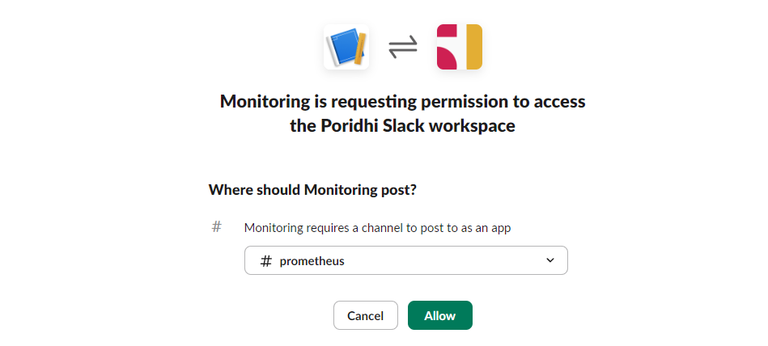

# Monitoring EC2 Instances

In this lab, you will set up Prometheus on `Poridhi's VM` to monitor an AWS EC2 instance. You will install Node Exporter on the `AWS EC2 instance` to collect system metrics like CPU and memory usage. Additionally, you will configure Alertmanager on `Poridhi's VM` to send alerts to a Slack channel.


Terraform will be used to automate creation of AWS ec2 instance with necessary security groups, key pair, and route table.


## **Objective**
- Set up Prometheus on `Poridhi's VM` to monitor an AWS EC2 instance.
- Install Node Exporter on the `AWS EC2 instance` to collect system metrics like CPU and memory usage.
- Configure Alertmanager to send alerts to a Slack channel.
- Perform load testing on the EC2 instance to trigger alerts and test the monitoring setup.

## **Tools Used**

- **Prometheus**: An open-source monitoring system that collects and stores metrics from configured targets.
- **Node Exporter**: A tool used to expose hardware and OS metrics for monitoring via Prometheus.
- **Promtool**: A utility to validate Prometheus configuration files.
- **Alertmanager**: A tool to handle alerts generated by Prometheus and send them to external systems like Slack.
- **Terraform**: An infrastructure as code tool to define and provision AWS resources.

## **Set Up AWS Infrastructure with Terraform**


Here, we create the following resources using Terraform:

- VPC, Subnet, Internet Gateway
- Route Table and Route Table Association
- Security Group, Key Pair, and EC2 Instance

### **1. Configure AWS CLI**

Set up AWS credentials for Terraform:

```bash
aws configure
```


### **2. Create an SSH Key Pair**

Create a directory for the project:

```bash
mkdir terraform-aws-prometheus
cd terraform-aws-prometheus
```

Generate the key pair for accessing the EC2 instance:

```bash
ssh-keygen -t rsa -b 4096 -f ~/.ssh/prometheus_key_pair
```

Ensure the path to the public key `~/.ssh/prometheus_key_pair.pub` is used in the Terraform script.

### **3. Write the Terraform Script**

Create a `main.tf` file with the following content:

```hcl
provider "aws" {
  region = "ap-southeast-1"
}

resource "aws_vpc" "prometheus_vpc" {
  cidr_block = "10.0.0.0/16"
  enable_dns_support = true
  enable_dns_hostnames = true
}

resource "aws_subnet" "public_subnet" {
  vpc_id                  = aws_vpc.prometheus_vpc.id
  cidr_block              = "10.0.1.0/24"
  map_public_ip_on_launch = true
  availability_zone       = "ap-southeast-1a"
}

resource "aws_internet_gateway" "igw" {
  vpc_id = aws_vpc.prometheus_vpc.id
}

resource "aws_route_table" "public_route_table" {
  vpc_id = aws_vpc.prometheus_vpc.id

  route {
    cidr_block = "0.0.0.0/0"
    gateway_id = aws_internet_gateway.igw.id
  }
}

resource "aws_route_table_association" "route_table_association" {
  subnet_id      = aws_subnet.public_subnet.id
  route_table_id = aws_route_table.public_route_table.id
}

resource "aws_security_group" "prometheus_sg" {
  vpc_id      = aws_vpc.prometheus_vpc.id
  description = "Allow HTTP, Node Exporter, and SSH access"

  ingress {
    from_port   = 22
    to_port     = 22
    protocol    = "tcp"
    cidr_blocks = ["0.0.0.0/0"]
  }

  ingress {
    from_port   = 9090
    to_port     = 9090
    protocol    = "tcp"
    cidr_blocks = ["0.0.0.0/0"]
  }

  ingress {
    from_port   = 9100
    to_port     = 9100
    protocol    = "tcp"
    cidr_blocks = ["0.0.0.0/0"]
  }

  egress {
    from_port   = 0
    to_port     = 0
    protocol    = "-1"
    cidr_blocks = ["0.0.0.0/0"]
  }
}

resource "aws_key_pair" "prometheus_key_pair" {
  key_name   = "prometheus_key_pair"
  public_key = file("~/.ssh/prometheus_key_pair.pub")
}

resource "aws_instance" "prometheus_instance" {
  instance_type          = "t2.micro"
  ami                    = "ami-047126e50991d067b"
  subnet_id              = aws_subnet.public_subnet.id
  key_name               = aws_key_pair.prometheus_key_pair.key_name
  vpc_security_group_ids = [aws_security_group.prometheus_sg.id]

  tags = {
    Name = "PrometheusNodeInstance"
  }
}

output "public_ip" {
  value = aws_instance.prometheus_instance.public_ip
}
```

### **4. Deploy Infrastructure**

```bash
terraform init
terraform apply
```

Review the changes and confirm deployment.

### **5. SSH into EC2 Instance**

```bash
ssh -i ~/.ssh/prometheus_key_pair ubuntu@<public_ip>
```

To get the public ip of the instance, you can use the following command:

```bash
terraform output public_ip
```

## **Install Prometheus and Node Exporter**

### **1. Install Prometheus on `Poridhi's VM`**

Create a script `prometheus.sh`:

```bash
#!/bin/bash

PROM_VERSION="2.53.2"
PROM_USER="prometheus"
PROM_DIR="/etc/prometheus"
PROM_LIB_DIR="/var/lib/prometheus"
PROM_BINARY_URL="https://github.com/prometheus/prometheus/releases/download/v${PROM_VERSION}/prometheus-${PROM_VERSION}.linux-amd64.tar.gz"
PROM_BIN_PATH="/usr/local/bin"

sudo apt-get update && sudo apt-get install -y wget tar

wget $PROM_BINARY_URL && tar -xvzf prometheus-${PROM_VERSION}.linux-amd64.tar.gz

sudo mv prometheus-${PROM_VERSION}.linux-amd64/{prometheus,promtool} $PROM_BIN_PATH/
sudo mkdir -p $PROM_DIR $PROM_LIB_DIR && sudo mv prometheus-${PROM_VERSION}.linux-amd64/{prometheus.yml,consoles,console_libraries} $PROM_DIR/

sudo useradd --no-create-home --shell /bin/false $PROM_USER
sudo chown -R $PROM_USER:$PROM_USER $PROM_DIR $PROM_LIB_DIR

sudo tee /etc/systemd/system/prometheus.service > /dev/null <<EOT
[Unit]
Description=Prometheus Monitoring System
Wants=network-online.target
After=network-online.target

[Service]
User=$PROM_USER
ExecStart=$PROM_BIN_PATH/prometheus --config.file=$PROM_DIR/prometheus.yml --storage.tsdb.path=$PROM_LIB_DIR

[Install]
WantedBy=multi-user.target
EOT

sudo systemctl daemon-reload
sudo systemctl enable --now prometheus
sudo systemctl status prometheus
```

Run the script:

```bash
sudo chmod +x prometheus.sh
sudo ./prometheus.sh
```

This will install Prometheus on the `Poridhi's VM`. You can check the status of the Prometheus service using the following command:

```bash
sudo systemctl status prometheus
```

### **2. Install Node Exporter on `EC2` Instance**

SSH into the EC2 instance:

```bash
ssh -i ~/.ssh/prometheus_key_pair ubuntu@<public_ip>
```

Create a script `exporter.sh` on the EC2 instance:

```bash
#!/bin/bash

NODE_EXPORTER_VERSION="1.8.2"
NODE_EXPORTER_USER="node_exporter"
NODE_EXPORTER_BINARY_URL="https://github.com/prometheus/node_exporter/releases/download/v${NODE_EXPORTER_VERSION}/node_exporter-${NODE_EXPORTER_VERSION}.linux-amd64.tar.gz"
NODE_EXPORTER_BIN_PATH="/usr/local/bin"

sudo apt-get update && sudo apt-get install -y wget tar

wget $NODE_EXPORTER_BINARY_URL && tar -xvzf node_exporter-${NODE_EXPORTER_VERSION}.linux-amd64.tar.gz

sudo mv node_exporter-${NODE_EXPORTER_VERSION}.linux-amd64/node_exporter $NODE_EXPORTER_BIN_PATH/

sudo useradd --no-create-home --shell /bin/false $NODE_EXPORTER_USER
sudo chown $NODE_EXPORTER_USER:$NODE_EXPORTER_USER $NODE_EXPORTER_BIN_PATH/node_exporter

sudo tee /etc/systemd/system/node_exporter.service > /dev/null <<EOT
[Unit]
Description=Node Exporter
Wants=network-online.target
After=network-online.target

[Service]
User=$NODE_EXPORTER_USER
Group=$NODE_EXPORTER_USER
ExecStart=$NODE_EXPORTER_BIN_PATH/node_exporter

[Install]
WantedBy=multi-user.target
EOT

sudo systemctl daemon-reload
sudo systemctl enable --now node_exporter
sudo systemctl status node_exporter
```

Run the script:

```bash
sudo chmod +x exporter.sh
sudo ./exporter.sh
```

This will install Node Exporter on the EC2 instance. You can check the status of the Node Exporter service using the following command:

```bash
sudo systemctl status node_exporter
```

## **Configure Alertmanager**

### **Install Alertmanager on `Poridhi's VM`**

Create a script `alertmanager.sh`:

```bash
#!/bin/bash

# Define the correct version of Alertmanager
ALERTMANAGER_VERSION="0.25.0"  # Use a valid version
ALERTMANAGER_BINARY_URL="https://github.com/prometheus/alertmanager/releases/download/v${ALERTMANAGER_VERSION}/alertmanager-${ALERTMANAGER_VERSION}.linux-amd64.tar.gz"

# Download and extract Alertmanager
wget $ALERTMANAGER_BINARY_URL || { echo "Error: Failed to download Alertmanager. Check version and URL."; exit 1; }
tar -xvzf alertmanager-${ALERTMANAGER_VERSION}.linux-amd64.tar.gz || { echo "Error: Failed to extract the tarball."; exit 1; }

# Move binaries to /usr/local/bin
sudo mv alertmanager-${ALERTMANAGER_VERSION}.linux-amd64/alertmanager /usr/local/bin/ || { echo "Error: Failed to move alertmanager binary."; exit 1; }
sudo mv alertmanager-${ALERTMANAGER_VERSION}.linux-amd64/amtool /usr/local/bin/ || { echo "Error: Failed to move amtool binary."; exit 1; }

# Set up directories for Alertmanager configuration
sudo mkdir -p /etc/alertmanager /var/lib/alertmanager
sudo mv alertmanager-${ALERTMANAGER_VERSION}.linux-amd64/alertmanager.yml /etc/alertmanager/ || { echo "Error: Failed to move alertmanager.yml."; exit 1; }

# Create a systemd service file
sudo tee /etc/systemd/system/alertmanager.service > /dev/null <<EOT
[Unit]
Description=Alertmanager
Wants=network-online.target
After=network-online.target

[Service]
ExecStart=/usr/local/bin/alertmanager --config.file=/etc/alertmanager/alertmanager.yml --storage.path=/var/lib/alertmanager
Restart=on-failure

[Install]
WantedBy=multi-user.target
EOT

# Reload systemd and start Alertmanager
sudo systemctl daemon-reload
sudo systemctl enable --now alertmanager
sudo systemctl status alertmanager
```

Run the script:

```bash
sudo chmod +x alertmanager.sh
sudo ./alertmanager.sh
```

This will install Alertmanager on the `Poridhi's VM`. You can check the status of the Alertmanager service using the following command:

```bash
sudo systemctl status alertmanager
```

## **Set Up Slack**

We will use Slack to send alerts. So, we need to set up a Slack webhook. 

**Note**: You can use any other channel to send alerts. But for this lab, we will use Slack.

### **Create a Slack Workspace**
1. Create a `Slack` account if you don't have one by visiting [Slack](https://slack.com/).
2. Go to [Slack Workspace](https://slack.com/create) and create a new workspace.

   

3. Give a name to your workspace (e.g. `Poridhi`).

   
4. Enter your `Name`
5. Skip the `Create a Slack Team` step and add a project name (e.g. `Prometheus`).
   
   

Congratulation! You have created a Slack workspace.

### **Create a Slack App**
1. Go to Slack API: [Slack API Dashboard](https://api.slack.com/apps).

   

2. Click **Create an App** and select **From Scratch**.
3. Name your app and choose the workspace we created (e.g. `Prometheus`).
4. Under **Features**, enable **Incoming Webhooks**.

   

5. Add a new webhook and select the channel (e.g. `prometheus`).

   

6. Copy the webhook URL and and channel name. We will use this in the Alertmanager configuration.

   


## **Alertmanager Configuration**

Update `Alertmanager Configuration` file:

```bash
sudo vim /etc/alertmanager/alertmanager.yml
```

```yaml
global:
  resolve_timeout: 1m

route:
  group_by: ['alertname']
  group_wait: 5s
  group_interval: 5s
  repeat_interval: 1m
  receiver: 'slack'

receivers:
  - name: 'slack'
    slack_configs:
      - api_url: 'https://hooks.slack.com/services/Your/Webhook/URL'
        channel: '#<Your-Channel-Name>'
        send_resolved: true
        title: 'Prometheus Alert: {{ .CommonLabels.alertname }}'
        text: >-
          *Alert:* {{ .CommonLabels.alertname }}
          *Instance:* {{ .CommonLabels.instance }}
          *Severity:* {{ .CommonLabels.severity }}
          *Description:* {{ .CommonAnnotations.description }}
          *Status:* {{ .Status }}
```
*Note : Replace `Your/Webhook/URL` with the webhook URL you copied from Slack and `Your-Channel-Name` with the channel name you copied from Slack.*

In this configuration, we have 3 main sections:

**Global Configuration**: This section defines the global configuration for Alertmanager. Here, we set the `resolve_timeout` to 1 minutes. This will wait for 1 minutes before considering an alert as resolved.

**Routing Rules**: This section defines the routing rules for alerts. Here, we group alerts by `alertname` and wait for 5 seconds before sending the first alert. We then wait for 5 seconds before sending any additional alerts. Finally, we wait for 1 minute before sending the alert again.

**Receivers**: This section defines the receivers for alerts. Here, we have a single receiver called `slack`. This receiver sends alerts to a Slack channel.

- **text**: This section defines the message that will be sent to the Slack channel. Example: `Alert: High Memory Usage` and `Instance: i-01234567890abcdef0` and `Severity: Critical` and `Description: Memory usage is high` and `Status: firing`.


### **Restart Alertmanager**

```bash
sudo systemctl restart alertmanager
```

### **Update Prometheus Configuration**

Create a `alert_rules.yml` file:

```bash
sudo vim /etc/prometheus/alert_rules.yml
```

**Add the following configuration to the `alert_rules.yml` file:**

```yaml
groups:
  - name: memory_alerts
    rules:
      - alert: HighMemoryUsage
        expr: node_memory_MemAvailable_bytes / node_memory_MemTotal_bytes * 100 < 20
        for: 5s
        labels:
          severity: critical
        annotations:
          summary: "High Memory Usage on {{ $labels.instance }}"
          description: "Available memory is below 20% for more than 5 seconds."
```
In this configuration, we have a single rule that alerts when the available memory is below 20% for more than 5 seconds. `Labels` and `Annotations` are used to add additional information to the alert.

**Update `Prometheus Configuration` file:**

```bash
sudo vim /etc/prometheus/prometheus.yml
```

**Add the following configuration to the `Prometheus Configuration` file:**

```yaml
global:
  scrape_interval: 5s
  evaluation_interval: 5s

alerting:
  alertmanagers:
    - static_configs:
        - targets:
            - localhost:9093

rule_files:
  - "alert_rules.yml"

scrape_configs:
  - job_name: "prometheus"
    static_configs:
      - targets: ["localhost:9090"]

  - job_name: "node"
    static_configs:
      - targets: ["<ec2-instance-public-ip>:9100"]
```

**Validate the `Prometheus Configuration` file:**

   ```bash
   sudo promtool check config /etc/prometheus/prometheus.yml
   ```

**Restart Prometheus:**

   ```bash
   sudo systemctl restart prometheus
   ```

## **Verify the Installation**

- Find the `eth0` IP address for the `Poridhi's VM` currently you are running by using the command:

  ```bash
  ifconfig
  ```
  

-  Go to Poridhi's `LoadBalancer`and Create `2` `LoadBalancers` with the `eht0` IP and port `9090` for `Prometheus`, and `9093` for `Alertmanager`.

- By using the Provided `URL` by `LoadBalancer`, you can access the `Prometheus`, and `Alertmanager` from any browser.

- In `Prometheus`, you can see the `Node Exporter` as a target. In `Alert` tab you will see a `HighMemoryUsage` alert in `inactive` state.

  

## **Load Testing**

**`SSH` into EC2 Instance:**

```bash
ssh -i ~/.ssh/prometheus_key_pair ubuntu@<public_ip>
```

**Install `stress` on the EC2 instance:**

```bash
sudo apt update
sudo apt-get install stress
```
`Stress` is a tool to test the system's ability to handle load.

**Run a memory load test:**

```bash
stress --vm-bytes $(awk '/MemAvailable/ {printf "%d\n", $2 * 0.85;}' < /proc/meminfo)k --vm-keep -m 1
```

This will start a memory load test. The test will use 85% of the available memory of the EC2 instance.

When the memory usage reaches 85%, the `Stress` tool will start using swap space. This will trigger the `HighMemoryUsage` alert.

In Prometheus, you will see the `HighMemoryUsage` alert in `pending` state. After 5 seconds, the alert will be in `firing` state.


### **Verify the Alert**

To verify the alert, you can check the `Slack` channel. You will see a `HighMemoryUsage` alert in the `prometheus` channel.


Now if we terminate the `Stress` process, the alert will be in `resolved` state. A message will be sent to the Slack channel to notify the user.


## **Summary**

In this lab, we have learned how to set up Prometheus on `Poridhi's VM` to monitor an AWS EC2 instance. We have installed Node Exporter on the `AWS EC2 instance` to collect system metrics like CPU and memory usage. Additionally, we have configured Alertmanager to send alerts to a Slack channel. We have also performed load testing on the EC2 instance to trigger alerts and test the monitoring setup.

