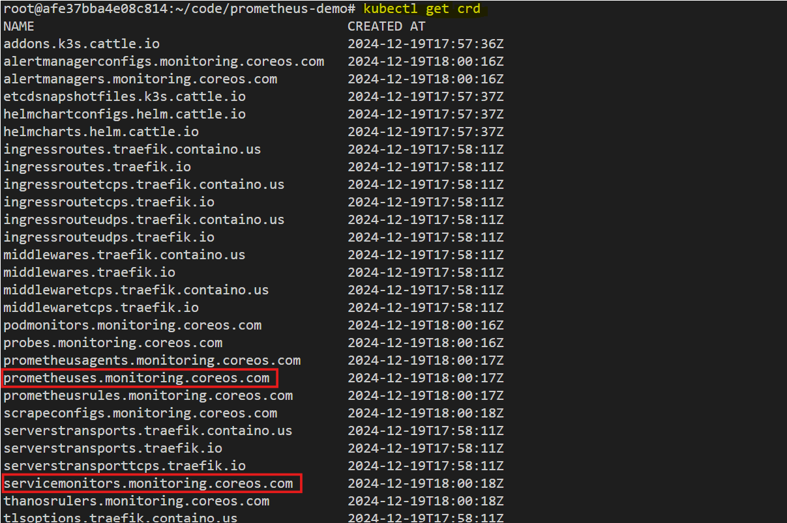
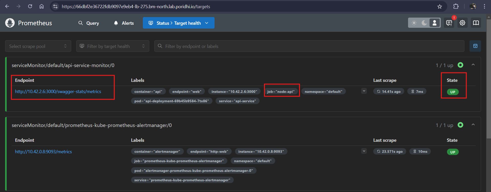
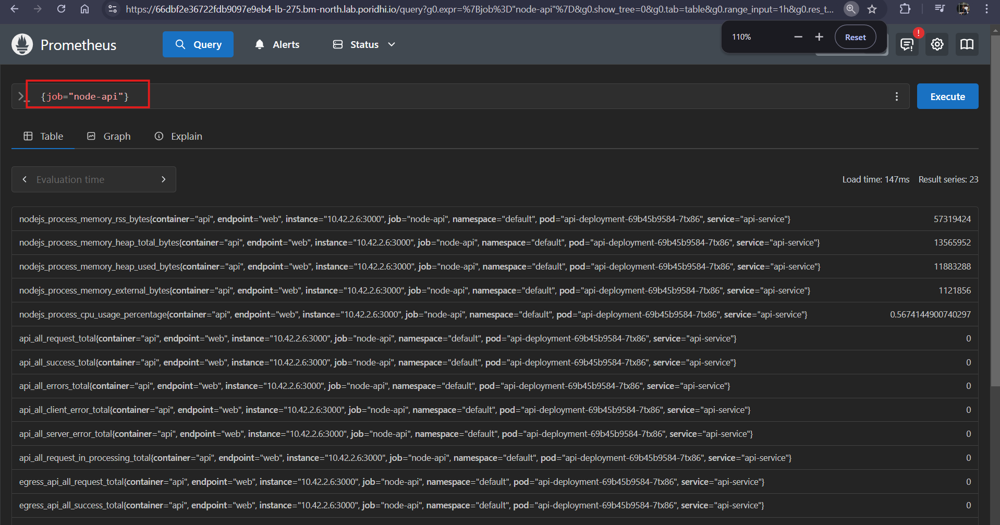

# **Deploying Demo Applications and Service Monitors with Prometheus**

This detailed guide provides an in-depth exploration of deploying a demo application and configuring service monitors in Kubernetes using the Prometheus operator. By following this guide, you will achieve a fully operational Prometheus setup, including a sample Node.js application integrated with Prometheus metrics and service monitors for automated metric scraping. Each step is accompanied by comprehensive YAML configurations, task descriptions, and detailed explanations to ensure clarity and successful implementation.


## **Introduction**

Prometheus is a powerful and widely-used open-source monitoring and alerting toolkit designed to handle reliability and scalability requirements. It employs a time-series database to store metrics and offers advanced querying capabilities, making it an essential tool in modern application monitoring. At the heart of Prometheus operator functionality are Custom Resource Definitions (CRDs), which extend Kubernetes' capabilities. Among these, the ServiceMonitor CRD plays a crucial role by enabling Prometheus to dynamically discover and scrape metrics from specified Kubernetes services.

In this tutorial, we focus on understanding and utilizing the ServiceMonitor CRD to deploy the Node.js application on Kubernetes and configure service monitors to automate metric scraping processes ensuring seamless integration and monitoring by validating the complete setup.

Whether you are new to Kubernetes or experienced in deploying applications, this hands-on guide equips you with practical knowledge and real-world examples to integrate Prometheus effectively.

## **Task Description**

This exercise aims to provide a comprehensive walkthrough for:

1. Setting up Prometheus in a Kubernetes cluster using the Helm chart.

2. Developing and deploying a Node.js application that exposes both custom and default metrics for Prometheus.

3. Creating Kubernetes manifests to deploy the application and expose it via a service.

4. Configuring a ServiceMonitor resource to enable Prometheus to scrape metrics automatically from the deployed application.

5. Verifying the functionality of the setup and monitoring the application using Prometheus.

## **Deploying Prometheus with Helm**

This section demonstrates how to install Helm, add the Prometheus community repository, deploy Prometheus using the Helm chart.


### **Install Helm**

1. **Navigate to Helm Documentation**  
   Visit the [Helm documentation](https://helm.sh/docs/intro/install/) to view installation instructions for various operating systems.

2. **Install Helm on Linux**  
   Run the following commands to install Helm using the default script:
   ```bash
   curl -fsSL https://raw.githubusercontent.com/helm/helm/main/scripts/get-helm-3 > get_helm.sh
   chmod 700 get_helm.sh
   ./get_helm.sh
   ```

3. **Verify Installation**  
   Confirm that Helm is installed by checking its version:
   ```bash
   helm version
   ```


### **Add the Prometheus Community Repository**

1. Add the Prometheus community Helm repository:
   ```bash
   helm repo add prometheus-community https://prometheus-community.github.io/helm-charts
   ```

2. Update the Helm repository:
   ```bash
   helm repo update
   ```


### **Install the Prometheus Helm Chart**

1. Verify your KUBECONFIG environment variable:

   ```bash
   $KUBECONFIG
   ```

   If it's not set, you might need to:
   ```bash
   export KUBECONFIG=/etc/rancher/k3s/k3s.yaml
   ```


2. Deploy the Helm chart with a release name of your choice (e.g., `prometheus`):
   ```bash
   helm install prometheus prometheus-community/kube-prometheus-stack
   ```

   - **Release Name**: `prometheus` (you can change this to any name you prefer).
   - **Chart Name**: `prometheus-community/kube-prometheus-stack`.

3. Confirm the installation by checking the Helm releases:
   ```bash
   helm list
   ```

4. Verify the CRDs: 
   ```bash
   kubectl get crd
   ```

   

   - `prometheus.monitoring.coreos.com`: Used to create prometheus instance. 
   - `servicemonitor.monitoring.coreos.com`: Add additional target for prometheus to scrape.

### **Verify Deployment**

1. **Check the Pods**  
   Ensure all Prometheus pods are running:
   ```bash
   kubectl get pods -n default
   ```

2. **List Kubernetes Resources Created**  
   View the resources created by the Helm chart:
   ```bash
   kubectl get all -n default
   ```

   Let’s explore these resources based on the provided `kubectl get all` output.


### Access the Prometheus Dashboard

Since the Prometheus service (`prometheus-kube-prometheus-prometheus`) is of type `ClusterIP`, it is only accessible within the Kubernetes cluster by default. To access the Prometheus dashboard on your local machine, you can change the type of the Prometheus service as `NodePort`.


#### Change the Service Type to NodePort
If you'd like to access Prometheus without relying on port forwarding, you can update the service type from `ClusterIP` to `NodePort`. This makes the service accessible via any node in the cluster at a specific port. 

1. Edit the service configuration:
   ```bash
   kubectl edit svc prometheus-kube-prometheus-prometheus
   ```

   Press `i` to enter into `insert` mode.

2. Change the `type` field under `spec` from `ClusterIP` to `NodePort`:
   ```yaml
   spec:
     type: NodePort
   ```

   Press `Esc` and type `:wq` to save and exit the editor.

3. Save the changes. Kubernetes will automatically allocate a port in the range 30000–32767 for the service. To find the allocated port:
   ```bash
   kubectl get svc prometheus-kube-prometheus-prometheus
   ```

   Example output:
   ```
   NAME                                  TYPE       CLUSTER-IP       EXTERNAL-IP   PORT(S)          AGE
   prometheus-kube-prometheus-prometheus NodePort   10.96.232.231    <none>        9090:31234/TCP   5m
   ```

4. Create a load balancer in Pordhi using the `eth0` IP and `NodePort` for the prometheus service. Access the Prometheus dashboard by visiting the load balancer url.


## **Setting Up the Demo Application**

We’ll deploy a simple Node.js application that provides APIs and exposes Prometheus metrics.

### **Initialize the Project**
1. Create a directory for the project:
   ```bash
   mkdir prometheus-demo && cd prometheus-demo
   ```
2. Initialize a Node.js project and install dependencies:
   ```bash
   npm init -y
   npm install express swagger-stats prom-client@14.2.0
   ```
### NodeJS Application Code

Save the above application code as `app.js` in the project directory.

```js
const express = require('express');
const swaggerStats = require('swagger-stats');
const promClient = require('prom-client');

const app = express();
const port = 3000;

// Create a Registry for Prometheus metrics
const register = new promClient.Registry();

// Enable the default metrics
promClient.collectDefaultMetrics({
    register,
    prefix: 'node_'
});

// Create custom metrics
const httpRequestDuration = new promClient.Histogram({
    name: 'http_request_duration_seconds',
    help: 'Duration of HTTP requests in seconds',
    labelNames: ['method', 'route', 'status_code'],
    registers: [register]
});

// Create request counter
const httpRequestCounter = new promClient.Counter({
    name: 'http_requests_total',
    help: 'Total number of HTTP requests',
    labelNames: ['method', 'route', 'status_code'],
    registers: [register]
});

// Middleware to measure request duration
app.use((req, res, next) => {
    const start = Date.now();
    res.on('finish', () => {
        const duration = (Date.now() - start) / 1000;
        httpRequestDuration.observe(
            {
                method: req.method,
                route: req.path,
                status_code: res.statusCode
            },
            duration
        );
        httpRequestCounter.inc({
            method: req.method,
            route: req.path,
            status_code: res.statusCode
        });
    });
    next();
});

// Swagger stats middleware (optional, for API monitoring)
app.use(swaggerStats.getMiddleware({
    name: 'api-monitoring'
}));

// Prometheus metrics endpoint
app.get('/swagger-stats/metrics', async (req, res) => {
    res.set('Content-Type', register.contentType);
    const metrics = await register.metrics();
    res.end(metrics);
});

// Dummy endpoints
app.get('/comments', (req, res) => {
    res.json({ message: 'Comments endpoint' });
});

app.get('/threads', (req, res) => {
    res.json({ message: 'Threads endpoint' });
});

app.get('/replies', (req, res) => {
    res.json({ message: 'Replies endpoint' });
});

// Start the server
app.listen(port, () => {
    console.log(`Node.js app running on http://localhost:${port}`);
});
```

### **Create a Dockerfile**
To containerize the application, create a `Dockerfile` in the project directory:

```Dockerfile
# Use Node.js base image
FROM node:16

# Set working directory
WORKDIR /usr/src/app

# Copy package files
COPY package*.json ./

# Install dependencies
RUN npm install

# Copy application code
COPY . .

# Expose port 3000
EXPOSE 3000

# Command to run the application
CMD ["node", "app.js"]
```

### **Build and Push the Docker Image**

1. Docker login:
   ```bash
   docker login
   ```

   Provide dockerhub `username` and `password`.

2. Build the Docker image:
   ```bash
   docker build -t <dockerhub-username>/prometheus-demo:latest .
   ```
3. Push the image to Docker Hub:
   ```bash
   docker push <dockerhub-username>/prometheus-demo:latest
   ```

## **Deploying the Application in Kubernetes**

### **Kubernetes YAML Manifest**
Create a manifest file `deployment.yaml` with the deployment and service configurations.

### **Deployment Configuration**

```yaml
apiVersion: apps/v1
kind: Deployment
metadata:
  name: api-deployment
  labels:
    app: api
spec:
  replicas: 2
  selector:
    matchLabels:
      app: api
  template:
    metadata:
      labels:
        app: api
    spec:
      containers:
      - name: api
        image: <dockerhub-username>/prometheus-demo:latest
        ports:
        - containerPort: 3000     
```

- **apiVersion**: Specifies the API version.
- **kind**: Defines the resource type (Deployment).
- **metadata**: Contains the deployment’s name and labels.
- **spec**: Configuration of replicas, selectors, and templates.
  - **replicas**: Number of pod replicas.
  - **template.metadata.labels**: Labels for the pods.
  - **containers**: Specifies container configurations, including the image and port.

### **Service Configuration**

```yaml
---
apiVersion: v1
kind: Service
metadata:
  name: api-service
  labels:
    app: api
    job: node-api
spec:
  type: ClusterIP
  selector:
    app: api
  ports:
  - name: web
    protocol: TCP
    port: 3000
    targetPort: 3000
```

- **type: ClusterIP**: The service is internal to the cluster.
- **selector**: Targets pods with the specified label.
- **ports**:
  - **port**: Exposed port of the service.
  - **targetPort**: Port on the container to which traffic is forwarded.

### **Apply the Configuration**
Deploy the application using `kubectl`:
```bash
kubectl apply -f deployment.yaml
```
Verify the deployment and service:
```bash
kubectl get deployments
kubectl get services
```

## **Configuring Service Monitors**

A `ServiceMonitor` is a custom resource definition (CRD) provided by the Prometheus Operator that simplifies monitoring in Kubernetes. It defines how Prometheus should scrape metrics from a specific service by specifying endpoints, paths, and intervals for metric collection. Instead of manually adding targets to Prometheus, a `ServiceMonitor` uses label-based selection to automatically discover and configure services within the cluster. In this setup, Prometheus continuously watches for changes to the `ServiceMonitor` CRD and dynamically updates its scrape configuration, ensuring seamless and efficient metric collection without manual intervention.

### **Service Monitor YAML**
Create a `service-monitor.yaml` file to configure Prometheus scraping.

```yaml
apiVersion: monitoring.coreos.com/v1
kind: ServiceMonitor
metadata:
  name: api-service-monitor
  labels:
    release: prometheus
spec:
  selector:
    matchLabels:
      app: api
  endpoints:
  - port: web
    interval: 30s
    path: /swagger-stats/metrics
  jobLabel: job
```

- **apiVersion**: CRD version for ServiceMonitor.
- **kind**: ServiceMonitor.
- **metadata.labels**: Must include `release: prometheus` to register with Prometheus.
- **selector.matchLabels**: Matches the service labels.
- **endpoints**:
  - **port**: Matches the service port.
  - **path**: Endpoint for Prometheus metrics.
  - **interval**: Scraping frequency.
- **jobLabel**: Gets the `job` defined in the service as label.

### **Apply the Service Monitor**
```bash
kubectl apply -f service-monitor.yaml
```

### **Verify Prometheus Configuration**
1. Check if the service monitor is active:
   ```bash
   kubectl get servicemonitors
   ```

   

2. Access the Prometheus dashboard and confirm the target is listed under the `Targets` section.

   

3. Query the `node-api` job:

   ```
   {job="node-api"}
   ```

   


## **Conclusion**
This tutorial demonstrated deploying Prometheus and integrating it with a Node.js application. The guide provided hands-on steps to set up monitoring and validate the setup, ensuring a complete understanding of Kubernetes, Prometheus, and ServiceMonitor integration.
